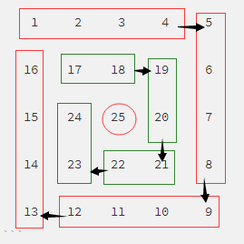

问题秒数：根据输入的数 n，输出其回形矩阵

比如输入：5 ，输出：将如下二维数组顺时针看，是依次递增的

```
    1     2     3     4     5 
   16    17    18    19     6 
   15    24    25    20     7 
   14    23    22    21     8 
   13    12    11    10     9 
```

思路：先用一个数组构建起这个矩阵，然后输出数组即可；主要问题在于数组的构建：首先x从1开始递增，用数组arr一层层保存这个x，对于偶数来说，总共有n/2层；对于奇数来说则有n/2+1层，多出来中心的那一层作另外处理。



代码实现：

```
public class SnakeMatrix {
    public static void main(String[] args) {
        Scanner scanner = new Scanner(System.in);
        System.out.println("输入一个整数得到它的蛇形矩阵：");
        while(scanner.hasNext()){
            int n = scanner.nextInt();
            snakeMatrix(n);
        }
    }

    private static void snakeMatrix(int n) {
        int i = 0;
        int j = 0;
        int x = 1;
        int[][] arr = new int[n][n];
        for(int k=0; k<n/2; k++){
            int m = n-k-1;  //每轮循环每条边生成m个数（第一轮生成n-1;第二轮生成n-2，第三轮生成n-3...）
            for(i=k, j=k; j<m; j++){
                arr[i][j] = x++;
            }
            for(i=k, j=m; i<n-k-1; i++){
                arr[i][j] = x++;
            }
            for(i=n-k-1, j=n-k-1; j>k; j--){
                arr[i][j] = x++;
            }
            for(i=n-k-1, j=k; i>k; i--){
                arr[i][j] = x++;
            }
        }
        if(n%2==1){ //如果要生成蛇形矩形边长为奇数，则区别于偶数为其生成矩形中心的数,根据规则可以这个数为输入数的平方
            arr[n/2][n/2] = n*n;
        }
        //顺时针输出
        for(i=0; i<n; i++){
            for(j=0; j<n; j++){
                System.out.format("%5s ",arr[i][j]);
            }
            System.out.println();
            System.out.println();
        }
        //逆时针输出
//        for(j=0; j<n; j++){
//            for(i=0; i<n; i++){
//                System.out.format("%5s ",arr[i][j]);
//            }
//            System.out.println();1
//            System.out.println();
//        }
    }
}

```

