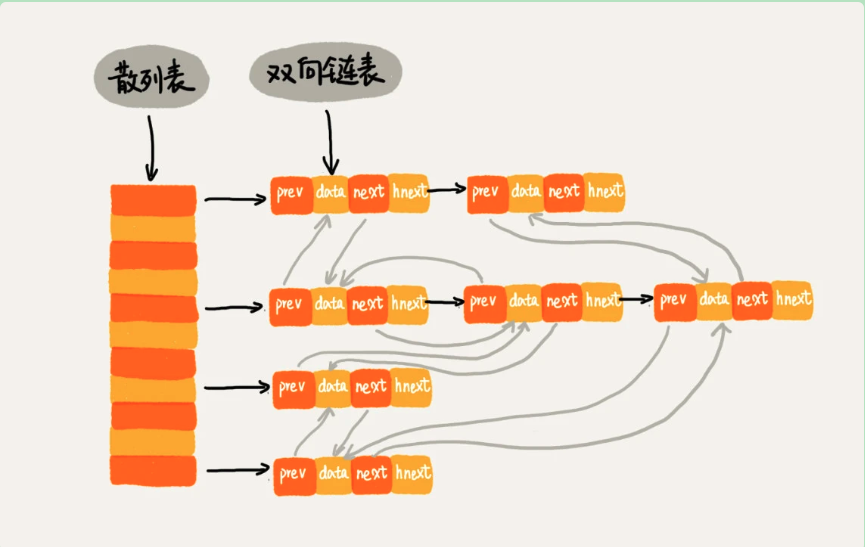

## 哈希表

### 一、哈希冲突

1. 开放寻址法

    - 线性探测

    如果出现了散列冲突，则重新探测一个空间位置，将其插入，比如线性探测，存储到下一个位置。

    当为线性探测时，如果删除元素不能将节点置空，会导致后来查找的元素找不到，因为查找时遇到空算做找完了。可以被删除的节点标记为 delete

    当数据越来越多的时候，散列表发生冲突的可能性就会越来越大，最坏的查找/删除时间复杂度为 O(n) ，

    - 二次探测、双重散列

        二次探测发生哈希冲突每次探测的步长为原来的二次方。

        双重散列不仅要使用一个散列表，而是使用一组散列函数。先用第一个散列函数如果计算得到的存储位置已经被占用，在用第二个散列函数，依次类推，直到找到空间的存储位置

    **装载因子**：散列表的装载因子 = 填入表中的元素个数 / 散列表的长度 

    装载因子越大，说明空闲位置越少，冲突越多，散列表的性能会下降。

    - 优点：数据存储在数组中，可以有效利用CPU缓存加快查询速度。而且序列化比较简单。

    - 缺点：删除数据比较麻烦，需要添加特殊标记。相对链表法冲突代价更高，因此装载因子的上限不能太大，可能会更浪费空间
    - 适用范围：当数据量比较小、装载因子小的时候，适合采用开放寻址法

2. 链表法

    也有可能单个节点的链表很长，查找和删除操作的时间复杂度变为 O(K)

    - 优点：对内存的利用率高，因为链表节点可以在需要时再创建，而开放寻址法需要事先申请好。相比开放寻址法对装载因子容忍度高，开发寻址法只能适用于装载因子小于 1 的情况，接近 1 时，就会有大量的散列冲突；但是哈希函数的值随机均匀，即便装载因子变成了 10，也就是链表长度变长了，虽然查找效率下降，但比起顺序查找还是快很多
    - 缺点：对 CPU 缓存不友好，链表中的节点分布在内存中，不是连续的
    - 改造：将链表改造成其他高效的数据结构，比如跳表、红黑树
    - 适用范围：基于链表的哈希冲突处理方法适用存储大对象、大数据量的哈希表，而且，比起开放寻址法，更佳灵活，支持更多的优化策略，比如红黑树代替链表

#### 如何设计哈希函数

1. 哈希函数不能太复杂，不能消耗太多计算时间
2. 哈希函数生成的值要尽可能随机并且均匀分布

#### 装载因子过大怎么办

在搬迁数据时，可以采用redis 的思路，每次搬迁一部分，分而治之，将扩容操作穿插在插入操作过程中，甚至在每次增删改查中迁移一部分数据。减少可能出现的一次搬迁数据量太大的情况。

装载因子阈值的设置要权衡时间、空间复杂度。如果内存空间不紧张，对执行效率要求很高，可以降低负载因子的阈值；相反，如果内存空间紧张，对执行效率要求又不高，可以增加负载因子的值，甚至可以大于 1。

### 二、LRU 缓存算法

使用哈希和双向链表，可以做到查找/删除/添加的时间复杂度都为 O(1) 

双向链表中前驱和后驱指针是为了将节点串在双向链表中，hnext 指针是为了将节点串在哈希表的拉链中。

### 三、为什么哈希表和链表经常一起使用

哈希表这种数据结构虽然支持非常高效的数据插入、删除、查找操作，但是哈希表中的数据是无序存储的，无法支持按照某种顺序快速遍历数据。因为哈希表是动态数据结构，当我们遍历的时候需要先排序，那效率会很低。

### 三、问题

- Word 文档中单词拼写检查功能如何实现

    常用的英文单词有 20w，假设每个单词 10 个字节，那 20w 英文单词也才 2M 的存储空间，完全可以放到内存中，当用户输入时去哈希中匹配，如果没有查到，说明拼写可能有误，给予提示。

- 假设我们有 10 万条 URL 访问日志，如何按照访问次数给 URL 排序？

    遍历 10w 条数据，URL 为key，访问次数为 value，存入散列表，同时记录下访问次数的最大值 K，时间复杂度为 O(n)

    如果 K 不是很大，可以使用桶排序，时间复杂度 O(n)；如果 K 非常大（比如大于 10w），就使用快速排序，复杂度 O(n*logn) 

- 有两个字符串数组，每个数组大约有 10 万条字符串，如何快速找出两个数组中相同的字符串？

    以第一个字符串数组构建散列表，key 为字符串，value 为出现次数。再遍历第二个字符串数组，以字符串为 key 再散列表中查找，如果 value 大于 0，说明存在相同字符串，时间复杂度为 O(n)

    

