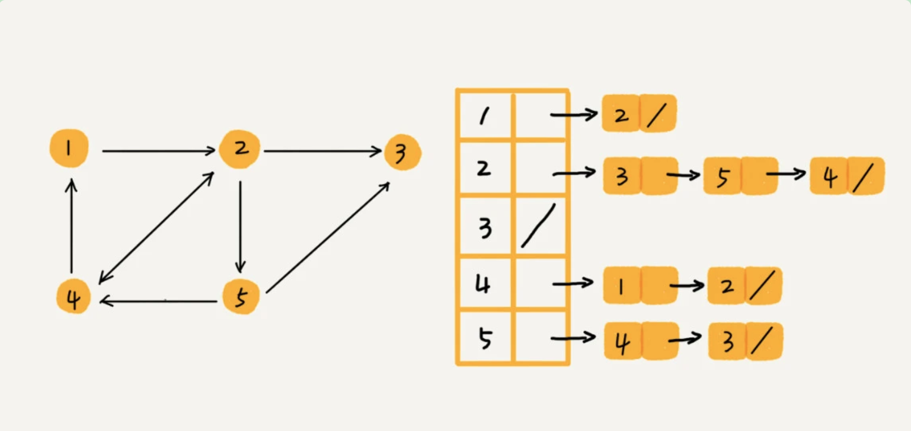

## 图

无向图、有向图、带权图

### 一、如何存储

#### 1. 邻接矩阵

使用二维数组存储，如果有一条箭头从顶点 j 指向顶点 i 的边，我们就将 A[j][i]标记为 1。对于带权图，数组中就存储相应的权重。

- 缺点：空间浪费，对于无向图，只需要上面或者下面一半空间就够了；而且像存储的是稀疏图（顶点很多，但每个顶点的边并不多），也很浪费空间

- 优点：存储方式简单直接，因为基于数组，所以获取两个顶点关系非常高效。其次方便计算，用邻接矩阵的方式存储图，可以将图的运算转换成矩阵之间的运算。

#### 2. 邻接表

有点像哈希表，每个顶点对应一条链表，链表中存储的是这个顶点相连接的其他顶点。



邻接表存储起来比较节省空间，查找就较耗时。我们可以将链表转换成其他更加高效的数据结构，比如平衡二叉查找树

### 二、问题

#### 1. 如何存储微博、微信等社交网络中的好友关系？支持以下操作：

```
判断用户 A 是否关注了用户 B；
判断用户 A 是否是用户 B 的粉丝；
用户 A 关注用户 B；用户 A 取消关注用户 B；
根据用户名称的首字母排序，分页获取用户的粉丝列表；
根据用户名称的首字母排序，分页获取用户的关注列表。
```

因为社交网络是一张稀疏图，使用邻接矩阵存储比较浪费空间，采用邻接表存储。

基础的邻接表不适合快速判断两个用户之间是否是关注和被关注的关系，所以将邻接表中的链表改为支持快速查找的动态数据结构（红黑树、跳表、有序动态数组、哈希表）。因为需要按照用户名称的首字母排序，分页来获取用户的粉丝列表或者关注列表，使用跳表很合适，跳表的插入、删除、查找都非常高效，时间复杂度是 O(logn)，空间复杂度是 O(n)，跳表存储的数据本来就有序的，所以分页获取粉丝列表非常高效。

对于大规模数据，我们要考虑分布式使用多台机器，通过哈希算法等数据分片方式，将邻接表存储在不同的机器，比如机器1 存储顶点 1 2 3 的邻接表，机器 2 存储顶点 4 5 的邻接表。当要查询顶点和顶点关系时，利用哈希算法，先定位顶点所在机器，然后再在相应的机器上查找。

内存的数据具有易失性，可以使用磁盘，比如数据库来持久化存储关系数据，建立相应索引来快速查询

