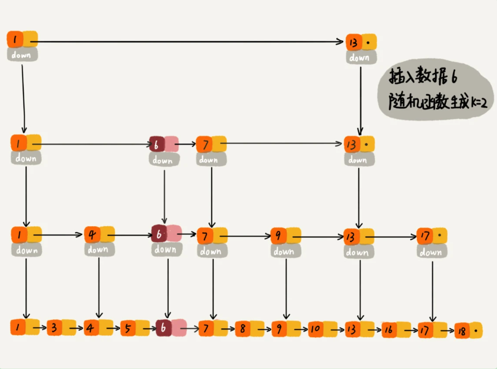

### 跳表

跳表的查询时间复杂度是 logn

空间复杂度是 n 。假设原始链表大小为 n，那第一级索引大约有 n/2 个结点，依次类推。这种每两个节点抽出一个索引，空间复杂度是 O(n)。如果每三个节点抽出一个索引，就是 O(n/2)

### 一、跳表索引动态更新

如果两个索引之间的节点过多，就会出现跳表退化成单链表的情况；跳表是通过随机函数来维护前面提到的“平衡性”。

当我们往跳表中插入数据的时候，我们可以选择同时将这个数据插入到部分索引层中。如何选择加入哪些索引层呢？

我们通过一个随机函数，来决定将这个结点插入到哪几级索引中，比如随机函数生成了值 K，那我们就将这个结点添加到第一级到第 K 级这 K 级索引中。

随机函数的选择很有讲究，从概率上来讲，能够保证跳表的索引大小和数据大小平衡性，不至于性能过度退化

### 二、为什么 Redis 要用跳表来实现有序集合，而不是红黑树？

redis 对于有序集合的实现有：插入、删除、查找、区间查找数据、迭代输出有序序列。

- 增删改查这几个红黑树和跳表时间复杂度是一样的，但是区间查找跳表可以做到 log(n) 的时间复杂度。

- 跳表更容易代码实现。虽然跳表的实现也不简单，但比起红黑树来说还是好懂、好写多了，而简单就意味着可读性好，不容易出错。

- 跳表更加灵活，它可以通过改变索引构建策略，有效平衡执行效率和内存消耗

