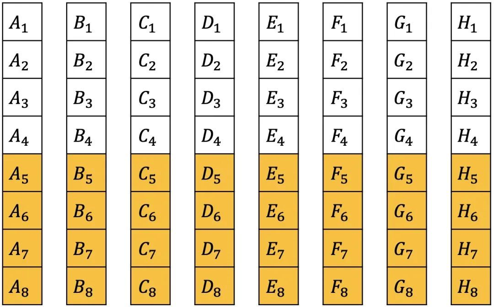
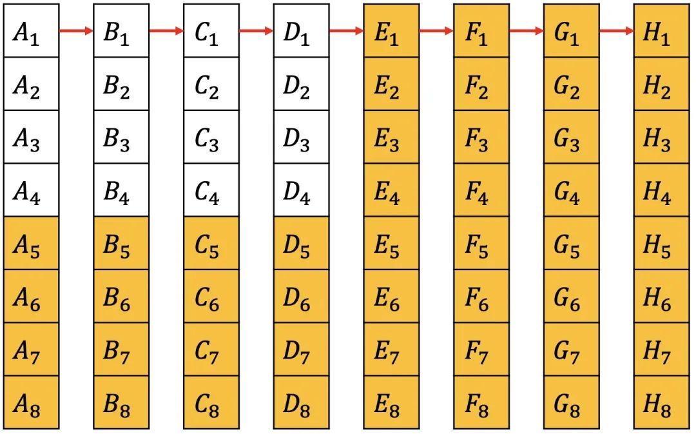
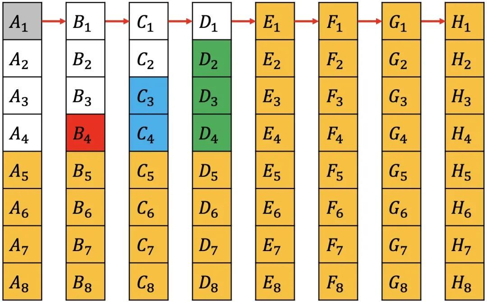

### 64匹马，8赛道，找到最快的4匹马至少要几次

一共需要 11 次赛马。

1. 首先每一匹马都要跑一次，64 匹马，8个赛道，那就将马随机分成 8 组跑 8 次

2. 每一组都会得到当前组中 8 匹马的相对速度，也就是同一组内的名次。每一组都会诞生第一名

3. 因为我们要找到最快的 4 匹马，那我们就可以直接排除掉每一组的后 4 名。因为对于每一组来说，当前组中已经有前 4 匹马跑的比后 4 匹马快了

    

4. 然后我们选择每组的第一名去比赛，假如有 `A、B、C、D、E、F、G、H` 这 8 个组，`A1、B1、C1、D1、E1、F1、G1、H1` 分别为每个组的第一名；那每个组第一名比赛完后之后，假定 `A1、B1、C1、D1` 是前 4 名；则可以直接剔除掉后 4 名所对应的组，即剔除 `E、F、G、H` 四个组

    

5. 这个时候，剩下 `A、B、C、D` 这四个组的前 4 匹马。也就是 `A1-A4、B1-B4、C1-C4、D1-D4` 这 16 匹马。这 16 匹马中，首先 `A1、B1、C1、D1` 是有序的，A1 最快，而且 A1 也是 A 组最快的马。那么 A1 是最终结果最快的马是确定的。

6. 因为要选出前 4 匹最快的马，已经确定了第一名，那么只需要选出剩下的 15 匹马的前三名，因为要选前三名，那么就可以直接排除掉 `B4、C3、C4、D2、D3、D4` 这几匹马

    

7. 那继续在 `A2、A3、A4、B1、B2、B3、C1、C2、D1` 这 9 匹马中找出前 3 名即可。9 匹马找出前三对于 8 个赛道需要两次赛跑。先 8 匹马赛一次，淘汰一个，加入第 9 匹马再赛一次，即可获取到前 3 名