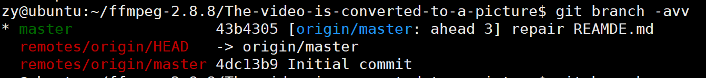

# git基础操作

* git status ：查看整个仓库的状态
* git add ： 跟踪此新建文件，即把新增文件添加到暂存区，以备提交    * 注意：git add . 是将目录中的所有文件都添加到暂存区

* git reset -- [文件名] 或者 git rm -- cached [文件名] ： 撤销暂存区的修改    * 注意：git reset -- ：会把暂存区的全部修改撤销

* git diff ： 可以用来查看工作区被跟踪的文件的修改情况。【注意：只有在版本中存在的文件才是被跟踪文件】    * git diff --cached ： 查看暂存区的全部修改

* git log ： 可以查看版本区的提交历史记录。    * git log [分支名] 查看某分支的提交历史，不写分支名查看当前所在分支
    * git log --oneline 一行显示提交历史
    * git log -n 其中 n 是数字，查看最近 n 个提交
    * git log --author [贡献者名字] 查看指定贡献者的提交记录
    * git log --graph 图示法显示提交历史

* git config --global user.email "13572252156@163.com"
* git config --global user.name "zhangyi" ： 对git 配置自己的属性
* git config -l ： 可以查看配置信息，系统会自动生成 Git 的配置文件，就是主目录中的隐藏文件 .gitconfig，这个配置文件也可以手动修改
* git commit -m "备注" ：生成一个提交，一个必须的选项 -m 用来提供该提交的备注    * 使用commit 时，还有一个 -a 选项，它的作用是将未添加到暂存区的修改，也就是工作区的修改也一并提交，但会略过未被跟踪的文件
    * git log 可以查看提交信息，git log --reverse ：按时间正序排列

* git branch -avv ： 查看全部分支信息

    * 第一行，开头的星号表示当前所在分支，绿色的 master 是分支名，之所以是绿色，也是因为它是当前所在分支。后面第二项是版本号，第三项中括号里面蓝色的字，表示此分支跟踪的远程分支的名字，当然啦，这也是克隆远程仓库到本地时的默认设置 -- 创建 master 分支并自动跟踪远程同名分支；冒号后面黑色文字表示本地分支领先其跟踪的远程分支一个提交。最后一项是提交时填写的备注信息。
    * 第二行，是 Git 指针信息，它指向远程仓库的 master 分支，这行信息暂不重要。
    * 第三行，远程分支信息，详见第一行的解释

* git push ： 后面不用任何选项和参数，此命令会把本地仓库 master 分支上的新增提交推送到远程仓库的同名分支上。    * 此命令需要再次输入用户名和密码，密码是隐藏数据，输入时看不到。推送成功后 git branch -avv 可以看到远程分支和本地分支的版本号相同
    * 一次推送可以包含多个git commit 操作，也就是多个提交可以一起推送

* git reset -- soft HEAD^ ： 撤销最近的一次提交，将修改还原到暂存区。 --soft 返回软退回，对应的还有 --hard 硬退回，HEAD^ 表示撤销一次提交，HEAD^^ 表示撤销两次提交，撤销 n 次可以简写为 HEAD~n    * 软退回一个提交后执行 git branch --avv 可以看到本地仓库的分支版本号已经和远程的不一样了，本地分支落后于远程分支的提交
    * 再去执行 git status 查看仓库状态，会发现上一个提交中的修改全部扔回了暂存区
    * 此时本地仓库的master 分支和远程仓库的 origin/master 分支在提交版本上有冲突，又叫做提交时间线分叉。这种情况直接git push 会失败，需要加上 -f 选项，是 --force 的简写，就是强制推送。

* git reflog ： 它会记录本地仓库所有分支的每一次版本变化，只要本地仓库不删除，都可以显示出来    * 会看到版本号或者 HEAD@{1} 这类的东西
    * 直接可以回退到任意一个版本

* git reset --hard 版本号 或者 git reset --hard HEAD@{2} ： 这个命令就是回到那个版本。之后再git push -f
* 查看远程仓库地址：git remote -v
