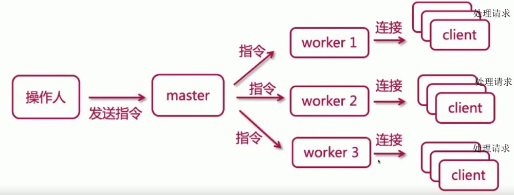
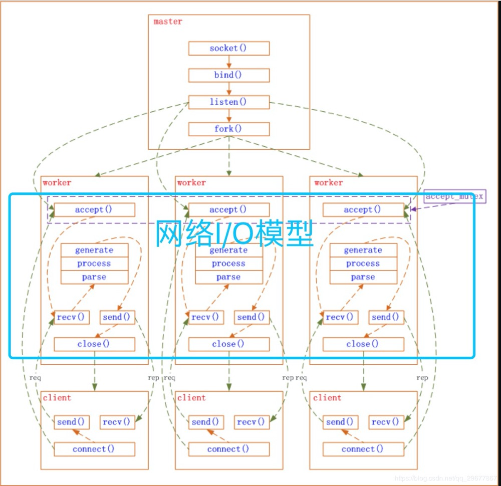

## nginx 架构

### 一、nginx 进程模型

 Nginx之所以为广大码农喜爱，除了其高性能外，还有其优雅的系统架构。与Memcached的经典多线程模型相比，Nginx是经典的多进程模型。Nginx启动后以daemon的方式在后台运行，后台进程包含一个master进程和多个worker进程，具体如下图：

#### 1. 多进程模型的好处

 对于每个worker进程来说，独立的进程，不需要加锁，所以省掉了锁带来的开销，同时在编程以及问题查找时，也会方便很多。其次，采用独立的进程，可以让互相之间不会影响，一个进程退出后，其它进程还在工作，服务不会中断，master进程则很快启动新的worker进程，并且独立的进程，可以让互相之间不会影响，一个进程退出后，其它进程还在，以上也是Nginx高效的另一个原因了。

#### 2. master 与 worker

master 进程 主要用来管理 worker 进程

- 接收来自外界的信号。
- 向各worker进程发送信号。
- 监控woker进程的运行状态。
- 当woker进程退出后（异常情况下），会自动重新启动新的woker进程。

worker 进程主要用来处理基本的网络事件

- 多个worker进程之间是对等且相互独立的，他们同等竞争来自客户端的请求。
- 一个请求，只可能在一个worker进程中处理，一个worker进程，不可能处理其它进程的请求。
- worker进程的个数是可以设置的，一般我们会设置与机器cpu核数一致。更多的worker数，只会导致进程来竞争cpu资源了，从而带来不必要的上下文切换。而且，nginx为了更好的利用多核特性，具有cpu绑定选项，我们可以将某一个进程绑定在某一个核上，这样就不会因为进程的切换带来cache的失效。

#### 3. 进程控制方式

对Nginx进程的控制主要是通过master进程来做到的，主要有两种方式：

- 手动发送信号

master接收信号以管理众woker进程，那么，可以通过kill向master进程发送信号，比如kill -HUP pid用以通知Nginx从容重启。所谓从容重启就是不中断服务：master进程在接收到信号后，会先重新加载配置，然后再启动新进程开始接收新请求，并向所有老进程发送信号告知不再接收新请求并在处理完所有未处理完的请求后自动退出

- 自动发送信号

可以通过带命令行参数启动新进程来发送信号给master进程，比如./nginx -s reload用以启动一个新的Nginx进程，而新进程在解析到reload参数后会向master进程发送信号（新进程会帮我们把手动发送信号中的动作自动完成）。当然也可以这样./nginx -s stop来停止Nginx

#### 4. 多线程和多进程的问题

进程的优点

- 进程之间不共享资源，不需要加锁，所以省掉了锁带来的开销。
- 采用独立的进程，可以让互相之间不会影响，一个进程退出后，其它进程还在工作，服务不会中断，master进程则很快重新启动新的worker进程。
- 编程上更加容易。

线程的缺点：

 而多线程在多并发情况下，线程的内存占用大，线程上下文切换造成CPU大量的开销。想想apache的常用工作方式（apache 也有异步非阻塞版本，但因其与自带某些模块冲突，所以不常用），每个请求会独占一个工作线程，当并发数上到几千时，就同时有几千的线程在处理请求了。这对 操作系统来说，是个不小的挑战，线程带来的内存占用非常大，线程的上下文切换带来的cpu开销很大，自然性能就上不去了，而这些开销完全是没有意义的。

### 二、网路事件模块

Nginx（多进程）采用异步非阻塞的方式来处理网络事件。 master进程先建好需要listen的socket后，然后再fork出多个woker进程，这样每个work进程都可以去accept这个socket。当一个client连接到来时，所有accept的work进程都会受到通知，但只有一个进程可以accept成功，其它的则会accept失败。Nginx提供了一把共享锁accept_mutex来保证同一时刻只有一个work进程在accept连接，从而解决惊群问题。当一个worker进程accept这个连接后，就开始读取请求，解析请求，处理请求，产生数据后，再返回给客户端，最后才断开连接，这样一个完成的请求就结束了。

参考：https://www.baiyp.ren/Nginx%E6%9E%B6%E6%9E%84.html#:~:text=%E2%80%8B%20nginx%E6%A8%A1%E5%9D%97%E5%8C%96%E7%9A%84,%E7%9A%84%E6%9F%90%E4%B8%AA%E7%89%88%E6%9C%AC%E5%BC%80%E5%8F%91%E3%80%82

