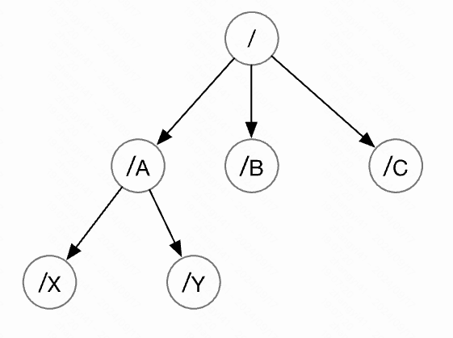

本文解释一下 zookeeper 的基础概念。

### 一、znode 节点

zookeeper 的数据模型是层次模型。层次模型常见于文件系统。层次模型和 K-V 模型是两种主流的数据模型。

ZK 使用层次模型出于以下两点考虑：

- 文件系统的树形结构便于表达数据之间的层次关系
- 文件系统的树形结构便于为不同的应用分配独立的命名空间。

ZK 的层次模型称作 data tree。Data Tree 的每个节点叫做 znode。每个节点都可以保存数据，并且每个节点都有一个版本号，一般版本号从 0 开始计数。

znode 节点可以包含数据，也可以不包含。如果包含数据，则使用 字节数组 类型进行存储。最多可以存储 1MB 的数据。

#### 1. 节点的类型

znode节点可以是持久节点（`persistent`），也可以是临时节点（`ephemeral`）。

- 持久节点：只能通过调用 delete 来删除。
- 临时节点：当创建该节点的客户端 “崩溃 / 会话超时 / 与ZK断开连接”、 “某个客户端主动 delete 该节点”，这个节点就会被删除。

节点也可以是有序节点（`sequential`）。每一个顺序型的 znode 关联一个唯一的单调递增整数。这个单调递增整数是 znode 名字的后缀。因此，znode 又有以下两种 znode：

- 持久顺序性的 znode
- 临时顺序性的 znode

#### 2. znode 的版本号

每一个 znode 都有一个版本号，它随着数据的变化而自增。

某些 API 操作，比如 setData、delete 等。以版本号做为传入参数，只有传入参数的版本号与服务器上的版本号一致时调用才会成功。

ZK 使用版本号来阻止并行操作的不一致性。

#### 3. Zxid

ZK 通过 “事务ID”（zxid）标识 znode 的每个更改。Zxid 是唯一的，并且为每个事务保留时间戳，可以轻松的确认从一个请求到另一个请求所经过的时间。

### 二、ZK 的架构部署方式

ZK 服务器运行于两种模式下：独立模式（`standalone`）和 仲裁模式（`quorum`）。

- 独立模式：只有一个单独的服务器
- 仲裁模式：具有一组 ZK 服务器，也称为 ZK 集合。

// TODO 仲裁模式

### 三、会话 Session

ZK 客户端和 ZK 集群中的节点创建一个 session。

- 客户端可以主动关闭 session
- 如果 ZK 节点没有在规定时间（与session关联的timeout时间）内收到客户端数据的话，ZK 节点也会关闭 session
- 客户端如果发现连接的 ZK 节点出错，会自动和其他 ZK 节点建立连接

当会话由于任何原因结束时，在该会话期间创建的临时节点也会被删除。

### 四、监视 Watches

客户端可以在读取特定 znode 时设置 Watches。Watches 会向注册的客户端发送任何 znode 更改的通知。

znode 更改：znode 相关数据的修改、znode 的子项中的更改。znode 更改 只会触发一次 watches。

当连接会话过期时，客户端将与服务器断开连接，相关的 watches 也将被删除。

原理：ZK 客户端有两个线程，一个负责网络连接通信(`connect`)、一个负责监听(`listen`)。通过 connect 线程将注册的监听事件发送给 ZK；将注册的监听事件添加到 ZK 的监听器列表中；ZK 监听到有数据或路径变化，就将这个消息发送给客户端的 listen 线程；客户端即可收到相关通知。

### 五、ZK 的特点

- 一个领导者 leader，多个跟随者 follower 组成的集群
- 集群中只要半数以上的节点存活，ZK 集群就能正常服务
- 全局数据一致性：每个 Server 保存一份相同的数据副本，Client 无论连接那个 Server，数据都是一致的
- 数据更新原子性：一次数据更新要么成功，要么失败
- 更新请求顺序进行：来自同一个 Client 的更新请求，按其发送顺序依次执行
- 实时性：在一定时间范围内，Client 能读到最新的数据

