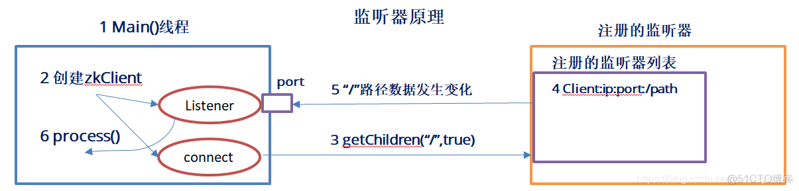

zookeeper 提供了处理变化的重要机制：监视点（Watch）。通过监视点，客户端可以对指定的 znode 节点注册一个通知请求，在发生变化时就会收到一个单次的通知。

### 一、监视点

- 首先创建 zookeeper 客户端，内部会创建两个线程，一个负责网络连接通信（connect），一个负责监听（listener）
- 通过 connect 线程将注册的监听事件发送给 zookeeper ，zookeeper 将这个监听事件添加到自身的注册监听器列表中
- zookeeper 监听到有数据或路径变化，就会将这个消息发送给客户端的  listener 线程
- listener 线程收到之后会进行处理

当一个监视点被一个事件触发时，就会产生一个通知。并且最多只触发一次。

客户端设置的监视点和会话 session 相关联。如果会话过期，等待中的监视点将会被删除。但是，监视点可以跨越不同服务端的连接而保持，比如一个 ZK 客户端与一个服务端的连接断开后，连接到另一个服务端，客户端会发送未触发的监视点列表，此时如果 znode 节点已经发生变化，那么监视点事件将会发送给客户端；如果 znode 节点无变化，则会在新服务端上注册监视点。

不应该对 zookeeper 的 watch 监听事件进行强依赖，理由如下：

- 当客户端在 zookeeper 上某个节点绑定监听事件后，如果该事件被触发，zookeeper 会通过回调函数的方式通知客户端，但是客户端只会收到**一次通知**。如果后续这个节点再次发生变化，那么之前设置 Watcher 的客户端不会再次收到消息（**Watcher 是一次性的操作**），可以通过循环监听去达到永久监听的效果。
- 客户端断开之后重新连接到服务器也是需要一段时间。这就导致了 zookeeper 客户端不能接收全部的 zookeeper 事件

#### 1. 监听机制的特点

zookeeper 的 `getData()` 和 `getChildren()` 和 `exists()` 方法都可以注册 watcher 监听，监听有下面几个特性

- 一次性触发。当数据改变的时候，那么一个Watch事件会产生并且被发送到客户端中。但是客户端只会收到一次这样的通知，如果以后这个数据再次发生改变的时候，之前设置Watch的客户端将不会再次收到改变的通知，因为Watch机制规定了它是一个一次性的触发器。可以通过循环监听去达到永久监听的效果。而循环注册 watch 事件，在第一个 watch 触发，并且第二个 watch 还未注册成功的间隙，进行节点数据的修改，显然无法收到 watch 事件。
- watch 事件异步发送给客户端。这就表明不同的客户端收到的 watch 的时间可能不同，但是 zookeeper 有保证：**当一个客户端在看到 watch 事件之前是不会看到节点数据的变化的**。网络延迟或其他因素可能导致不同 client 在不同时刻获取到 watch 事件，但是不同的客户端所看到的一切具有一致的顺序
- 我们可以认为 zookeeper 内部会维护两个 watch 列表：`data watch` 和 `child watch`。`getData()` 和 `exists()` 会设置 `data watch`，而 `getChildren()` 会设置 `child watch`。或者我们可以认为 watch 是根据返回值设置，`getData()` 和 `exists()` 返回节点本身的信息，而 `getChildren()` 会返回子节点的列表。因此成功的 `setData()` 会触发 znode 上设置的 `data watch`；成功的 `create()` 操作会触发被创建的 znode 上的`data watch` 以及其父节点上的 `child watch`。而一次成功的 `delete()` 操作将会同时触发一个 znode 节点的 `data watch` 和 `child watch`（因为这样就没有子节点了），同时还会触发其父节点的 `child watch`。
- Watch由 client 连接上的 ZooKeeper 服务器在本地维护。这样可以减小设置、维护和分发watch的开销。当一个客户端连接到一个新的服务器上时，watch将会被以任意会话事件触发。当与一个服务器失去连接的时候，是无法接收到watch的。而当client重新连接时，如果需要的话，所有先前注册过的watch，都会被重新注册。通常这是完全透明的。只有在一个特殊情况下，watch可能会丢失：对于一个未创建的znode的 watch，如果在客户端断开连接期间被创建了，并且随后在客户端连接上之前又删除了，这种情况下，**这个watch事件可能会被丢失**
- 客户端断开之后重新连接到服务器也是需要一段时间。**这就导致了 zookeeper 客户端不能接收全部的 zookeeper 事件**
- 从 zookeeper 相关的文档来看，zookeeper 消息并不保证一定送达，**在网络短暂故障的重连期间，可能存在消息丢失的情况**，所以在 zookeeper 服务器压力不大并且数据不大的情况下，可以周期性全量拉取 zookeeper 数据

watch 机制会丢失数据，因此在 zookeeper 服务器压力不大并且数据不大的情况下，可以周期性全量拉取 zookeeper 数据进行对账。

#### 2. 单次触发是否会丢失事件？

会丢失事件。一个应用在接收到通知后，注册新监视点时，可能会丢失事件。

不过，在接收通知与注册新监视点之间的变化情况，均可以通过读取 ZK 的状态信息来获得。所有丢失事件通常不是问题。

---

注意：一旦设置监视点就无法移除。只能等这个监视点被触发，或者使其会话关闭或过期。

另外，客户端设置监视点，需要在服务端创建一个 Watcher 对象，消耗大约 300 字节的内存。因此需要注意设置的监视点的数量。

### 二、监视点的羊群效应

举一个场景，如果有大量客户端通过 exists 操作监视一个 znode 节点，那么当 znode 节点有变动时，就需要给每个客户端发送通知。将会导致性能上的突刺。有可能导致在突刺时刻提交的操作延迟。

解决方法就是避免一个特定节点设置大量的监视点。

或者客户端之间创建有序的节点，然后让他们互相监视，最终选择最小序号的节点。比如：

- 创建 lock-001 的客户端获取锁
- 创建 lock-002 的客户端监视 lock-001 节点
- 创建 lock-003 的客户端监视 lock-002 节点

这样每个节点设置的监视点只有一个客户端。