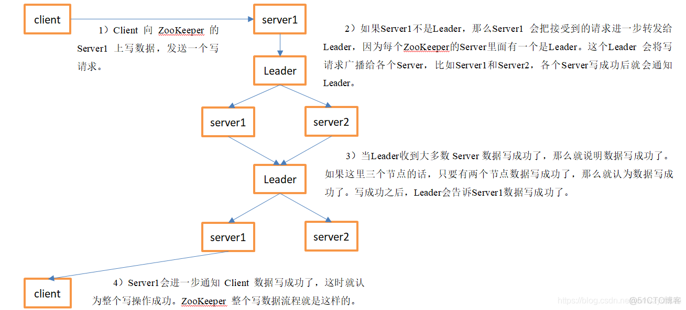

ZK 允许所有节点处理读请求，分摊领导者的压力。除领导者之外的任何一个副本的数据都可能不是最新的。缺点是读操作可能会返回过时的数据，但提高了读的性能。即 ZK 不保证线性一致性。

如下，是ZK 写数据的流程：

ZK 为了系统可用性，提出了两个额外的一致性保证：线性写和先进先出（FIFO）的客户端请求。

#### 1. 线性写

ZK 保证写操作满足线性一致性。ZK 的领导者能保证所有请求“串行化执行”，并且该执行顺序在所有跟随者上保持一致。

ZK 不保证线性读，客户端A更新了关键字 X 的值，而客户端B在另一台服务器读取关键字X 的时候可能会读到旧值。

#### 2. 先进先出的客户端请求

每个客户端可以为其操作（读和写）指定一个顺序，ZK 会按照客户端指定的顺序执行。

对于写请求：

- 所有的写请求会以客户端发送的相对顺序加入总的写请求中，保证满足线性写。

对于读请求：

- 由于读请求不需要经过领导者，多个读请求可能先请求某个副本，但这个副本宕机了，剩余读请求切换到其他副本。针对这个问题，ZK 通过 zxid 来记录读请求的进度。
- zxid 是副本完成的最后一个事务的标记。当客户端发出一个请求到一个相同或者不同的副本上时，会在请求中附加上 zxid 标记，副本通过比对请求的 zxid 和自己的 zxid，保证读到的是更新的 zxid 的数据。

通过这种方式，ZK 保证从单个客户端的角度来满足线性一致性。

#### 3. sync 操作

sync 操作告知 ZK 将最新的写操作同步到客户端连接的服务器上，最终客户端会读到最新的数据。

但 sync 是一个代价比较高的操作。同时，ZK 为保证性能，读操作和 sync 操作都不需要满足 Quorum 要求，因此又很小的概率集群同时存在两个领导者，一个写操作发送给了一个新的领导者，写操作满足 Quorum要求，回复成功。但 sync 操作发送给了旧的领导者，由于 sync 操作不需要满足 Quorum 要求，因此同步完后的读请求并不能读到最新的写入数据。

因此，sync 后面跟一个读请求也不能在极端情况下保证读的线性一致性。

