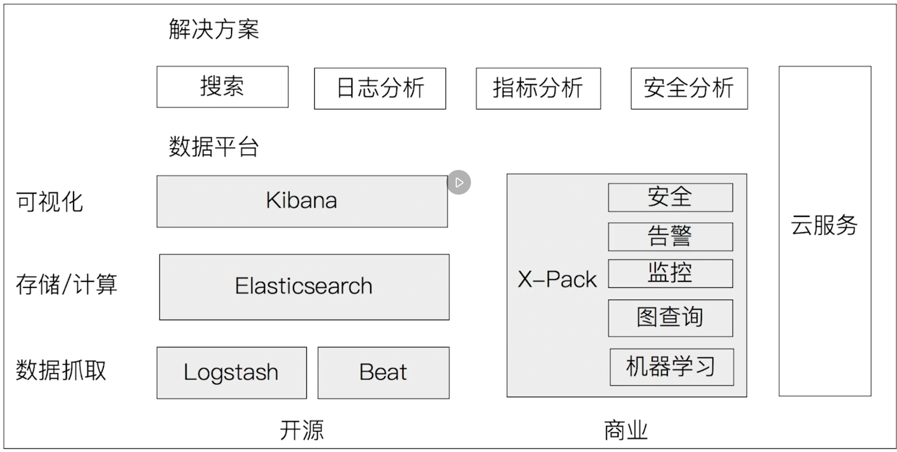

### Elastic Stack 生态圈



### 一、软件

docker 上启动 elasticsearch：`docker run -p 9200:9200 -p 9300:9300 -e "discovery.type=single-node" -e "cluster.name=elasticsearch" -e ES_JAVA_OPTS="-Xms256m -Xmx256m" -d elasticsearch:7.10.1`

cerebro 软件：可以查看到 elasticsearch 集群的一些信息。比如节点数、文档数、占用空间等等

Logstash：保证和 elasticsearch 版本一致。

### 二、概念

#### 1. 文档

- Elasticsearch 是面向文档的，文档是所有可搜索数据的最小单元
- 文档会被序列化成 JSON 格式，保存在 Elasticsearch 中
    - JSON 对象由字段组成
    - 每个字段都有对应的字段类型（字符串/数值/布尔/日期/二进制/范围类型）
- 每个文档都有一个 Unique ID。可以自已指定，也可以自动生成

文档的元数据，用于标注文档的相关信息：

- `_index`：文档所属的索引名
- `_type`：文档所属的类型名
- `_id`：文档唯一 ID
- `_source`：文档的原始 JSON 数据
- `_version`：文档的版本信息
- `_score`：相关性打分

#### 2. 集群、节点、分片

分布式特性：

- Elasticsearch 的分布式架构：
    - 不同的集群通过不同的名字来区分，默认名字：“elasticsearch”
    - 通过配置文件修改，或者在命令行中 `-E cluster.name = elasticsearch_1` 进行设定
    - 一个集群可以有一个或者多个节点

节点：是一个 elasticsearch 的实例。本质上是一个 Java 进程

- 每一个节点都有名字，通过配置文件配置，或者启动时候 `-E node.name=node1` 指定
- 每一个节点在启动之后，会分配一个 UID，保存在 data 目录下

Master-eligible nodes 和 Master Node

- 每个节点启动后，默认就是一个 Master eligible 节点。可以设置 `node.master: false` 禁止
- Master-eligible 节点可以参加选主流程，成为 Master 节点
- 当第一个节点启动后，他会将自己选举成 Master 节点
- 每个节点上都保存了集群的状态，只有 Master 节点才能修改集群的状态信息
    - 集群状态（Cluster State），维护了一个集群中必要的信息：所有的节点信息、所有的索引和其相关的 Mapping 与 Setting 信息、分片的路由信息

Data Node 和 Coordinating Node

- Data Node：可以保存数据的节点，叫做 Data Node。负责保存分片数据。在数据扩展上起到了重要作用
- Coordinating Node：负责接受 Client 的请求，将请求分发到合适的节点，最终把结果汇聚到一起；每个节点默认都起到了 `Coordinating Node` 的职责

其他的一些 Node

- Hot & Warm Node：冷硬节点，使用不同的硬件配置的 Data Node
- Machine Learning Node：负责跑机器学习的 Job，用来做异常检测

分片（Primary Shard 和 Replica Shard）

- 主分片：用以解决数据水平扩展的问题。通过主分片，可以将数据分布到集群内的所有节点上
    - 一个分片是一个运行的 Lucene 的实例
    - 主分片数在索引创建时指定，后续不允许修改，除非 Reindex
- 副本：用来解决数据高可用的问题。分片是主分片的拷贝
    - 副本分片数，可以动态调整
    - 增加副本数，还可以在一定程度上提高服务的可用性（读取的吞吐）

查看集群的健康状况：

- Green：主分片和副本都正常分配
- Yellow：主分片全部正常分配，有副本分片未能正常分配
- Red：有主分片未能分配。例如，当服务器的磁盘容量超过 50% 时，去创建了一个新的索引

```
# 查看健康状态
GET _cluster/health 
```


