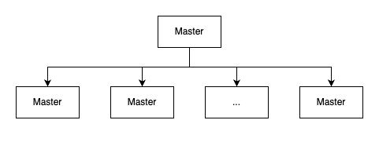

在分布式场景下，让多个独立的程序协同工作是一件非常困难的事情。于是出现了 zk，帮助我们做协调工作。

当我们准备使用 zk 时，最好将应用数据和协同数据独立开。

> 比如网络邮箱服务的用户对自己邮箱中的内容感兴趣，但是并不关心由那台服务器来处理特定邮箱的请求。此时，邮箱内容就是应用数据，而从邮箱到某一台邮箱服务器之间的映射关系就是协同数据（或称为元数据）。zookeeper 服务管理的应该是后者。

### 一、zookeeper 的使命

在分布式系统中协调多个任务运行。这里的协调可能有多种含义，比如：

- “协同多个进程”。多个进程需要一起处理某个事情，一些进程采取某些行动使得其他进程可以继续工作。比如典型的主从工作模式中，从节点处于空闲状态时通知主节点，然后主节点分配任务给从节点。
- “管理竞争”。两个进程不能同时处理工作，

zookeeper 作为一个分布式的服务框架，主要用来解决分布式集群中服务的一致性问题。

ZK 提供的服务包括：分布式消息同步和协调机制、服务器节点动态上下线、统一配置管理、负载均衡、集群管理等。

ZK 提供类似于 Linux 文件系统的目录节点树方式的数据存储。但 ZK 不是专门用于存储数据的，他的作用主要用来维护和监控存储数据的状态变化，通过监控这些数据状态的变化，从而达到基于数据的集群管理，ZK 节点的数据上限是 1MB。

ZK 中的节点被称为 znode，znode 可以有子节点，并且每个 znode 可以存储数据。但临时节点不能有子节点。

znode 是有版本号的，版本号随着数据的变化而自增。

ZK 的客户端和服务器通信采用长连接方式，通过心跳来保持连接，这个连接状态称为 session。如果 znode 是临时节点，session 失效时，znode 也会被删除。

znode 节点可以是持久节点、临时节点。还可以是有序的。

znode 可以被监控，包括节点中数据的变化、子节点目录的变化等。一旦变化可以通知到设置监控的客户端。这个是 ZK 的核心特性。

### 二、分布式系统设计难点

在分布式系统中，我们需要注意如下问题：

1. 消息延迟

消息传输可能会发生延迟。比如：网络拥堵。这种延迟可能会导致不可预期的后果。比如，根据基准时钟，进程 P 先发送了一个消息，之后另一个进程 Q 发送了消息，但是进程 Q 的消息也许会先完成传送。

2. 处理器性能

操作系统的调度和超载也可能导致消息处理的任意延迟。消息的延迟时间：发送端消耗的时间、传输时间、接收端的处理时间。还需要包括发送或接收过程中进程调度的时间。

3. 时钟偏移

处理器时钟并不可靠，他们之间会发生任意的偏移。依赖处理器时钟也许会导致错误的决策。

如上问题，产生了一个结果，就是我们 “**很难判断一个进程是崩溃了还是因为某些因素导致了延时**”。

### 三、常见的主从架构的系统

主从架构的系统，一般主节点进程负责跟踪从节点状态和任务的有效性，并分配任务到从节点。

这种架构的系统，有三个关键问题：

- 主节点崩溃。如果主节点发生错误并失效，系统将无法分配新任务或重新分配已失败的任务。
- 从节点崩溃。如果从节点崩溃，已分配的任务将无法完成。
- 通信故障。如果主从节点无法进行信息交换，从节点将无法收到新任务

为了处理这些问题，我们就需要在主节点出现问题时，系统可靠的选举一个新的主节点。

#### 1. 主节点崩溃

难点之一：状态恢复问题。

当主节点崩溃时，新的主节点需要能够恢复到之前主节点崩溃时的状态。我们可以通过 zk 来获取。

难点之二：脑裂问题。

假如之前的主节点有效，但是由于一些原因导致认为之前主节点已经崩溃，从而选择出新的主节点。原因比如：主节点负载很高，导致消息延迟。这时就会有多个主节点。

更糟糕的是，假如存在网络分区（`network partition`）问题，将产生脑裂问题，系统中两个或多个部分开始独立工作，导致整体行为不一致。

因此，我们需要找出一种方法来处理主节点失效的情况。

#### 2. 从节点失效

从节点执行主节点派发的任务，如果从节点崩溃了，那么已派发给这个从节点，且尚未完成的任务需要重新派发。

第一要点：需要主节点具有检测从节点崩溃的能力

第二要点：一个从节点崩溃时，也许执行了部分任务，也许全部执行完，但没有报告结果。如果任务的执行过程产生了其他影响，我们有必要执行某些恢复过程来清除之前的状态。

#### 3. 通信故障

第一要点：主从节点网络连接断开，比如发生了网络分区问题。有可能出现一个任务多个从节点执行。如果任务执行过程中有其他影响，无法多次执行。我们就需要解决这个问题的能力。

第二要点：当发生通信故障时，我们希望这个从节点停止运行，因为没有意义了，这个从节点此时是一个不能被主节点协调的特殊存在。zookeeper 需要有处理这种情况的机制。

- 首先，客户端可以告诉 zookeeper 某些数据的状态是临时状态；
- 其次，zookeeper 需要客户端定时发送是否存活的通知，如果一个客户端没有及时发送通知，那么从属于这个客户端的临时状态的数据将全部被删除。

通过这两个机制，我们可以预防客户端不听协调的独立运行了。

#### 4. 小总结

- 主节点选举。主节点可以给从节点分配任务
- 崩溃检测。主节点必须具有检测从节点崩溃或失去连接的能力
- 组成员关系管理。主节点必须具有知道哪一个从节点可以执行任务的能力
- 元数据管理。主节点和从节点必须具有通过某种可靠的方式来保存分配状态和执行状态的能力

### 四、总结

分布式服务遵循 CAP 原理。一致性（`Consistency`）、可用性（`Availability`）、分区容错性（`Partition tolerance`）。分布式服务无法同时满足这三种属性。

zookeeper 的设计尽可能满足一致性和可用性。在发生网络分区时 zookeeper 只提供了只读能力。

