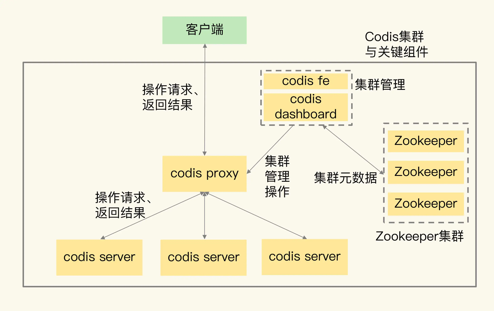
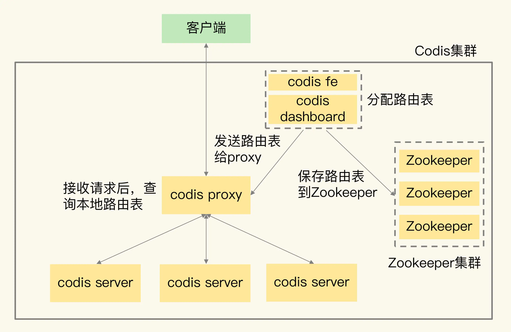
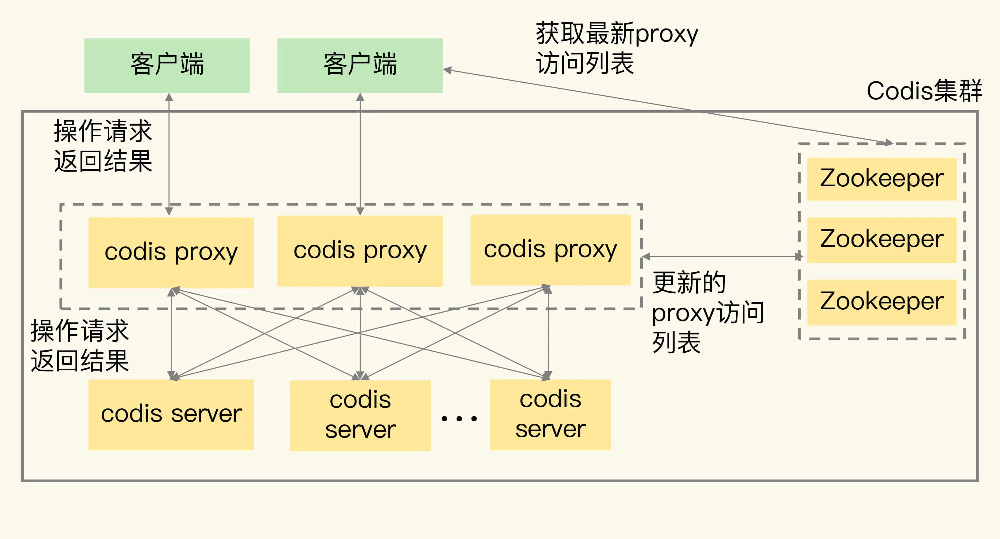
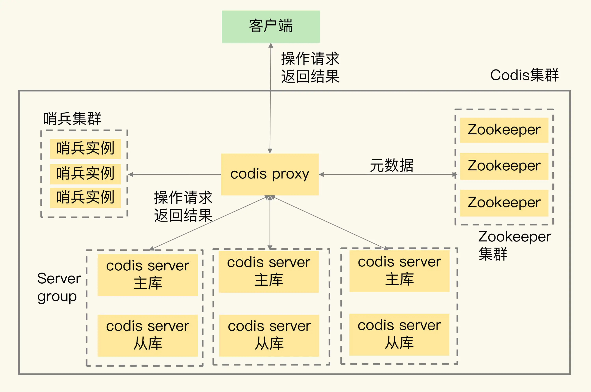
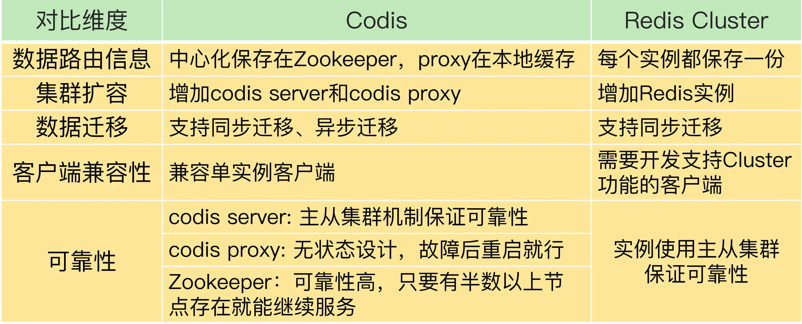

## Codis 原理

### 一、Codis 的整体架构和基本流程

Codis 集群中包含了 4 类关键组件

- codis server：基于 redis 3.2.8 二次开发的 redis 实例，其中增加了额外的数据结构，支持数据迁移操作，主要负责处理具体的数据读写请求
- codis proxy：接收客户端请求，并把请求转发给 codis server
- Zookeeper 集群：保存集群元数据，例如数据为止信息和 codis proxy 信息。codis 也可以使用 etcd 或本地文件系统保存元数据信息 
- codis dashboard 和 codis fe：共同组成了集群管理工具。其中，codis dashboard 负责执行集群管理工作，包括增删 codis server、codis proxy 和进行数据迁移。而 codis fe 负责提供 dashboard 的 Web 操作界面，便于我们直接在 Web 界面上进行集群管理。

codis 是如何处理请求的呢？

- 先使用 codis dashboard 设置 codis server 和 codis proxy 的访问地址，完成设置后，codis server 和 codis proxy 才会开始接收连接
- 客户端直接和 codis proxy 连接，codis proxy 支持 redis 的 RESP 交互协议，和访问原生的 Redis 实例没有区别
- codis proxy 接收到请求，会查询请求数据和 codis server 的映射关系，并把请求转发给相应的 codis server 进行处理。当 codis server 处理完请求后，会把结果返回给 codis proxy，proxy 再把数据返回给客户端

### 二、数据在集群的分布

数据应该保存在那个 codis server 上，通过逻辑槽（slot）映射来完成

1. codis 集群一共有 1024 个 slot，可以手动分配，也可以让 codis dashboard 进行自动分配给所有的 server
2. 客户端读写数据时，会使用 CRC32 算法计算数据 key 的哈希值，并对这个哈希值对 1024 取模。得到的值对 slot 的编号。此时就可以查到某个key 对应那个 server 了

slot 和 codis server 的映射关系称为数据路由表。我们在 codis dashboard 上分配好路由表后，dashboard 会把路由表发送给 codis proxy，同时，dashboard 也会把路由表保存在 zookeeper 中。codis-proxy 会把路由表缓存在本地，当他接收到客户端请求后，查询本地的路由表，就可以完成正确的请求转发了

Redis cluster 也会把 key 映射到 slot、slot 再分配到实例上。和 codis 的区别：

- codis 上的路由表是通过 codis dashboard 分配和修改的，并被保存在 zookeeper 集群中，一旦数据位置发生变化，路由表被修改，codis dashboard 就会把修改后的路由表发送给 codis proxy，proxy 就可以根据最新的路由信息转发请求
- 在 redis cluster 中，数据路由表是通过每个实例相互间的通信传递的，最后会在每个实例上保存一份。当数据路由信息发生变化时，就需要在所有实例间通过网络消息进行传递。所以，如果实例数量较多的话，就会消耗较多的集群网络资源

### 三、集群扩容和数据迁移

当codis 集群扩容时，codis-server 按照 slot 的粒度进行数据迁移，我们看下迁移的基本流程：

1. 在源 server 上，codis 从要迁移的 slot 中随机选择一个数据，发送给目的 server 
2. 目的 server 确认收到数据后，会给源 server 返回确认消息。这时，源 server 会在本地将刚才迁移的数据删除
3. 第一步和第二步是单个数据的迁移过程。codis 会不断重复这个迁移过程，直到要迁移的 slot 中的数据全部迁移完成

codis 有两种迁移模式，同步迁移和异步迁移。

- 同步迁移：在数据从源 server 发送给目的 server 的过程中，源 server 是阻塞的，无法处理新的请求操作。这种模式很容易实现，但是迁移过程中会涉及多个操作（包括数据在源 server 序列化、网络传输、在目的 server 反序列化，以及在源 server 删除），如果迁移的数据是一个 bigkey，源 server 就会阻塞较长时间，无法及时处理用户请求

- 异步迁移：

    - 当源 server 把数据发送给目的 server 后，就可以处理其他请求操作了，不用等到目的 server 的命令执行完。而目的 server 会在收到数据并反序列化保存到本地后，给源 server 发送一个 ACK 消息，表明迁移完成。此时，源 server 在本地把刚才迁移的数据删除。迁移的数据会被设置为只读，写请求会报错，proxy 会重试。所以，源 server 上的数据不会被修改，自然也就不会出现“和目的 server 上的数据不一致”的问题。

    - 对于 bigkey，异步迁移采用了拆分指令的方式进行迁移。具体来说就是，对 bigkey 中每个元素，用一条指令进行迁移，而不是把整个 bigkey 进行序列化后再整体传输。这种化整为零的方式，就避免了 bigkey 迁移时，因为要序列化大量数据而阻塞源 server 的问题。

        当 bigkey 迁移了一部分数据后，如果 Codis 发生故障，就会导致 bigkey 的一部分元素在源 server，而另一部分元素在目的 server，这就破坏了迁移的原子性。所以，Codis 会在目标 server 上，给 bigkey 的元素设置一个临时过期时间。如果迁移过程中发生故障，那么，目标 server 上的 key 会在过期后被删除，不会影响迁移的原子性。当正常完成迁移后，bigkey 元素的临时过期时间会被删除。

        为了提升迁移的效率，codis 在异步迁移 slot 时，允许每次迁移多个 key。可以通过异步迁移命令 SLOTSMGRTTAGSLOT-ASYNC 的参数 numkeys 设置每次迁移的 key 数量

codis-proxy 也需要扩容，因为当客户端增加时，单个 proxy 无法支撑大量请求操作。

直接启动 codis-proxy ，在通过 codis-dashboard 把 proxy 加入集群即可。codis proxy 的访问连接信息都会保存在 Zookeeper 上。所以，当新增了 proxy 后，Zookeeper 上会有最新的访问列表，客户端也就可以从 Zookeeper 上读取 proxy 访问列表，把请求发送给新增的 proxy。这样一来，客户端的访问压力就可以在多个 proxy 上分担处理了

### 四、集群客户端和集群可靠性

使用 redis 时，有些功能切片集群和单实例不一样。比如集群中的数据迁移操作，在单实例上没有；还比如数据访问请求可能要被重定向（Redis cluster 中的 MOVED 命令）。因此如果客户端原来是单实例的，想要使用集群就需要更新客户端。

codis 使用 codis proxy 直接和客户端连接，且和单实例客户端兼容。而和集群相关的管理工作（例如请求转发、数据迁移等），都由 codis proxy、codis dashboard 这些组件来完成，不需要客户端参与。

**codis 如何保证 server 的可靠性**：

- codis server 其实就是 Redis 实例，只不过增加了和集群操作相关的命令。Redis 的主从复制机制和哨兵机制在 codis server 上都是可以使用的，所以，Codis 就使用主从集群来保证 codis server 的可靠性。简单来说就是，Codis 给每个 server 配置从库，并使用哨兵机制进行监控，当发生故障时，主从库可以进行切换，从而保证了 server 的可靠性。在这种配置情况下，每个 server 就成为了一个 server group，每个 group 中是一主多从的 server。数据分布使用的 Slot，也是按照 group 的粒度进行分配的。同时，codis proxy 在转发请求时，也是按照数据所在的 Slot 和 group 的对应关系，把写请求发到相应 group 的主库，读请求发到 group 中的主库或从库上。
- 因为 codis proxy 和 Zookeeper 这两个组件是搭配在一起使用的。proxy 上的信息源头都是来自 Zookeeper（例如路由表）。而 Zookeeper 集群使用多个实例来保存数据，只要有超过半数的 Zookeeper 实例可以正常工作， Zookeeper 集群就可以提供服务，也可以保证这些数据的可靠性。
- codis proxy 使用 Zookeeper 集群保存路由表，可以充分利用 Zookeeper 的高可靠性保证来确保 codis proxy 的可靠性，不用再做额外的工作了。当 codis proxy 发生故障后，直接重启 proxy 就行。重启后的 proxy，可以通过 codis dashboard 从 Zookeeper 集群上获取路由表，然后，就可以接收客户端请求进行转发了。这样的设计，也降低了 Codis 集群本身的开发复杂度。
- 对于 codis dashboard 和 codis fe 来说，它们主要提供配置管理和管理员手工操作，负载压力不大，所以，它们的可靠性可以不用额外进行保证了。

### 五、codis 和 redis cluter 对比

- 从稳定性和成熟度来看，Codis 应用得比较早，在业界已经有了成熟的生产部署。虽然 Codis 引入了 proxy 和 Zookeeper，增加了集群复杂度，但是，proxy 的无状态设计和 Zookeeper 自身的稳定性，也给 Codis 的稳定使用提供了保证。而 Redis Cluster 的推出时间晚于 Codis，相对来说，成熟度要弱于 Codis，如果你想选择一个成熟稳定的方案，Codis 更加合适些。
- 从业务应用客户端兼容性来看，连接单实例的客户端可以直接连接 codis proxy，而原本连接单实例的客户端要想连接 Redis Cluster 的话，就需要开发新功能。所以，如果你的业务应用中大量使用了单实例的客户端，而现在想应用切片集群的话，建议你选择 Codis，这样可以避免修改业务应用中的客户端。
- 从使用 Redis 新命令和新特性来看，Codis server 是基于开源的 Redis 3.2.8 开发的，所以，Codis 并不支持 Redis 后续的开源版本中的新增命令和数据类型。另外，Codis 并没有实现开源 Redis 版本的所有命令，比如 BITOP、BLPOP、BRPOP，以及和与事务相关的 MUTLI、EXEC 等命令。Codis 官网上列出了不被支持的命令列表，可以在使用时记得去核查一下。所以，如果你想使用开源 Redis 版本的新特性，Redis Cluster 是一个合适的选择。
- 从数据迁移性能维度来看，Codis 能支持异步迁移，异步迁移对集群处理正常请求的性能影响要比使用同步迁移的小。所以，如果你在应用集群时，数据迁移比较频繁的话，Codis 是个更合适的选择。

建议：当你有多条业务线要使用 Codis 时，可以启动多个 codis dashboard，每个 dashboard 管理一部分 codis server，同时，再用一个 dashboard 对应负责一个业务线的集群管理，这样，就可以做到用一个 Codis 集群实现多条业务线的隔离管理了。

