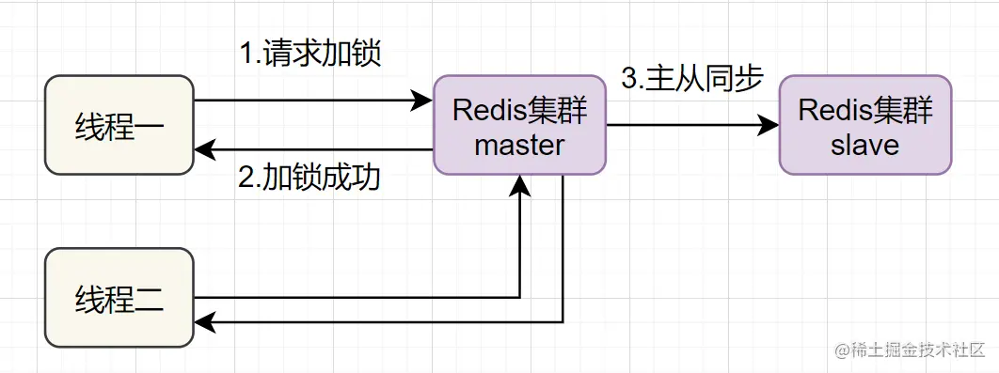

本文讨论 redis 分布式锁的特点。

### 一、分布式锁的特性

- 互斥性：任意时刻，只有一个客户端能持有锁
- 锁超时释放：持有锁超时，可以释放，防止不必要的资源浪费，也可以防止死锁
- 可重入性：一个线程如果获取了锁之后，可以再次对其请求加锁
- 高性能和高可用：加锁和解锁的开销尽可能低，同时也要保证高可用，避免分布式锁失效
- 安全性：锁只能被持有的客户端删除，不能被其他客户端删除

### 二、redis 的分布式锁方式

#### 1. SETNX + EXPIRE

先用 setnx 来抢锁，如果抢到之后，在用 expire 给锁设置一个过期时间，防止锁忘记了释放。

```
setnx 是 "set if not exists" 的简写
命令格式为：setnx key value
如果 key 不存在，则 setnx 成功返回 1；如果这个 key 已经存在了，则返回 0
```

但是这个方案中，`setnx` 和 `expire` 两个命令分开了，不是原子操作。如果执行完 setnx 加锁，正要执行 expire 设置过期时间时，进程 crash 了，那么别的线程就永远获取不到这个锁了。

#### 2. 使用 set 方法

Redis 提供了 set 指令的扩展参数。`set key value [EX seconds] [PX milliseconds] [NX | XX]`

- `EX seconds`：设定 key 的过期时间，时间单位为秒；`PX milliseconds`：设定 key 的过期时间，单位为毫秒
- NX 表示 key 不存在时，才能 set 成功，也即保证只有第一个客户端请求才能获取锁，而其他客户端请求只能等其释放锁后，才能获取。
- XX：仅当 key 存在时设置值

```
// key 不存在时，才能 set 成功。并且设置过期时间为 5s
set key value EX 5 NX
```

此方案存在问题：

- 问题一：**锁过期释放了，业务还没有执行完**。假设线程 A 获取锁成功，一直在执行临界区的代码。但是过期时间结束后，还没有执行完。但此时锁已经过期了。线程 B 请求过来，线程 B 就可以获取锁成功。导致临界区不安全。
- 问题二：**锁被别的线程误删**。假设线程 A 执行完后，去释放锁。有可能过期时间已经到了，此时线程 B 进来占有了锁。但线程 A 并不知道当前的锁已经被线程 B 持有，于是线程 A 释放了这把锁，但此时线程 B 还在执行临界区的代码。

#### 3. 延长锁过期时间

给获得锁的线程，开启一个定时守护线程，每隔一段时间检查锁是否还存在，存在则对锁的过期时间延长，防止锁过期提前释放。

也就是说，只要线程 A 加锁成功，就会启动一个定时守护线程，每割一定时间检查一下。如果线程 A 还持有锁，那么就不断的延长锁 key 的生存时间。这样可以解决**锁过期释放，业务没执行完** 的问题。

#### 4. 分布式方案

以上都是单机版，redis 一般都是集群部署的。



如果线程一在 redis 的 master 节点上获取到了锁，但是加锁的 key 还没有同步到 slave 节点。恰好这时，master 节点发生故障，一个 slave 节点就会升级为 master 节点。线程二就可以获取相同 key 的锁了。但线程一也已经拿到锁了。导致不安全。

为了解决这个问题，提出了 RedLock 的方式。基本思路是：让客户端和多个独立的 redis 节点依次请求申请加锁，如果客户端能够和半数以上的节点成功的完成加锁操作，那么我们就认为，客户端成功的获得分布式锁，否则加锁失败。

核心思想是：搞多个 redis 的 master 部署，以保证他们不会同时宕机。并且这些 master 节点是完全相互独立的，互相之间不存在数据同步。同时，需要确保在这多个 master 实例上，使用相同方法来获取和释放锁。

这样以来，即使有某个 Redis 节点发生故障，因为锁的数据在其他节点上也有保存，所以客户端仍然可以正常地进行锁操作，锁的数据也不会丢失。


RedLock 算法加锁的过程：

第一步：客户端获取当前时间。

第二步：客户端按顺序依次向 N 个 redis 节点执行加锁操作。

- 加锁操作使用 set 命令，带上 NX，`EX/PX` 选项，以及带上客户端的唯一标识
- 如果某个 redis 节点发送故障了，为了保证在这种情况下，RedLock 算法能够继续运行，我们需要给这个“加锁操作” 设定一个耗时。也就是说，在某个节点 “加锁过程” 超过了这个耗时，就跳过这个节点。

第三步：一旦客户端完成了和所有 redis 节点的加锁操作，客户端就要计算整个加锁过程的总耗时

加锁成功需要满足两个条件：

- 客户端从超过半数（大于等于 `N/2+1`）的 redis 节点上成功获取了锁。
- 客户端获取锁的总耗时没有超过锁本身的过期时间

加锁成功后，客户端需要重新计算这把锁的有效时间，计算的结果：`锁最初有效时间 - 客户端为获取锁的总耗时`

如果加锁失败，客户端则向所有 redis 节点发起释放锁的操作。因为在某一个Redis节点加锁时，可能因为网络原因导致加锁失败，例如一个客户端在一个Redis实例上加锁成功，但在读取响应结果时由于网络问题导致读取失败，那这把锁其实已经在Redis上加锁成功了。所以释放锁时，不管之前有没有加锁成功，需要释放所有节点上的锁以保证清理节点上的残留的锁。