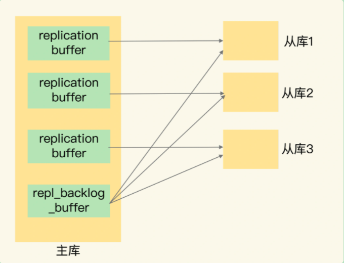

Redis的高可靠性：**1. 数据尽量少丢失 2. 服务尽量少中断**。AOF和RDB 保证了前者，对于后者增加了副本冗余量，即将一份数据同时保存在多个实例上。

问题：多副本，他们之间的数据如何保持一致呢？数据读写操作可以发给所有的实例吗？

### Redis数据同步

Redis提供主从库模式，保证数据副本的一致，主从库之间采用的是读写分离的方式

读操作：主库、从库都可以接收

写操作：首先到主库执行，然后，主库将写操作同步给从库

在从redis实例上执行命令  ` replicaof 主redis实例ip 主redis实例port` ，即可配置主从库。当主从库第一次连接时会先进行全量同步。

#### 一、全量同步

1. 建立连接，从库给主库发送 psync 命令，表示要进行数据同步，主库根据这个命令参数来启动复制。psync 命令包含了主库的 runID 和复制进度 offset 两个参数。
   - runID：每个Redis 实例启动时都会自动生成的一个随机ID，用来唯一标识这个实例。当从库和主库第一次复制时，因为不知道主库的 runID，所以将 runID 设置为 "?"
   - offset：此时设置为 -1，表示第一次复制
2. 主库收到 psync 命令，会用 FULLRESYNC（全量复制）响应命令带上两个参数：主库 runID 和主库目前的复制进度 offset，返回给从库。从库收到响应后，会记录下这两个参数
3. 主库将所有数据同步给从库。从库收到数据后，在本地完成数据加载。这个过程依赖于内存快照生成的RDB文件。具体来说，主库执行 bgsave 命令，生成 RDB 文件，接着将文件发给从库。从库接收到 RDB 文件后，会先清空当前数据库，然后加载 RDB 文件。这是因为从库在通过 replicaof 命令开始和主库同步前，可能保存了其他数据。为了避免之前数据的影响，从库需要先把当前数据库清空。
4. 针对同步过程中，主库收到的写操作，主库会在内存中用 replication buffer 来记录这个过程中所有写操作。等RDB 文件同步成功之后，再把 replication buffer 中的修改操作发送给从库。

问题：生成 RDB 文件和传输 RDB 文件耗时很大，如果主库有多个从库，会导致同步阻塞主线程，造成响应应用程序的请求速度变慢等问题。

采用 “主-从-从”模式

#### 二、主从级联模式

通过 “主-从-从” 模式将主库生成 RDB 和传输 RDB 的压力，以级联的方式分散到从库上。

问题：全量复制后的数据应该如何同步？

#### 三、基于长连接的命令传播

一旦主库完成了全量复制，主从库之间就会一直维护一个网络连接，主库会通过这个连接将后续陆续收到的命令操作再同步给从库。可以避免频繁的建立连接的开销。

问题：网路断开或者阻塞时如何处理？

#### 四、增量复制

在Redis 2.8 之前，如果主从库在命令传播时出现网络闪断，那么主从库会重新进行一次全量复制，开销非常大。Redis 2.8 之后，网络断了重连，会采用增量复制方式。

当主从库断连之后，主库会把断连期间收到的写操作命令，写入 repl_backlog_buffer 这个环形缓冲区，主库会记录自己写到的位置，从库则会记录自己已经读到的位置。主库对应的偏移量为：master_repl_offset，每个从库对应的偏移量为：slave_repl_offset。

主从库在连接恢复后，从库首先会给主库发送 psync 命令，并把自己当前的 slave_repl_offset 发给主库，一般来说，主库只用把master_repl_offset 和 slave_repl_offset 之间的命令操作同步给从库就行。

repl_backlog_buffer 环形缓冲区写满之后，主库会覆盖掉之前写入的操作。一般调整 repl_backlog_size 这个参数。

```shell
缓冲空间=主库写入命令速度 * 操作大小 - 主从库网络传输命令速度 * 操作大小
考虑突发请求压力：repl_backlog_size = 缓冲空间大小 * 2 
```

#### 五、replication buffer 和 repl_backlog_buffer 的区别

repl_backlog_buffer 是在 Redis 服务器启动后，开始一直接收写操作命令，并且所有从库共享。主库和从库会各自记录自己的复制进度，所以不同的从库在进行恢复时，会把自己的复制进度（slave_repl_offset）发给主库，主库就可以和它独立同步。

replication buffer 是在主从库进行全量复制时，主库创建一个客户端，用来连接从库并把写操作命令发给从库，此客户端对应一个 replication buffer。Redis 通过 client_buffer 配置项来控制这个 buffer 的大小。主库会给每个从库建立一个客户端，所以 replication buffer 不是共享的。



问题：repl_backlog_buffer 环形缓冲区中如果master_repl_offset 领先 slave_repl_offset 一圈怎么办？何时全量同步何时增量同步？

使用切片集群来分担单个主库的请求压力