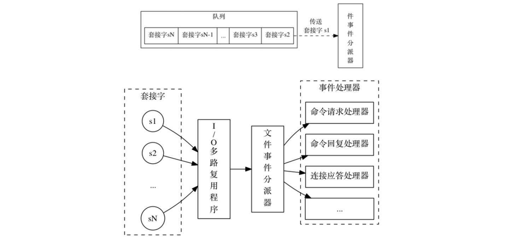
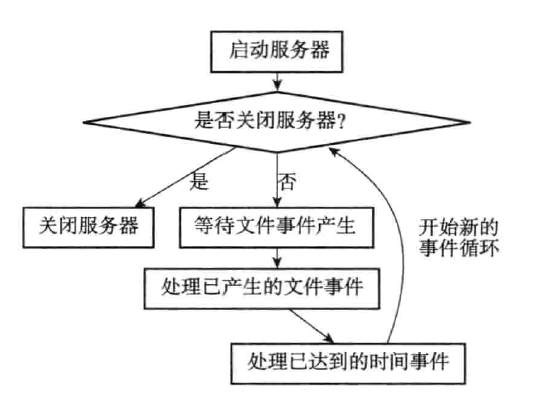

Redis 是一个事件驱动程序，服务器需要处理以下两类事件：

1. 文件事件：Redis服务器通过套接字与客户端（或者其他Redis服务器）进行连接，而文件事件就是服务器对套接字操作的抽象。服务器和客户端（或者其他服务器）的通信会产生相应的文件事件，而服务器则通过监听并处理这些事件来完成一系列网络通信操作
2. 时间事件：Redis 服务器中的一些操作（比如 serverCron 函数）需要在给定的时间点执行，而时间事件就是服务器对这类定时操作的抽象

### 一、文件事件

redis 基于 reactor 模式实现了网络事件处理器：

- 使用 IO 多路复用，同时监听多个套接字，并根据套接字目前执行的任务来为套接字关联不同的事件处理器。
- 当被监听的套接字准备好执行 accept、read、write、close 等操作时，会调用关联好的事件处理器来处理这些事件。

redis 在编译时会自动选择系统中性能最高的 IO 多路复用函数库，来作为 redis 的 IO 多路复用程序的底层实现。包括：select、epoll 等

文件事件的流程：

### 二、时间事件

redis 的时间事件分为两类：

- 定时事件：让一段时间在指定的时间之后执行一次
- 周期性事件：让一段程序每隔指定时间就执行一次

一个事件事件主要由三个属性组成：

- id：服务器会为时间事件创建全局唯一 ID，作为标识。ID 号按从小到大的顺序递增
- when：毫秒精度的 UNIX 时间戳，记录了时间事件到达的时间
- timeProc：处理函数，当时间事件到达时，服务器会调用此函数来处理事件

redis 将所有时间事件都放在一个 “无序链表” 中，每当时间事件执行器运行时，他就遍历整个链表，查找所有已到达的时间事件，并调用相应的注册函数来处理事件。

这里的 “无序” 表示没有按照 when 属性来进行排序，因此需要遍历整个链表。一般来说，redis 服务器只有一个时间事件，所以并不影响性能。

时间事件一般做的事情包括：

- 更新服务器的各类统计信息，比如内存占用、数据库键值对数量 等
- 清理数据库中的过期键值对
- 关闭和清理连接失效的客户端
- 尝试进行 AOF 或 RDB 持久化操作
- 如果是主服务器，那么对从服务器进行定期同步
- 如果处于集群模式，对集群进行定期同步和连接测试

一般情况下，时间事件每隔 100 毫秒运行一次。

### 三、事件的调度与执行

因为 redis 中同时存在文件事件和时间事件，因此服务器必须对这两种事件进行调度。事件的调度和执行规则如下：

- 因为文件事件是随机出现的，如果等待并处理完一次文件事件之后，仍然没有时间事件到达，那么服务器将再次等待并处理文件事件。随着文件事件的不断执行，时间会逐渐向时间事件所设置的到达时间逼近，并最终来到到达时间，这时服务器就可以开始处理到达的时间事件了。

- 对文件事件和时间事件的处理都是同步、有序、原子的执行的，服务器不会中途中断事件处理，也不会对事件进行抢占。因此不管是文件事件的处理函数，还是时间事件的处理函数，他们都会尽可能减少程序的阻塞时间，并在有需要时主动让出执行权，从而降低造成事件饥饿的可能性。

  比如，在进行命令回复时，如果数据量过大，程序将会分两次写。另外时间事件也会将非常耗时的持久化操作放在子进程中去做。

- 因为在事件循环中，时间事件在文件事件处理完之后才会去检测，所以时间事件的实际处理时间通常比设定的到达时间晚一些。
