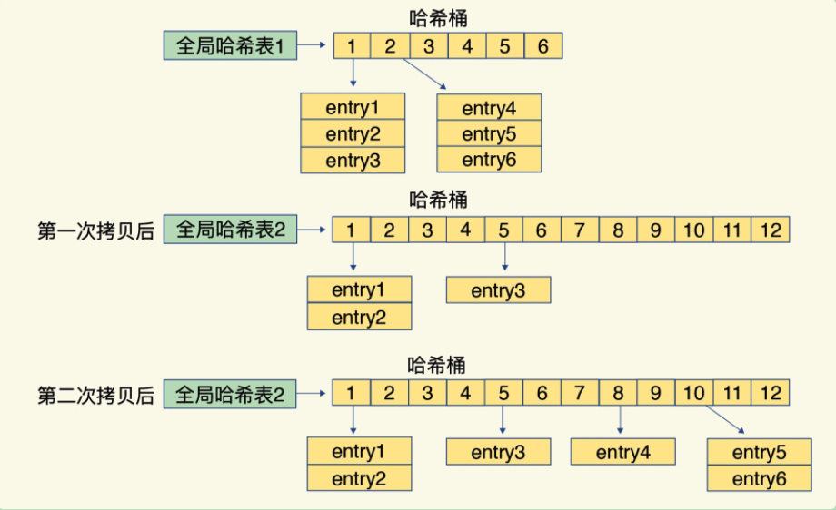

哈希表当数据量不断增加时，他的性能就经常会受到**哈希冲突和 rehash 开销**的影响。两个问题的核心都来自于哈希表要保存的数据量，超过了当前哈希表能容纳的数据量。

redis 的做法：针对哈希冲突，redis 采用了**链式哈希**。对于 rehash 开销，redis 实现了渐进式 rehash 设计。

### 一、哈希表的实现

```
typedef struct dictht {
    dictEntry **table;
    unsigned long size;  // 哈希表大小
    unsigned long sizemask;
    unsigned long used;
} dictht;

typedef struct dictEntry {
    void *key;
    union {
        void *val;
        uint64_t u64;
        int64_t s64;
        double d;
    } v;
    struct dictEntry *next;
} dictEntry;
```

如上是哈希表的实现，

- 哈希表被定义为一个二维数组`(dictEntry** table)`，这个数组的每个元素是一个指向哈希项`(dictEntry)` 的指针。
- redis 在每个 dictEntry 的结构设计中，除了包含指向键和值的指针，还包含了指向下一个哈希项的指针，以实现链式哈希。
- 在 dictEntry 结构体中，键值对的值是一个联合体，包含了指针、无符号的 64 位整数、有符号的 64 位整数、以及 double。这种方式可以节省内存，因为当值为整数或双精度浮点数时，其本身就是 64 位，就可以不用指针指向了，而是直接存在键值对的结构体中，避免了在用一个指针，从而节省了内存。

随着哈希表中链表长度的增加，哈希表查询的耗时会增加，会导致哈希表的性能下降。因此需要 rehash。

### 二、rehash 的过程

哈希表做 rehash 操作，rehash 也就是增加现有的哈希桶数量，让逐渐增多的元素能在更多的桶之间分散保存，减少单个桶中的元素数量，从而减少单个桶中的冲突。

redis 实现的 渐进式 rehash 操作，全局有默认有两个哈希表，一开始，当刚插入数据时，默认使用哈希表 0，此时的哈希表 1 并没有被分配空间。`装载因子 = 哈希表中所有项的个数 / 哈希表中哈希桶个数`。Redis 触发 rehash 操作的条件：

1. 装载因子 >= 5 ：立刻开始做 rehash
2. 装载因子 >= 1：允许进行rehash，但如果在进行 RDB生成和AOF重写时，哈希表的rehash 是被禁止的，为了避免对 RDB 和 AOF 重写造成影响
3. 装载因子 < 0.1 时：程序自动开始对哈希表执行收缩操作
4. redis 会执行定时任务，在 rehash 被触发后，即使没有收到新请求，Redis 也会定时执行一次 rehash 操作，而且，每次执行时长不会超过 1 ms，以免对其他任务造成影响。

Redis 执行 rehash，这个过程如下：

1. 给哈希表 1 分配空间，这个哈希表的空间大小取决于要执行的操作，以及哈希表 0 当前包含的键值对数量，假设为 m。
   - 如果执行的是扩展操作，那么哈希表 1 的大小为第一个大于等于 “2m” 的 `2^n`。就是在 2 的 n 次方中选一个值，大于等于 "2m" 即可。
   - 如果执行的是收缩操作，那么哈希表 1 的大小为第一个大于等于 m 的 `2^n`
2. 如果一次性将数据从哈希表 0 迁移到 哈希表 1，由于大量的数据拷贝，会造成 Redis 线程阻塞，无法服务其他请求，导致 Redis 就无法快速访问数据了。因此不可取。
3. redis 会在哈希表中维持一个索引计数器变量 rehashidx，并将它的值置为 0，表示 rehash 的工作正式开始
4. 在 rehash 进行期间，每次对字典执行添加、删除、查找或者更新操作时，程序除了执行指定的操作以外，还会顺带将哈希表 0 在 rehashidx 索引上的所有键值对 rehash 到哈希表 1，当 rehash 工作完成后，程序将 rehashidx 的值增加一。
5. 随着哈希表操作的不断执行，或者定时 rehash 任务的执行，最终在某个时间点上，哈希表 0 的所有键值对都会被 rehash 到哈希表 1，这时 redis 会把 rehashidx 的值设置为 -1，表示 rehash 操作已经完成。
6. 然后将哈希表 1 的地址赋值给 哈希表 0，释放哈希表 1 的空间。此时又回到正常服务请求的阶段，哈希表 0 接收和服务请求，哈希表 1 作为下一次 rehash 的迁移表。
7. 需要注意的是，在渐进式 rehash 进行期间，哈希表的删除、查找、更新等操作会在两个哈希表上进行。例如：要在哈希表中查找一个键的话，程序会先在哈希表 0 中进行查找，如果没找到的话，就会继续到哈希表 1 中进行查找。并且新增加到哈希表中的键值对一律会被保存到哈希表 1 中，而哈希表 0 则不再进行任何添加操作，这一措施保证了哈希表 0 包含的键值对数量会只减不增，并随着 rehash 操作的执行最终变成空表。

