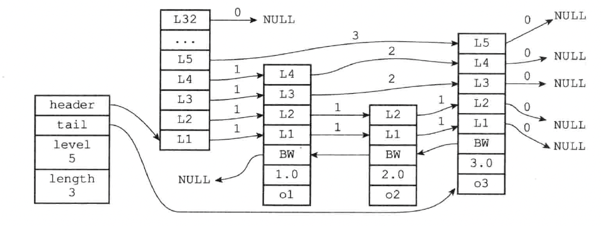

跳表的查询、插入、删除的平均时间复杂度为 `O(logN)`

#### 为什么 Redis 选择使用跳表而不是红黑树来实现有序集合？

Redis 中的有序集合(zset) 支持的操作：

1. 插入一个元素
2. 删除一个元素
3. 查找一个元素
4. 有序输出所有元素
5. 按照范围区间查找元素（比如查找值在 [100, 356] 之间的数据）

其中，前四个操作红黑树也可以完成，且时间复杂度跟跳表是一样的。但是，按照区间来查找数据这个操作，红黑树的效率没有跳表高。按照区间查找数据时，跳表可以做到 O(logn) 的时间复杂度定位区间的起点，然后在原始链表中顺序往后遍历就可以了，非常高效。

### 一、概述

跳表的结构定义：

```
typedef struct zskiplistNode {
		// 元素
    sds ele;
    // 元素权重值
    double score;
    // 后向指针
    struct zskiplistNode *backward;
    // 节点的 level 数组，保存每层上的前向指针和跨度
    struct zskiplistLevel {
    		// 前向指针
        struct zskiplistNode *forward;
        // 跨度
        unsigned long span;
    } level[];
} zskiplistNode;

typedef struct zskiplist {
		// 表头节点和表尾节点
    struct zskiplistNode *header, *tail;
    // 记录跳跃表的长度，也即跳表目前包含节点的数量（表头节点不计算在内）
    unsigned long length;
    // 目前跳表内，层数最大的那个节点的层数（表头节点的层数不计算在内）
    int level;
} zskiplist;
```



解释下 “跳表” 字段的含义。

- 跳表的 header 和 tail 分别指向跳表的表头节点和表尾节点
- level 记录目前跳表内，层数最大的那个节点的层数（表头节点的层数不计算在内）
- length 记录跳表的长度，也就是跳表目前所包含节点的数量（表头节点不计算在内）

在解释下 “跳表节点” 的字段含义。

**层和跨度**：

节点中用 L1、L2、L3 等来标记节点的各个层，L1 代表第一层，L2 代表第二层，以此类推。

每个层都带有两个属性：前进指针和跨度。前进指针用于访问位于表尾方向的其他节点，而跨度则记录了前进指针所指向节点和当前节点的距离。

每次创建一个新跳表节点时，程序都根据幂次定律（越大的数出现的概率越小）随机生成一个介于 1 和 32 之间的值作为 level 数组的大小，这个大小就是层的高度。一般来说，层的数量越多，访问其他节点的速度越快。

层的跨度用来记录两个节点之间的距离。跨度实际上是用来计算排位的：在查找某个节点的过程中，将沿途访问过的所有层的跨度累计起来，得到的节点就是目标节点在跳表中的排位。

**后退指针**：节点中使用 BW 来标记节点的后退指针，他指向位于当前节点的前一个节点。后退节点在程序从表尾向表头遍历时使用。

**分值（score）**：也称为权重。各个节点中的 1.0、2.0、3.0 是节点所保存的分值。在跳表中，节点按各自所保存的分值从小到大排列。

**成员（ele）**：各个节点中的 o1、o2 和 o3 是节点所保存的成员对象，他是一个字符串对象。


## 二、一种详细的实现方法

#### 1. 跳表查询时间复杂度以及空间复杂度

##### <1>. 跳表的查询时间复杂度

查找元素的过程是从最高级索引开始，一层一层遍历最后下沉到原始链表。所以，时间复杂度 = 索引的高度 * 每层索引遍历元素的个数

先来求跳表的索引高度。假设每两个结点会抽出一个结点作为上一级索引的结点，原始的链表有n个元素，则一级索引有n/2 个元素、二级索引有 n/4 个元素、k级索引就有 `n/(2^k)`个元素。最高级索引一般有2个元素，即：最高级索引 h 满足 `2 = n/(2^h)`，即 `h = logn - 1`，最高级索引 h 为索引层的高度加上原始数据一层，跳表的总高度 `h = logn`。因为跳表的查找一个元素的时间复杂度为 `O(logN)`

##### <2>. 跳表的空间复杂度

假如原始链表包含 n 个元素，则一级索引元素个数为 n/2、二级索引元素个数为 n/4、三级索引元素个数为 n/8 以此类推。所以，索引节点的总和是：`n/2 + n/4 + n/8 + … + 8 + 4 + 2 = n-2`，空间复杂度是 `O(n)`

如果每三个结点抽一个结点做为索引，索引总和数就是 `n/3 + n/9 + n/27 + … + 9 + 3 + 1= n/2`，减少了一半。所以我们可以通过较少索引数来减少空间复杂度，但是相应的肯定会造成查找效率有一定下降，我们可以根据我们的应用场景来控制这个阈值，看我们更注重时间还是空间

但是索引结点往往只需要存储 key 和几个指针，并不需要存储完整的对象，所以当对象比索引结点大很多时，索引占用的额外空间就可以忽略了

#### 2. 跳表插入数据过程

当我们往跳表中插入数据的时候，为了提高查询效率，可以选择将这个数据同时插入到索引层中。我们通过一个随机函数，来决定将这个结点插入到哪几级索引中，比如随机函数生成了值 K，那我们就将这个结点添加到第一级到第 K 级这 K 级索引中。随机函数的选择很有讲究，从概率上来讲，能够保证跳表的索引大小和数据大小平衡性，不至于性能过度退化。

跳表维护索引希望是 随机选 n/2 个元素作为一级索引、随机选 n/4 个元素作为二级索引，随机选 n/8 个元素作为三级索引，依次类推，一直到最顶层索引。这样的话每层索引的元素个数是确定的，且每层索引元素选取的足够随机。

因此需要一个概率算法，就是说当每次有数据插入时，先通过概率算法告诉我们这个元素需要插入到几级索引中，然后开始维护索引并把数据插入到原始链表中。

redis 实现 randomLevel 方法类似如下，该方法会随机生成一个 `1 - MAX_LEVEL` 之间的数（MAX_LEVEL 表示索引的最高层数），且该方法有 1/2 的概率返回 1，1/4 的概率返回 2，1/8 的概率返回 3，依次类推。

- randomLevel 方法返回 1 表示当前插入的该元素不需要建索引，只需要存储数据到原始链表即可（概率 1/2）
- randomLevel 方法返回 2 表示当前插入的该元素需要建一级索引（概率 1/4）
- randomLevel 方法返回 3 表示当前插入的该元素需要建二级索引（概率 1/8）
- 依次类推

举一个例子，假设我们插入元素 6 的时候，randomLevel 方法返回 1，则不会为 6 建立索引。插入 7 的时候，randomLevel 方法返回 3，所以我们需要为元素 7 建立二级索引。当然，当建立二级索引时，同时也会建立一级索引；建立三级索引时，同时也会建立一、二级索引。

因此 一级索引中的元素的个数等于 `[原始链表元素个数] * [randomLevel 方法返回值 > 1 的概率]` 。

- 因为 randomLevel 方法返回值大于 1 就会建索引，凡是建索引，无论几级索引必然有一级索引，所以一级索引中元素个数占原始数据个数的比率为 randomLevel 方法返回值大于 1 的概率。
- 又因为 randomLevel 方法随机生成 `1 - MAX_LEVEL` 的数字，且 randomLevel 方法返回值为 1 的概率为 1/2，则 randomLevel 方法返回值大于 1 的概率为 `1 - 1/2 = 1/2` 。因此上述流程实现了一级索引中元素个数占数据个数的 1/2 

同理，当 randomLevel 方法返回值大于 2 时，会建立二级或二级以上索引，都会在二级索引中增加元素，因此二级索引中元素个数占原始数据的比率为 randomLevel 方法返回值大于 2 的概率。randomLevel 方法返回值大于 2 的概率为 1 减去 randomLevel 方法返回 1 或 2 的概率，即 `1 - 1/2 - 1/4 = 1/4` 。因此二级索引中元素个数占原始数据的 1/4 


因此，我们此概率函数，遵守两个条件：

-  randomLevel 方法随机生成 `1 - MAX_LEVEL` 之间的数（MAX_LEVEL 表示索引的最高层数），且有 1/2 的概率返回 1，1/4 的概率返回 2，1/8 的概率返回 3
-  randomLevel 方法返回 1 不建索引、返回 2 建一级索引，返回 3 建二级索引，依次类推

就可以满足我们想要的结果，一级索引中元素个数占原始数据的 1/2 ，二级索引中元素的个数占原始数据的 1/4，以此类推

#### 代码实现

```java
// 该 randomLevel 方法会随机生成 1~MAX_LEVEL 之间的数，且 ：
//        1/2 的概率返回 1
//        1/4 的概率返回 2
//        1/8 的概率返回 3 以此类推
private int randomLevel() {
  int level = 1;
  // 当 level < MAX_LEVEL，且随机数小于设定的晋升概率时，level + 1
  while (Math.random() < SKIPLIST_P && level < MAX_LEVEL)
    level += 1;
  return level;
}
```

上述中概率 SKIPLIST_P 设置为 1/2，即每个节点抽出一个节点作为上一级索引的节点。如果想要节省空间利用率，可以适当降低代码中的 SKIPLIST_P，从而减少索引元素个数。Redis 的 zset 中 SKIPLIST_P 设定的是 0.25 。如下

```
int zslRandomLevel(void) {
	int level = 1;
	while ((random() & 0xFFFF) < (ZSKIPLIST_P * 0xFFFF) ) 
    	level += 1;
    return (level < ZSKIPLIST_MAX_LEVEL) ? level : ZSKIPLIST_MAXLEVEL;
}
```

因此元素插入单链表的时间复杂度为 O(1)，索引的高度最多为 O(logN)，当插入一个元素 x 时，最坏的情况就是元素 x 需要插入到每层索引中，索引插入数据到各层索引中，最坏时间复杂度为 O(logN) 

#### 举例插入

我们要插入数据 6 到跳表中，首先 randomLevel 返回 3，表示需要建立二级索引，即：一级索引和二级索引需要增加元素 6。该跳表目前最高三级索引，首先找到三级索引的 1，发现 6 比 1大比 13小，所以，从 1 下沉到二级索引。如图


- 下沉到二级索引后，发现 6 比1 大比 7 小，此时需要在二级索引中 1 和 7 之间加一个元素6 ，并从元素 1 继续下沉到一级索引。

  

- 下沉到一级索引后，发现 6 比 1 大比 4 大，所以往后查找，发现 6 比 4 大比 7 小，此时需要在一级索引中 4 和 7 之间加一个元素 6 ，并把二级索引的 6 指向 一级索引的 6，最后，从元素 4 继续下沉到原始链表

  

- 下沉到原始链表后，就比较简单了，发现 4、5 比 6小，7比6大，所以将6插入到 5 和 7 之间即可，整个插入过程结束

  

整个插入过程的路径与查找元素路径类似， 每层索引中插入元素的时间复杂度 O(1)，所以整个插入的时间复杂度是 O(logn)。

#### 3. 跳表删除数据过程

跳表删除数据时，要把索引中对应节点也要删掉。

删除元素的过程跟查找元素的过程类似，只不过在查找的路径上如果发现了要删除的元素 x，则执行删除操作。跳表中，每一层索引其实都是一个有序的单链表，单链表删除元素的时间复杂度为 O(1)，索引层数为 logn 表示最多需要删除 logn 个元素，所以删除元素的总时间包含 *查找元素的时间* 加 *删除 logn个元素的时间* 为 O(logn) + O(logn) = 2 O(logn)，忽略常数部分，删除元素的时间复杂度为 O(logn) 
