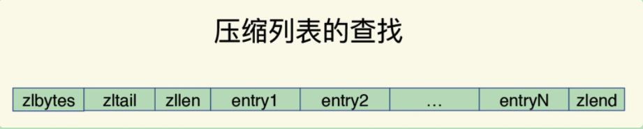
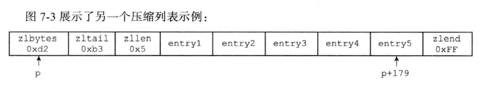
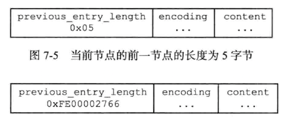
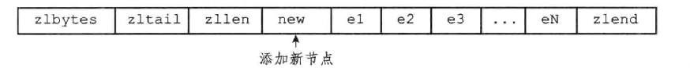

压缩列表（ziplist）是列表键和哈希键的底层实现之一。当一个列表键只包含少量列表项，并且每个列表项要么就是小整数值，要么就是长度比较短的字符串，那么 redis 就会使用压缩列表来做列表键的底层实现。

压缩列表是由一系列特殊编码的连续内存块组成顺序型数据结构。一个压缩列表可以包含任意多个节点（entry），每个节点可以保存一个字节数组或者一个整数值。

- zlbytes，4 字节。记录整个压缩列表占用的内存字节数。在对压缩列表进行内存重分配，或者计算 zlend 的位置时使用
- zltail，4 字节，记录压缩列表表尾节点距离压缩列表的起始地址有多少字节：通过这个偏移量，程序无需遍历整个压缩列表就可以确定表尾节点的地址
- zllen，2 字节，记录了压缩列表包含的节点数量：当这个属性的值小于 `UINT16_MAX`（65535）时，这个属性的值就是压缩列表包含节点的数量；当这个值等于 `UINT16_MAX` 时，节点的真实数量需要遍历整个压缩列表才能计算得出
- entryX，列表节点，占用长度不定。压缩列表包含的各个节点，节点的长度由节点保存的内容决定
- zlend，1字节，存储特殊值 `0xFF`，用于标记压缩列表的末端

我们举一个例子来说明一下：

- zlbytes 为 `0xd2`，十进制为 210，表示压缩列表的总长为 210 字节
- zltail 为 `0xb3`，十进制为 179，表示如果我们有一个指向压缩列表起始地址的指针 p，那么只要用指针 p 加上偏移 179，就可以计算出表尾节点 entry5 的地址
- 列表 zllen 属性的值为 `0x5`，十进制为 5，表示压缩列表包含 5 个节点

### 一、压缩列表节点的构成

每个压缩列表节点可以保存一个字节数组或者一个整数值。其中，字节数组可以是以下三种长度之一：

- 长度小于等于 63（`2^6 - 1`）字节的字节数组
- 长度小于等于 16383（`2^14 - 1`）字节的字节数组
- 长度小于等于 `2^32 - 1` 字节的字节数组

而整数值则可以是以下六种长度之一：

- 4 位长，介于 0 至 12 之间的无符号整数
- 1 字节长的有符号整数
- 3 字节长的有符号整数
- `int16_t` 类型整数、`int32_t` 类型整数、`int64_t` 类型整数

每个压缩列表节点都由 `previous_entry_length、encoding、content` 三个部分组成。

#### 1. previous_entry_length

previous_entry_length 记录了压缩列表中前一个节点的长度。这个属性可以是 1 字节或者 5 字节。

- 如果前一节点的长度小于 254 字节，那么 previous_entry_length 的长度为 1 字节。
- 如果前一节点的长度大于等于 254 字节，那么 previous_entry_length 的长度为 5 字节。其中第一字节被设置为 `0xFE`（十进制为 254），而之后的四个字节用于保存前一节点的长度。

因为 previous_entry_length 属性记录了前一个节点的长度，所以可以根据当前节点的起始地址来计算出前一个节点的起始地址。压缩列表从表尾向表头遍历操作就是使用这一原理实现的。

#### 2. encoding

节点的 encoding 属性记录了节点的 content 属性所保存数据的类型以及长度：

- 一字节、两字节或者五字节长，值的最高位为 00、01 或者 10 的是字节数组编码：这种编码表示节点的 content 属性保存着字节数组，数组的长度由编码除去最高两位之后的其他位记录
- 一字节长，值的最高位以 11 开头的是整数编码：这种编码表示节点的 content 属性保存着整数值，整数值的类型和长度由编码除去最高两位之后的其他位记录。

#### 3. content

节点的 content 属性负责保存节点的值，节点值可以是一个字节数组或者整数，值的类型和长度由节点的 encoding 属性决定。

### 二、连锁更新

假设一个压缩列表中，有多个连续的、长度都介于 250 字节到 253 字节，所以记录这些节点的长度的 previous_entry_length 属性都是 1 字节。这时，我们将一个长度大于等于 254 字节的新节点 new 设置为压缩列表的表头节点，new 将成为 e1 的前置节点。此时就需要扩充 e1 节点的 previous_entry_length 属性为 5 字节。扩充之后，e1 节点的长度超过了 254 字节，又引发了 e2 节点的扩充，以此类推，后面的节点都需要扩充。

这就引起了连锁更新，需要不断对压缩列表执行空间重分配操作，直到最后一个节点为止。

连锁更新在最坏情况下需要对压缩列表执行 N 次空间重分配操作，而每次空间重分配的最坏时间复杂度为 `O(N)`，所以连锁更新的最坏时间复杂度为 `O(N^2)`。

尽管连锁更新的时间复杂度较高，但他真正造成性能问题的几率是很低的：

- 首先，压缩列表里要恰好有多个连续的、长度介于 250 字节至 253 字节之间的节点，连锁更新才有可能被引发，在实际中，这种情况并不多见
- 其次，即使出现连锁更新，但只要被更新的节点数量不多，就不会对性能造成影响

### 三、优缺点

- 优点：紧凑的内存布局来保存数据，节省了内存空间
- 缺点：查找中间元素的时间复杂度较高，需要从列表头或列表尾遍历才可以。如果 ziplist 里面保存的是字符串，ziplist 在查找某个元素时，还需要逐一判断元素的每个字符，这样又进一步增加了复杂度。
- 缺点：ziplist 在插入元素时，如果内存空间不够了，ziplist 还需要重新分配一块连续的内存空间，而这还会进一步引发连锁更新的问题