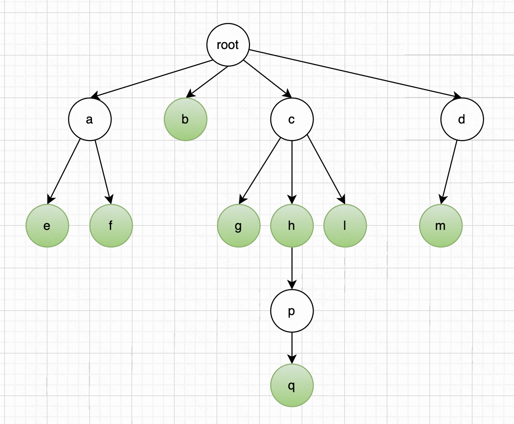
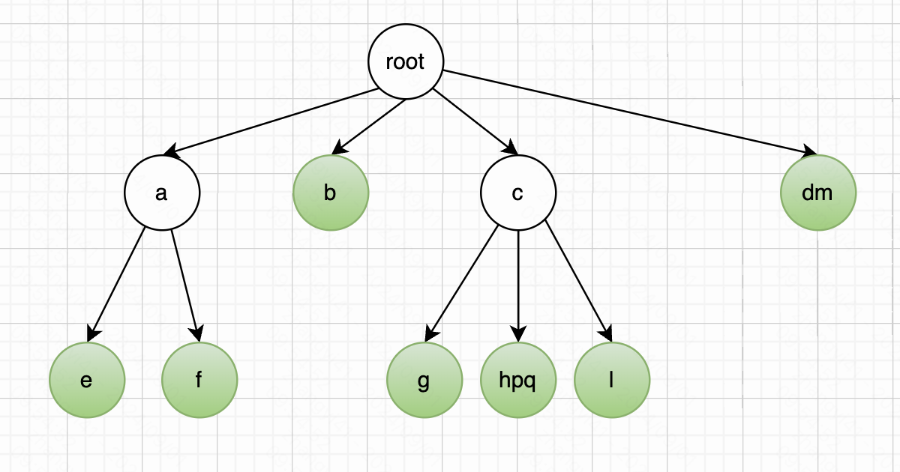
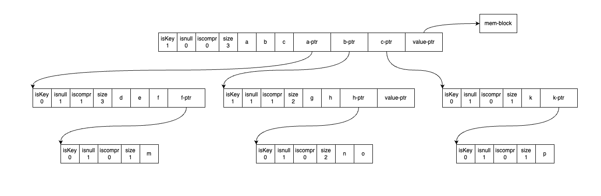

本文基于 redis 源码 7.4.0 版本。

快速列表的实现在文件 `rax.h`、`rax.c` 中。

### 一、概述

#### 1. 字典树（`Trie Tree`）

我们先来看看字典树（`Trie Tree`），也称为 “前缀树”。

字典树是对词典的一种存储方式，这个词典中的每个单词就是从根节点出发一直到某一个目标节点的路径，路径中每个字母连起来就是一个单词。因此他可以利用字符串的公共前缀来节省存储空间。



上图中的绿色节点是一个标识，表示有单词在这里结束。因此如上图所示，可以匹配的字符串有：

```
ae、af、b、cg、ch、chpq、ci、dm、dn
```

字典树有这样的问题：

- 我们从图中可以看出，有许多节点只有一个子节点。比如 dm 等，这种情况不仅增加了树的高度，影响了查询效率，而且还浪费了存储空间。如果将这些节点合并成一个节点，则可以解决这个问题。这就是 radix 树的由来。

#### 2. 压缩字典树（`Radix Tree`）

radix 树，也称为基数树，或者压缩字典树。radix 树将只有一个子节点的中间节点压缩，使之具有更加合理的内存使用和查询的效率。

radix 树常用于快速查找的场景中。例如：redis 中 stream 的实现、大多数 http 的 route 通过 radix 管理路由。



和 trie-tree 相比，radix 树有这样的优缺点：

- 优点：查询的时候，可以一次比较多个字符，提高效率
- 缺点：在插入和删除节点时，radix 树多了一个压缩和展开的过程，如上图，我们插入一个 dn 单词，那么现在的 dm 就需要展开。

### 二、redis 中的实现

先来看看单个节点的定义，如下

```c
typedef struct raxNode {
    uint32_t iskey:1;     /* Does this node contain a key? */
    uint32_t isnull:1;    /* Associated value is NULL (don't store it). */
    uint32_t iscompr:1;   /* Node is compressed. */
    uint32_t size:29;     /* Number of children, or compressed string len. */
    unsigned char data[];
} raxNode;
```

单个节点 raxNode 占用 4 个字节。其中 data 字段是一个柔性数组，不算在 raxNode 节点的长度中。

- isKey 字段：占用 1 位，表示从 Radix Tree 的根节点到当前节点路径上的字符组成的字符串，是否表示了一个完整的 key。如果是的话，那么 isKey 的值为 1。否则，isKey 的值为 0。
- isnull 字段：占用 1 位，表示关联的内存块指针是否为空，如果为空的话将不存储这个指针。
- iscompr 字段：占用 1 位，节点的数据是否被压缩。反应的是当前节点的子节点个数，如果被压缩了则只有一个子节点。如果未被压缩则有多个子节点。
- size 字段：占用 29 位，如果数据未压缩，表示子节点的数量。如果数据被压缩了，表示数据的长度。
- data 字段：是一个柔性数组，存储的是数据和子节点的指针，以及关联数据块的指针。

下面重点展开说一下 data 字段存储的内容，以及不同的参数，可能产生的不同的结果。



当节点未被压缩（`iscompr=0`），将有 size 个字节，每个字符一个字节，放在 data 字段的数组中。以及 size 个 raxNode 指针，指向各自的子节点。

当节点被压缩了（`iscompr=1`），则当前节点只有一个 raxNode 指针，指向子节点。size 表示有多少个字符。

无论是压缩节点还是未压缩节点，都可以带有一个关联的数据键。如果 `iskey=1` 并且 `isnull=0` ，那么 data 数组的最后，会额外存在一个值指针。这也意味着节点不仅可以指向其他子节点，还可以直接关联一个值，这个值可能是与键相关的数据。这种设计允许在树的任意位置存储键值对，而不仅仅是在叶子节点上。


## 小结

Radix Tree 在保存具有公共前缀的数据时，能有效节省内存开销。同时，Radix Tree 本身也是有序的树型索引，可以支持单点和范围查询。


