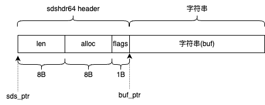

本文基于 redis 源码 7.4.0 版本。

字符串是 redis 中最基本的数据。实现在 `sds.h / sds.c` 文件中。

比如我们使用 redis 命令：`set key_name value_name`。其中 key_name 就是一个字符串。接下来我们看一下 redis 是如何存储这个字符串的。

### 一、头部结构定义

首先根据字符串长度划分五种类型。这个类型将作为最终存储的头部。使用多种不同类型的头部结构目的就是尽可能减少内存占用。

- 字符串长度小于 `1<<5`，使用 `sdshdr5`
- 字符串长度小于 `1<<8`，使用 `sdshdr8`
- 字符串长度小于 `1<<16`，使用 `sdshdr16
- 字符串长度小于 `1<<32`，使用 `sdshdr32`
- 否则，使用 `sdshdr64`

这五种类型的定义如下：

```c
struct __attribute__ ((__packed__)) sdshdr5 {
    unsigned char flags; /* 3 lsb of type, and 5 msb of string length */
    char buf[];
};
struct __attribute__ ((__packed__)) sdshdr8 {
    uint8_t len; /* used */
    uint8_t alloc; /* excluding the header and null terminator */
    unsigned char flags; /* 3 lsb of type, 5 unused bits */
    char buf[];
};
struct __attribute__ ((__packed__)) sdshdr16 {
    uint16_t len; /* used */
    uint16_t alloc; /* excluding the header and null terminator */
    unsigned char flags; /* 3 lsb of type, 5 unused bits */
    char buf[];
};
struct __attribute__ ((__packed__)) sdshdr32 {
    uint32_t len; /* used */
    uint32_t alloc; /* excluding the header and null terminator */
    unsigned char flags; /* 3 lsb of type, 5 unused bits */
    char buf[];
};
struct __attribute__ ((__packed__)) sdshdr64 {
    uint64_t len; /* used */
    uint64_t alloc; /* excluding the header and null terminator */
    unsigned char flags; /* 3 lsb of type, 5 unused bits */
    char buf[];
};
```

注意：在 redis 7.4.0 中，`sdshdr5` 结构已经被弃用，现在最小的会使用 `sdshdr8` 结构。

其中 ` __attribute__ ((__packed__))` 的作用就是告诉编译器取消结构在编译过程中的优化对齐,按照实际占用字节数进行对齐，是GCC特有的语法。比如 `sdshdr64` 就占用 17 字节(64位机器)。

如上的结构，我们也把他称为 “柔性数组”，有时候需要在结构体中存放一个动态长度的字符串，一般的做法，是在结构体中定义一个指针成员，这个指针成员指向该字符串所在的动态内存空间。如上结构中的 buf 成员就是做这个事情的，这个 buf 成员并不占用结构体内存。

### 二、创建 SDS 结构

在获取到字符串、以及字符串的长度之后。确认好头部结构之后，就可以使用 malloc 申请堆内存。redis 中使用的 malloc 可以自定义，并且可以按照机器环境(mac、windows、linux等)的不同选择对应的 malloc。比如 jemalloc、tcmalloc、ptmalloc等。

在申请内存之后，会通过 `malloc_size` 获取申请的内存块的实际分配的内存大小。

申请的内存大小为：`头部长度 + 原始字符串长度 + 1`。我以 `sdshdr64` 作为头部举例。如下图就是内存布局。



然后给申请的内存块的不同部位进行填充数据。

- sdshdr64 header 中的 len 位置：填充用户设定的字符串长度。占用8个字节
- sdshdr64 header 中的 alloc 位置：填充实际申请的内存大小 - （sdshdr64 header 的空间大小） - 1。占用 8个字节
- sdshdr64 header 中的 flags 位置：填充类型，比如：sdshdr64 的类型为 SDS_TYPE_64，占用1个字节
- buf 位置：将用户传入的字符串，拷贝到 buf 位置。不要忘记在字符串的末尾增加一个 `\0` 

最后返回 buf 位置的 buf_ptr 指针，不包括 sdshdr64 header 头部。指针类型是 sds，其实就是 `char*`。

如上的流程，就是根据用户传入的字符串、以及字符串长度，创建的一个 sds 结构。

>为什么申请的内存大小为：`头部长度 + 原始字符串长度 + 1`，这个额外的 1 个字节用来干嘛？
>
>在 C 语言中的字符串，是以 '\0' 结尾的，这个 '\0' 需要占用 1 个字节。因此需要额外申请。
>
>注意：这个额外的 '\0' 不包含在头部结构的 len 中。

我们使用 sds_ptr 指针表示整体的内存空间，即包括：header、存储字符串的空间。使用 buf_ptr 指针表示 存储字符串的空间。后文也使用这个定义来阐述。

### 三、释放 SDS 结构空间

当需要释放 SDS 结构时，因为之前返回的是 buf 位置的指针，不包括头部空间。此指针类型是 `char*`。所以我们拿到这个指针 buf_ptr 后。

- 通过 `buf_ptr[-1]` 获取到以当前位置为基准，上一个字节位置的数据。这里的 -1 表示的是偏移量。由于类型为 char*，所以偏移 1 个字节。
- 偏移 1 个字节后的位置即为 flags 位置。这个位置存储的为 header 的类型。比如 SDS_TYPE_64。
- 然后通过这个类型获取到 header 的内存长度。然后 buf 位置的指针 buf_ptr 减去 header 内存长度，即为 SDS 结构起始位置的指针。
- 拿到 SDS 结构起始位置指针后，我们就可以调用 free 来释放内存空间了。

### 四、扩展 SDS 结构的内存空间

有的时候，我们更新了字符串，字符串的长度也随之变化了。字符串长度变化后，头部结构也可能会随之变化，以适用新的存储长度。

因为我们暴露出来的是 buf_ptr 指针。因此当我们拿到 buf_ptr 指针时，buf_ptr 指针的类型实际上是 `char*`。我们向前偏移一位，即可找到前一个字节。而前一个字节存储是 flags，表示的是头部类型。而通过头部类型可以获取到头部结构，以及头部结构的长度。到这里，我们获取到了头部结构，从而得到了 “用户设定的字符串长度”、“实际申请的内存大小”。

这个时候，如果要扩充，或者压缩内存空间。通过传入的长度重新选择对应的头部类型。

如果 “新选择的头部类型和原来的一致” 或者 “新头部类型比原来的小”：

- 此时，头部结构不变，依旧使用老的头部结构。
- 新的内存大小为：老的头部结构大小 + 新的字符串长度 + 1
- 使用 realloc 在 sds_ptr 指针的位置处，获取新的内存大小。

否则：

- 使用新的头部结构
- 新的内存大小为：新的头部结构大小 + 新的字符串长度 + 1
- 使用 malloc 重新申请内存，使用新的内存大小
- 然后把老的字符串 拷贝到 新的内存空间
- 释放老的内存空间
- 并设置头部结构中的 flags 字段（头部结构的类型）

执行完上述操作后，需要在字符串的末尾加上 '\0'。同时设置头部结构的 len、alloc 字段。
