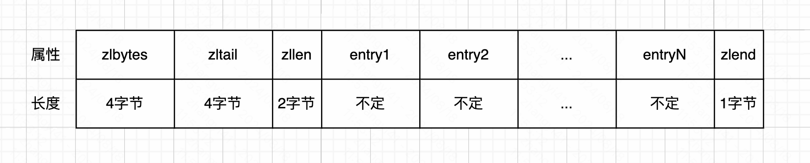
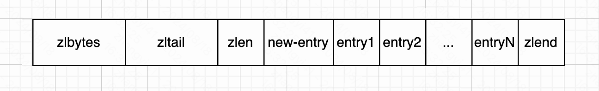
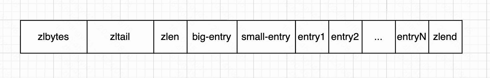

本文基于 redis 源码 7.4.0 版本。

压缩列表的实现在 `ziplist.h` 和 `ziplist.c` 中。压缩列表是 redis 中 列表和哈希的底层实现之一。压缩列表的使用场景如下：

- 当一个列表只包含少量列表项，并且每个列表项要么是小整数值，要么是长度比较短的字符串，那么 redis 就会使用压缩列表来做列表键的底层实现。
- 当一个哈希只包含少量键值对，并且每个键值对的键和值要么就是小整数值，要么就是长度比较短的字符串，那么 redis 就会使用压缩列表来做哈希键的底层实现。

压缩列表可以非常有效的利用内存，他可以存储字符串和整数值。在列表的任意一侧进行 push 或者 pop 操作的时间复杂度为 `O(1)`。但是由于每个操作都需要重新分配压缩列表所使用的内存，实际的复杂度也与压缩列表占有的内存相关。

### 一、基本结构

如下展示压缩列表的组成结构。

其中字段的含义做一下解释：

- zlbytes：记录整个压缩列表占用的内存字节数
- zltail：记录压缩列表表尾节点距离压缩列表的起始地址有多少字节
- zllen：记录了压缩列表包含的节点数量。当这个属性的值小于 `UINT16_MAX`(65535) 时，这个属性的值就是压缩列表包含节点的数量；当这个值等于 `UINT16_MAX`(65535) 时，节点的真实数量需要遍历整个压缩列表才能计算出来
- entryX：是列表节点，长度不定。
- zlend：是一个特殊值 `OXFF`，用于标识压缩列表的末尾。

### 二、压缩列表节点的结构

每个压缩列表节点可以保存一个整数值或者一个字符串。节点的结构定义如下所示

 

我们来介绍下这三个字段的含义

#### 1. prevlen 字段

prevlen 字段记录了压缩列表中前一个节点的长度。prevlen 字段的长度可以是 1字节或者 5 字节。

- 如果前一字节的长度小于 254 字节，那么 prevlen 字段的长度为 1 字节。并且前一字节的长度就保存在这一个字节中。
- 如果前一字节的长度大于等于 254 字节，那么 prevlen 字段的长度为 5 字节。其中 prevlen 字段的第一字节会被设置为 `OxFE`（十进制为254），而之后的四个字节则用于保存前一节点的长度。

#### 2. encoding 字段

encoding 字段记录了节点的 entry-data 字段所保存数据的类型以及长度。

- 当 entry-data 为字符串时，encoding 字段的第一个字节的前 2 位将保存编码类型（包括：00、01、10）
- 当 entry-data 为整数时，encoding 字段的第一个字节的前 2 位设置为 1（包括：11）

因此我们通过 encoding 字段的第一个字节，总能确认 entry-data 的类型。

##### (1). 当 entry-data 为字符串时，encoding 的存储内容。

- 当 encoding 字段为 `00xxxxxx` 时，占用 1 字节

此时 entry-data 保存的数据为小于等于 63 字节（6位）的字符串。其中 00 表示类型，后面的 6 位表示字符串的长度。

- 当 encoding 字段为 `01xxxxxx xxxxxxxx` 时，占用 2 字节

此时 entry-data 保存的数据为小于等于 16383 字节（14位）的字符串。其中 01 表示类型，后面的 14 位表示字符串的长度。不过需要注意的是，这 14 位以 “大端” 的方式存储

- 当 encoding 字段为 `10000000 xxxxxxxx xxxxxxxx xxxxxxxx xxxxxxxx` 时，占用 5 字节

此时 entry-data 保存的数据大于等于 16384 字节的字符串。只有第一个字节之后的 4 个字节表示长度，长度最大为 `2^32-1`。第一个字节的低6位不被使用，会被设置为0。同样的，后4个字节以“大端”方式存储。

##### (2). 当 entry-data 为整形时，encoding 的存储内容

| encoding 字段 | entry-data 保存的数据                                        |
| ------------- | ------------------------------------------------------------ |
| 11000000      | 此时 entry-data 保存的整形数据类型为 `int16_t`               |
| 11010000      | 此时 entry-data 保存的整形数据类型为 `int32_t`               |
| 11100000      | 此时 entry-data 保存的整形数据类型为 `int64_t`               |
| 11110000      | 此时 entry-data 保存的整形数据类型为 24 位有符号的整数       |
| 11111110      | 此时 entry-data 保存的整形数据类型为 8 位有符号的整数        |
| 1111xxxx      | xxxx 的取值在 0001 和 1101 之间，也就是 1-13 之间。是因为 0000、1110、1111 不能使用，所以最终表示的是一个无符号的 0-12 之间的整数。 使用这一编码的节点没有相应的 entry-data 字段，因为编码本身的 xxxx 四位已经保存了一个 0-12 之间的值，所以无须 entry-data 字段。 |
| 11111111      | 特殊的 entry-data                                            |

注意，所有的整形都是以 “小端序” 方式进行存储的。

#### 3. entry-data 字段

entry-data 字段保存具体的数据，可以是一个字符串或者整数。类型和长度有 encoding 字段决定。

### 三、连锁更新

压缩列表中每个节点的 prevlen 字段都记录了前一个节点的长度。我们举一个场景，来说明下。

在一个压缩列表中，有多个连续的、长度介于 250 字节到 253 字节之间的节点 entry1 到 entryN。

因为 entry1 到 entryN 所有节点的长度都小于 254 字节，所以这些节点的 prevlen 字段的长度只需要 1 字节即可。

这时，如果将一个长度大于等于 254 字节的新节点(`new-entry`)插入到压缩列表的头部，如下：

 

因为 entry1 的 prevlen 字段仅长 1 字节，没办法保存新节点 new-entry 的长度，所以需要对压缩列表执行空间重分配操作，并将 entry1 节点的 prevlen 字段从 1 字节扩展到 5 字节长。

entry1 原来的长度介于 250 字节到 253 字节之间，现在 prevlen 字段扩充之后，entry1 的长度就变成了 254 字节到 257 字节之间了。而这个长度使用 1 字节长的 prevlen 是无法保存的，因此 entry2 的 prevlen 字段需要从 1 字节扩充到 5 字节，这时 entry2 的长度又变成了 254 字节到 257 字节了。进而影响到了 entry3。依次类推，压缩列表中所有节点都需要进行扩充。

redis 将这种特殊情况下产生的连续多次空间扩展操作称之为 “连锁更新”（`cascade update`）。

除了添加新节点，删除节点也有可能引发连锁更新。

我们举一个删除节点引发连锁更新的场景。如下，entry1 到 entryN 都是大小介于 250 字节到 253 字节的节点。big-entry 节点的长度大于等于 254 字节，需要 5 字节的 prevlen 来保存，而 small-entry 节点的长度小于 254 字节，只需要 1 字节的 prevlen 来保存。

此时，当我们将 small-entry 节点从压缩列表删除之后，为了让 entry1 的 prevlen 字段可以记录 big-entry 节点的长度，就需要更新 entry1 节点的空间，并由此引发之后的连锁更新。

连锁更新在最坏情况下，需要对压缩列表执行 N 次空间重分配操作，而每次空间重分配的最坏复杂度为 `O(N)`，所以连锁更新的最坏复杂度为 `O(N^2)`。

尽管连锁更新的复杂度较高，但他真正造成性能问题的几率是很低的。

- 首先，压缩列表需要恰好多个连续的、长度介于 250 字节到 253 字节之间的节点，连锁更新才有可能被引发，在实际中，这种情况并不多见。
- 其次，即使出现连锁更新，但只要被更新的节点数量不多，就不会对性能造成任何影响。

因此，压缩列表的插入操作的平均复杂度为 `O(N)`。

### 四、小结

压缩列表是一种为了节约内存而出现的顺序型数据结构。

在添加新节点、或者删除节点的时候，可能会引发连锁更新操作，但这种操作出现的几率并不高。

