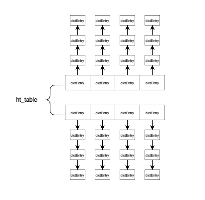

本文基于 redis 源码 7.4.0 版本。

哈希表的实现在 `sds.h / sds.c` 文件中。

### 一、基本的数据结构

redis 中的哈希系统整体由 dict 结构定义，如下所示：

```c
struct dict {
    dictType *type;

    dictEntry **ht_table[2];
    unsigned long ht_used[2];

    long rehashidx; /* rehashing not in progress if rehashidx == -1 */

    /* Keep small vars at end for optimal (minimal) struct padding */
    unsigned pauserehash : 15; /* If >0 rehashing is paused */

    unsigned useStoredKeyApi : 1; /* See comment of storedHashFunction above */
    signed char ht_size_exp[2]; /* exponent of size. (size = 1<<exp) */
    int16_t pauseAutoResize;  /* If >0 automatic resizing is disallowed (<0 indicates coding error) */
    void *metadata[];
};
```

其中字段的含义：

- type 字段：包含了一系列哈希系统需要用的函数，包含hash函数、key复制、value复制、key比较、key析构、value析构等
- ht_table 字段：他是由两个哈希表实例组成的数组。数组中每个元素是 `dictEntry**` 类型，是一个二级指针，`dictEntry**` 类型其实也可以看成是一个数组，然后这个数组中每个元素是 `dictEntry*` 类型。
- ht_used 字段：哈希表中元素数量
- rehashidx 字段：标识下一个需要扩容的哈希实例的编号。也就是记录了 rehash 目前的进度，如果没有进行 rehash，则为 -1

我们知道了，redis 的哈希系统中，其实有两个哈希表，可以快速切换。如下就是哈希表的定义，使用 “数组+开链” 的形式保存记录。哈希桶下挂的是一个链表，用于解决哈希冲突。每条记录就是链表中的一个节点。

```c
struct dictEntry {
    void *key;
    union {
        void *val;
        uint64_t u64;
        int64_t s64;
        double d;
    } v;
    struct dictEntry *next;     /* Next entry in the same hash bucket. */
};
```

- key 字段：
- val 字段：是一个内联，即这个位置占用 8 字节，可以是 `void*`、uint64、int64、double 类型。用于存储用户数据。
- next 字段：由于哈希桶上是一个链表，所以有一个后向指针指向下一个节点

如下，便是哈希表的结构示意图。



### 二、哈希算法

当要将一个新的键值对添加到哈希表中时，会先根据 key 计算出哈希值和索引值，然后再根据索引值，将包含新的键值对的节点放到哈希表数组的指定索引上。如下伪代码

```
// 根据设置的哈希函数，计算 key 的哈希值
hash = d->type->hashFunction(key);
// 使用哈希表的 MASK 属性和 hash 值，计算出索引值
idx = hash & DICTHT_SIZE_MASK(d->ht_size_exp[0]);
```

现在的版本已经使用 MurmurHash3 哈希算法了，这种算法的优点在于，即使输入的键是有规律的，算法仍能给出一个很好的随机分布性，并且算法的计算速度也是比较快的。

### 三、rehash 的流程

哈希表在使用的过程中，由于元素的增多或者减少，可能需要进行重新分配内存块大小。用于减少哈希冲突或者节省内存。

#### 1. 负载因子

什么情况会对哈希表执行扩展操作：

- 服务器目前没有在执行 BGSAVE 命令或者 BGREWRITEAOF 命令，并且哈希表的负载因子大于等于 1
- 服务器目前正在执行 BGSAVE 命令或者 BGREWRITEAOF 命令，并且哈希表的负载因子大于等于 5

什么情况会对哈希表执行收缩操作：

- 当哈希表的负载因子小于 0.1 时，会自动对哈希表执行收缩操作

负载因子一般的计算方式是：哈希表中已保存的节点数量 / 哈希表大小

#### 2. rehash

扩展和收缩哈希表的 rehash 操作步骤如下：

- 为哈希系统中 `ht_table[1]` 哈希表分配空间，空间大小取决于 `ht_table[0]` 当前包含的键值对数量（也就是 `ht_used[0]`的属性值）。
  - 如果执行的扩展操作，那么 `ht_table[1]` 的大小为第一个大于等于 `ht_used[0]*2` 的 2 的 N 次幂。
  - 如果执行的是收缩操作，那么 `ht_table[1]` 的大小为第一个大于等于 `ht_used[0]` 的 2 的 N 次幂。

- 将保存在 `ht_table[0]` 中的所有键值对 rehash 到 `ht_table[1]` 上面：rehash 指的是重新计算键的哈希值和索引值，然后将键值对放置到 `ht_table[1]` 哈希表的指定位置上。
- 当 `ht_table[0]` 包含的所有键值对都迁移到 `ht_table[1]` 之后，此时 `ht_table[0]` 变成了空表，释放 `ht_table[0]`。然后将 `ht_table[1]` 设置为 `ht_table[0]`，并在 `ht_table[1]` 新创建一个空白哈希表，为下一次 rehash 流程做准备。

需要注意的是，将 `ht_table[0]` 中的所有键值对 rehash 到 `ht_table[1]` 里面。这个 rehash 的动作并不是一次性、集中式的完成的，而是分多次、渐进式的完成的。如下是详细步骤：

- 为 `ht_table[1]` 分配空间，让哈希系统同时持有 `ht_table[0]` 和 `ht_table[1]`两个哈希表
- 在哈希系统中维护一个索引计数器变量 rehashidx，并将他的值设置为 0，表示 rehash 操作正式开始
- 在 rehash 进行的过程中，每次对哈希系统的操作（增/删/改/查），除了执行指定的操作之外，还会顺带将 `ht_table[0]` 哈希表在 rehashidx 索引上的所有键值对 rehash 到 `ht_table[1]`，当 rehash 操作完成之后，会将 rehashidx 属性的值增一。
- 随着哈希系统操作的不断执行，最终会在某个时间点上，`ht_table[0]` 的所有键值对都会被 rehash 到 `ht_table[1]`，这时将 rehashidx 属性的值设置为 -1，表示 rehash 操作已经完成。

rehash 过程中哈希表的操作

- 哈希系统在渐进式 rehash 的过程中，哈希系统会同时使用 `ht_table[0]` 和 `ht_table[1]` 两个哈希表，哈希系统的删除、查找、更新操作会在两个哈希表上进行。比如，要在哈希系统中查找一个键的话，会先在 `ht_table[0]` 中进行查找，如果没有找到的话，就会继续到 `ht_table[1]` 中查找
- 哈希系统在渐进式 rehash 的过程中，新添加到哈希系统的键值对一律会被保存到 `ht_table[1]` 中，`ht_table[0]` 不会做热和添加操作。这样，就可以保证 `ht_table[0]` 中的键值对数量会只减不增，并随着 rehash 操作的执行而变成空表。

### 四、小总结

- 哈希表使用 “哈希桶+单链表” 的形式来解决哈希冲突
- 在对哈希表进行扩展或者收缩操作时，采用的是渐进式 rehash 的方式。这样做，可以有效降低 rehash 操作对系统性能的影响，使系统在扩容过程中能够保证稳定性和高性能，从而提升了系统的可用性和稳定性。
