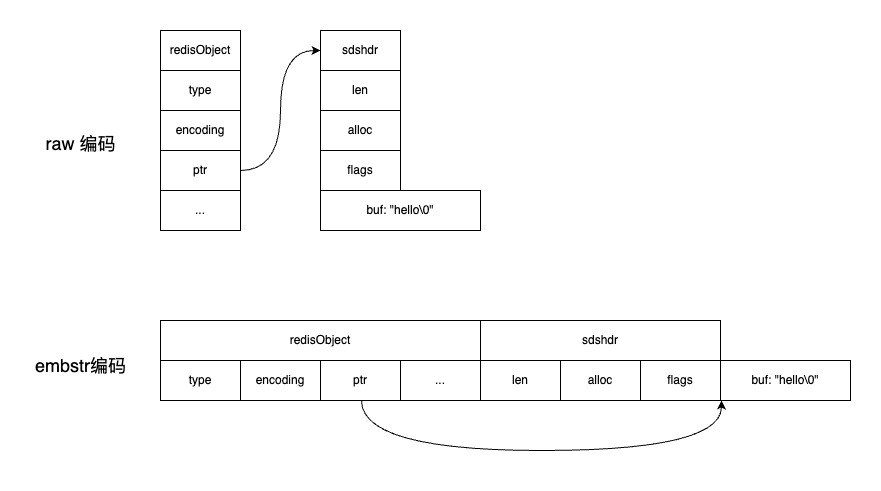

本文基于 redis 源码 7.4.0 版本。

字符串对象的实现在文件 `t_string.c` 中。

### 一、字符串对象的编码

字符串对象的编码可以是：`OBJ_ENCODING_INT`（整型）、`OBJ_ENCODING_RAW`（SDS类型的动态字符串）、`OBJ_ENCODING_EMBSTR`（更加紧凑的字符串）。

redis 对字符串对象做了节省空间的操作，比如 set 命令，在保存键值对的值对象时，会判断他的类型，然后选择合适的编码。源码的实现流程如下，函数调用流程：

```
setCommand -> tryObjectEncoding -> tryObjectEncodingEx
```

- 默认的字符串对象使用 `OBJ_ENCODING_RAW` 编码方式，他就是一个 SDS 类型的动态字符串结构。然后当要保存时，会有如下尝试。
- 当值对象的长度小于等于 20，并且可以正常转换成 `long long` 类型时，说明值对象是一个整数值，于是将对象的 ptr 字段类型由 `void*` 转换为 `long long`，用于存储这个整数，并且将字符串对象的编码设置为 `OBJ_ENCODING_INT`。
- 当字符串对象的长度小于等于 44 时，会尝试使用 embstr 编码方式。

### 二、raw 编码和 embstr 编码的区别

最主要的区别是 embstr 编码方式是将 redisObject 结构和 sdshdr 结构放在同一块连续的空间中的。如下所示：



这样的话，embstr 编码的字符串对象来保存短字符串值有如下好处：

- embstr 编码的字符串对象内存分配次数、内存释放次数都只需要一次，而 raw 编码则都需要两次。
- embstr 编码的字符串对象，所有数据都保存在一块连续的内存空间，可以更好的利用缓存带来的优势。

### 三、浮点数的存储方式

字符串对象中，对于 `long double` 类型的浮点数，也会转换为字符串进行保存的。当长度小于等于 44 时，会尝试使用 embstr 编码方式；否则，使用 raw 编码方式。

当存储的浮点数需要计算时，会先将其转换为浮点数，计算完成之后再转换成字符串进行存储。

### 四、编码转换

在字符串对象中，int 编码和 embstr 编码是 redis 为了节省内存所做的操作。如果不满足使用 int 编码或 embstr 编码的条件，那就会转换为 raw 编码。

比如，从 int 编码转换为 raw 编码的场景：

- 假如原本字符串对象存储的是整数，使用 append 追加一个字符串。

还需要注意一点。**embstr 编码的字符串对象是只读的**，当我们对 embstr 编码的字符串对象执行任何修改命令时，redis 会先将对象的编码从 embstr 转换为 raw，然后再执行修改命令。所以 embstr 编码的字符串对象在修改后一定会变成 raw 编码。