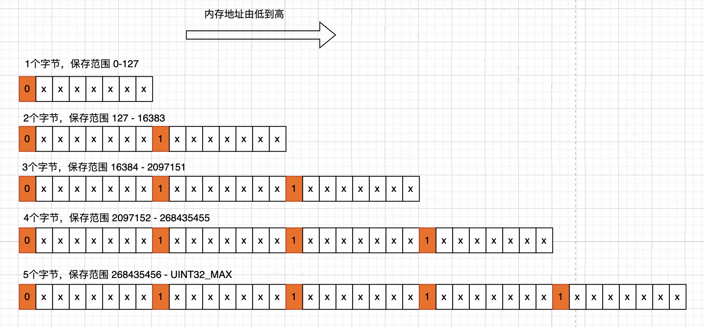

本文基于 redis 源码 7.4.0 版本。

listpack 的实现在文件 `listpack.h` 和 `listpack.c` 中。

### 一、概述

listpack 的出现是为了取代 ziplist（压缩列表）的，从 redis 7.0 开始已经完全取代了 ziplist，作为底层数据结构之一了。

listpack 也被称为“紧凑列表”，因为相比于 ziplist，listpack 的内存格局更加紧凑。

listpack 使用一块连续的内存空间保存数据，同时为了节省内存空间，listpack 列表项使用了多种编码方式，来表示不同长度的数据，数据包括整数和字符串。

源码中对于 listpack 的解释如下：

```
Listpack -- A lists of strings serialization format
```

listpack 是一个字符串的序列化格式，也就是将一个字符串列表进行序列化存储。

当然 listpack 不仅可以存储字符串，也能存储整形。 

### 二、listpack 结构

listpack 结构的内存块在 redis 中仅仅用一个字符串指针表示，通过剖析源码，可以总结出他的结构如下：


- total_len：占用 4 字节，表示 listpack 内存块的总字节长度。即最大为 `UINT32_MAX`
- elem_num：占用 2 字节，表示节点的个数。即最多存储 `UINT16_MAX` 个节点
- end：占用 1 字节，表示 listpack 结构的结尾。默认为 `0xFF`

### 三、entry 结构

listpack 中存储着多个 entry 节点。entry 节点可以是整数或者字符串。

如下是 entry 节点的编码方式：

```c
#define LP_ENCODING_7BIT_UINT 0
#define LP_ENCODING_13BIT_INT 0xC0
#define LP_ENCODING_16BIT_INT 0xF1
#define LP_ENCODING_24BIT_INT 0xF2
#define LP_ENCODING_32BIT_INT 0xF3
#define LP_ENCODING_64BIT_INT 0xF4

#define LP_ENCODING_6BIT_STR 0x80
#define LP_ENCODING_12BIT_STR 0xE0
#define LP_ENCODING_32BIT_STR 0xF0
```

不同的编码方式对应不同的存储结构。

#### 1. 整数的编码结构

我们先来看整数是如何存储的？

- LP_ENCODING_7BIT_UINT 编码：表示存储的数据是 7位的无符号整型。占用 1 个字节，高 1 位是编码位，为 0。剩余 7 位存储整数值。
- LP_ENCODING_13BIT_INT 编码：表示存储的数据是 13位的整形。占用 2 个字节，高 3 位是编码位，为 110。剩余 13 位存储整数值。
- LP_ENCODING_16BIT_INT 编码：表示存储的数据是 16位的整形。占用 3 个字节，高 8 位是编码位，为 11110001。剩余 16 位存储整数值。
- LP_ENCODING_24BIT_INT 编码：表示存储的数据是 24位的整形。占用 4 个字节，高 8 位是编码位，为 11110010。剩余 24 位存储整数值。
- LP_ENCODING_32BIT_INT 编码：表示存储的数据是 32位的整形。占用 5 个字节，高 8 位是编码位，为 11110011。剩余 32 位存储整数值
- LP_ENCODING_64BIT_INT 编码：表示存储的数据是 64位的整形。占用 9 个字节，高 8 位是编码位，为 11110100。剩余 64位存储整数值

我们可以总结出来，对于整数，entry 节点由两部分组成，一部分是编码，另一部分是数据。


这里多说一点，对于负数，redis 会将其转换为正数进行存储。

对于通过整数编码的数据，他的内部没有专门表示长度的部分。具体使用多少长度进行存储，通过编码方式就可以获取到。因此无需存储 长度这个信息。

#### 2. 字符串的编码结构

- LP_ENCODING_6BIT_STR 编码：表示可以存储长度不超过 63 `(2^6-1)` 的字符串。编码+长度占用一个字节。高 2位是编码位，为 10，剩余的 6位存储字符串的长度。接下来的位置就是一定长度的字符串了。
- LP_ENCODING_12BIT_STR 编码：表示可以存储长度不超过 4095 `(2^12-1)` 的字符串。编码+长度占用 2 个字节。高 4 位是编码位，为 1110。剩余 12 位存储字符串的长度。接下来的位置就是一定长度的字符串了。
- LP_ENCODING_32BIT_STR 编码：表示可以存储长度不超过 4294967295 `(2^32-1)` 的字符串。编码+长度占用 5 个字节。第一个字节存储编码，为 11110000。剩余 4 个字节存储字符串的长度。接下来的位置就是一定长度的字符串了。

我们可以总结出来，对于字符串，entry 节点由三部分组成：编码方式、长度、数据内容。结构如下：


#### 3. backlen 结构的编码

listpack 中每个节点的尾部还包含了一个表示当前数据的总字节数的结构。称为 backlen 结构。这个结构主要主要用于从右往左遍历、搜索数据使用。其内部也采用了一种数据编码机制。

如下表示 backlen 的编码结构：



每个字节有 8 位，只用低 7 位存储数值，最高位用来表示当前字节前面是否还是更多字节，0 表示没有了，1 表示还有。这样，在编码的时候，除了第一个字节，其他后续所有字节高位都为 1；解码的时候，根据这个标志位来判断什么时候终止。

我们举一个例子，以 268435470 为例，二进制为：`10000000000000000000000001110`，总共 29 位。需要用 5 个字节来存储。注意在编码的时候是以 7 位为分割进行编码，因为存储的时候每个字节8位只使用7位来存储。

编码的过程：

1. 处理高7位：先将这个数右移 28 位，留下高 7 位。即 `0x01`，将 `0x01` 保存到 `buf[0]` 位置。
2. 处理第二个高7位：将这个数右移 21 位，拿到的这 14 位中，高7位已经处理了，只需要处理剩下的低7位（只需要与 127 进行与操作即可）。但是在存储时，占用 1 个字节，并且这 1 个字节的最高位应该是 1，所以还要和 128 进行或操作。 
3. 处理第三个高7位：将这个数右移 14 位，拿到的这个 21 位，高 14 位已经处理了，只需要处理剩下的低7位。思路和上一步骤是相同的。
4. 处理第四个高7位：将这个数右移 7位，拿到的这个 28 位，高 21 位已经处理了，只需要处理剩下的低7位。
5. 处理第五个高7位：也就是这个数的低7位。直接将这个数和 127 进行与操作即可，就可以处理到这个数的低7位。

如果代码表示的话，如下：

```c
buf[0] = l>>28;
buf[1] = ((l>>21)&127)|128;
buf[2] = ((l>>14)&127)|128;
buf[3] = ((l>>7)&127)|128;
buf[4] = (l&127)|128;
```

解码的流程也是类似的，再此不再赘述。我们了解这个存储结构即可。

#### 4. 小结

到这里，我们基本上摸清楚了一个 entry 节点的结构。


- encoding+length：如果存储的是一个整数，则无需 length 字段。不同大小的整数、不同长度的字符串，他们的编码都是不一样的
- content：具体存储的数据内容，可以是整数或者字符串
- backlen：保存当前的 “encoding+length” 和 content 的总长度。占用 1-5字节，用于从尾部到首部遍历。

### 四、操作方法

listpack 的内存模型是一整块连续的线性内存。

- 插入：先对要插入的元素进行编码，然后检查是否需要内存扩容。然后搜索定位到具体插入位置，通过 memmove 函数把该位置的数据向后移动，腾出匹配长度的空位，然后把待插入元素填写到空位中，最后更新 listpack 的元素个数。
- 删除：先定位到待删除元素的位置，并计算出待删除元素的总长度 M。然后把待删除元素后续的所有元素数据统一往前移动 M 偏移量。这样数据就被删除了，实际上就是覆盖了待删除的数据。最后再检查是否需要对容量进行缩减。
- 更新：先计算新老数据的长度差异 diff。
  - 如果新数据比老数据长，则判断是否需要扩容，然后待更新元素的后续全部元素需要向后移动 diff 偏移量。
  - 如果新数据比老数据短，则需要待更新元素的后续全部元素需要向前移动 diff 偏移量。并将新数据更新到对应位置，然后检查是否需要对容量进行缩减。
- 查找、遍历：因为 listpack 内部每个节点的前后部分都有相关长度。
  - 从前到后搜索遍历，用编码可以获取存储的数据类型（整数或字符串），以及他的长度范围。使用 length 获取存储数据的长度。然后 backlen 也可以一字节一字节的解码获取到。通过指针移动即可遍历
  - 从后往前遍历，直接解码 backlen 结构，计算当前元素占用的空间大小，往前偏移即可。

### 五、总结

listpack 的出现，替代了 ziplist。在实现上，更加偏向空间换时间。内存更加紧凑。而且也在一定程度上，规避了 ziplist 的连锁更新问题。

一般也是用在数据量较少的场景下，因此从操作上来看，时间复杂度哪怕是 `O(N)`，耗时也是在可接受范围内。 

