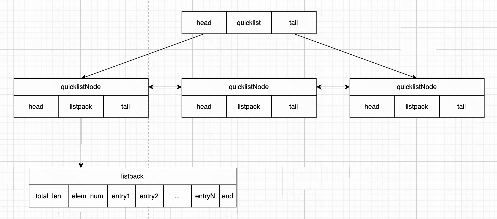

本文基于 redis 源码 7.4.0 版本。

快速列表的实现在文件 `quicklist.h`、`quicklist.c` 中。

### 一、快速列表概述

从 ziplist，再到 quicklist，再到 listpack。quicklist 一路在更新优化。

ziplist 有两个问题：

- 不能保存过多的元素，否则访问性能会下降
- 不能保存过大的元素，否则容易导致内存重新分配，甚至引起连锁更新

于是推出了 quicklist 结构，也就是 双向链表+ziplist 的结合体。但是依然没有解决连锁更新的问题。直到又有了新的更加紧凑的数据结构 listpack，解决了连锁更新问题。

quicklist 的底层实现也变成了 “双向链表” 和 “listpack” 的结合体。首先快速列表是一个双向链表，然后双向链表的每个节点是一个 listpack。

快速列表这样做也是在 “内存空间” 和 “性能” 上的折中。

- 双向链表因为有前向指针、后向指针的存在，导致内存占用较大。而且双向链表的各个节点是单独的内存块，地址不连续，节点多了容易产生内存碎片。
- listpack 由于是一整块连续内存空间，因此存储效率高。但是不利于修改操作，每次数据变动都可能引发一次内存的 realloc。如果 listpack 中数据量较多时，一次 realloc 可能会导致大量的数据拷贝，进一步降低性能。

但是同时，如果将双向链表和 listpack 结合之后，又需要我们找到一个平衡点，即快速列表的节点应该包含多长的 listpack 呢？

- 如果快速列表节点上的 listpack 太短，极端情况下，快速列表可能脱化成一个双向链表。则会有内存碎片多、存储效率低的问题。
- 如果快速列表节点上的 listpack 太长，极端情况下，快速列表可能蜕化成一个 listpack。则会由于大量拷贝造成的性能开销较大问题。

关于这个平衡点如何去控制，我们在下文中阐述。

### 二、快速列表的结构

如下是整个 quicklist 结构



quicklist 结构下有多个 quicklistNode 结构，这些 quicklistNode 结构之间使用双向链表进行连接，每个 quicklistNode 结构底层是通过 listpack 结构构成。

再来看看他们的程序定义。

如下是快速列表的结构：

```c
typedef struct quicklist {
    quicklistNode *head;
    quicklistNode *tail;
    unsigned long count;        /* total count of all entries in all listpacks */
    unsigned long len;          /* number of quicklistNodes */
    signed int fill : QL_FILL_BITS;       /* fill factor for individual nodes */
    unsigned int compress : QL_COMP_BITS; /* depth of end nodes not to compress;0=off */
    unsigned int bookmark_count: QL_BM_BITS;
    quicklistBookmark bookmarks[];
} quicklist;
```

在 64 位系统中，这个结构占用 40 字节。其中不同字段的含义：

- head 和 tail 字段：分别表示快速列表的头节点和尾节点
- count 字段：所有 listpack 中 entry 的数量
- len 字段：quicklistNodes 的数量
- fill 字段：根据占用字节数来决定每个 quicklistNode 上的 listpack 长度
- compress 字段：quicklist 的压缩深度，0 表示不压缩
- bookmark_count 字段：bookmarks 数组的大小
- bookmarks 字段：柔性数组，是一个可选项。用来 quicklist 重新分配内存空间时使用，不使用时不占用空间

如下是每一个节点的结构：

```c
typedef struct quicklistNode {
    struct quicklistNode *prev;
    struct quicklistNode *next;
    unsigned char *entry;
    size_t sz;             /* entry size in bytes */
    unsigned int count : 16;     /* count of items in listpack */
    unsigned int encoding : 2;   /* RAW==1 or LZF==2 */
    unsigned int container : 2;  /* PLAIN==1 or PACKED==2 */
    unsigned int recompress : 1; /* was this node previous compressed? */
    unsigned int attempted_compress : 1; /* node can't compress; too small */
    unsigned int dont_compress : 1; /* prevent compression of entry that will be used later */
    unsigned int extra : 9; /* more bits to steal for future usage */
} quicklistNode;
```

每个快速列表节点占用 32 字节，每个字段如下含义：

- prev、next 字段：前向指针和后向指针
- entry 字段：如果当前节点的数据没有压缩，那么他指向一个 listpack 结构；否则他指向一个 quicklistLZF 结构
- sz 字段：表示 entry 的总大小
- count 字段：表示 listpack 中包含的数据项个数
- encoding 字段：1表示没有压缩；2表示被压缩了，而且用的是 LZF 压缩算法
- container 字段：1表示直接存储；2表示使用 listpack 来作为容器
- recompress 字段：表示当前节点是否是临时使用的解压后的节点，当我们使用类似 lindex 这样的命令查看了某一项本来压缩的数据时，需要把数据暂时解压，这时就设置 recompress=1 做一个标记，等有机会再把数据重新压缩。
- attempted_compress 字段：节点太小，不能压缩
- dont_compress 字段：禁止压缩，防止 entry 以后被使用
- extra 字段：扩展空间

quicklistLZF 压缩结构：

```c
typedef struct quicklistLZF {
    size_t sz; /* LZF size in bytes*/
    char compressed[];
} quicklistLZF;
```

quicklistLZF 结构是一个 8+N 字节长度的结构

- sz 字段：表示 compressed 字段占用的字节长度
- compressed 字段：是一个数组，表示的是被压缩的数据，并且采用的是 LZF 压缩算法。

当 quicklistNode->entry 被压缩之后，quicklistNode->entry 将指向这个 quicklistLZF 结构。

### 三、压缩机制

在 quicklist 中，两端节点的数据被访问的可能性比较高，中间节点的数据被访问的可能性比较低。因此 redis 提供了一个参数 `list-compress-depth` 进行配置，可以把中间节点的数据使用 LZF 算法进行压缩，从而进一步节省内存空间。

- 默认情况下，`list-compress-depth` 参数为 0，也就是不压缩数据；
- 当该参数被设置为 1 时，除了头部和尾部之外的节点都会被压缩；
- 当改参数被设置为 2 时，除了头部两个节点、尾部两个节点，其他节点都会被压缩
- 依次类推

### 四、listpack 的长度

前文探讨到，quicklistNode 结构中的 listpack 应该有多长呢？太长了不行，太短了也不行。

于是在 quicklist 结构中有一个 fill 字段，就是来决定每个 quicklistNode 上的 listpack 长度的。

```c
static const size_t optimization_level[] = {4096, 8192, 16384, 32768, 65536};

static size_t quicklistNodeNegFillLimit(int fill) {
    assert(fill < 0);
    size_t offset = (-fill) - 1;
    size_t max_level = sizeof(optimization_level) / sizeof(*optimization_level);
    if (offset >= max_level) offset = max_level - 1;
    return optimization_level[offset];
}
```

fill 配置的具体数值以及含义：

- -1：每个 quicklistNode 节点的 listpack 所占字节数不能超过 4KB
- -2：每个 quicklistNode 节点的 listpack 所占字节数不能超过 8KB（默认配置）
- -3：每个 quicklistNode 节点的 listpack 所占字节数不能超过 16KB
- -4：每个 quicklistNode 节点的 listpack 所占字节数不能超过 32KB
- -5：每个 quicklistNode 节点的 listpack 所占字节数不能超过 64KB


