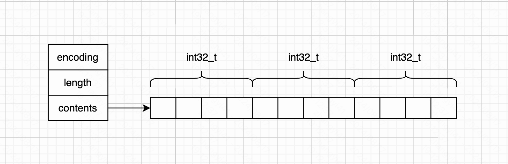
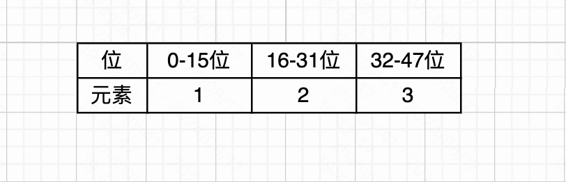
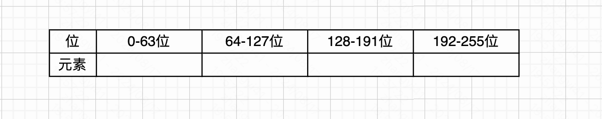
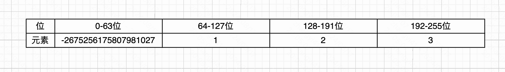

本文基于 redis 源码 7.4.0 版本。

redis 中整数集合的实现在文件 `intset.h` 和 `intset.c` 中。是一个比较简单的数据结构。

在 redis 中，当一个集合中只包含整数值元素，并且这个集合的元素数量不多时，redis 就会使用整数集合作为集合键的底层实现。

### 一、基本结构

整数集合的结构非常简单，如下

```c
typedef struct intset {
    uint32_t encoding;
    uint32_t length;
    int8_t contents[];
} intset;
```

- 字段 encoding：表示编码方式，可选值包含：INTSET_ENC_INT16、INTSET_ENC_INT32、INTSET_ENC_INT64
- 字段 length：表示集合中包含的元素数量
- 字段 contents：是一个数组，用于保存元素

因此，我们知道整数集合可以保存类型为 `int16_t`、`int32_t`、`int64_t` 的整数值，并且保证集合中不会出现重复元素。同时集合中的元素都是从小到大有序的排列。

我们可以看到 contents 数组的元素类型是 `int8_t`。

- 当编码类型为 `int16_t` 时，contents 数组的两个位置存储一个 `int16_t` 的元素
- 当编码类型为 `int32_t` 时，contens 数组的四个位置存储一个 `int32_t` 的元素
- 当编码类型为 `int64_t` 时，contents 数组的八个位置存储一个 `int64_t` 的元素

如下图，举例一个存储 `int32_t` 类型的结构。



### 二、升级操作

当起始创建一个整型集合时，encoding 编码类型为 `int16_t`。当插入了一些 `int16_t` 类型的数据后，突然需要插入一个 `int64_t` 的数字。这个时候整形集合就需要升级了。



如上，假如 content 数组有三个元素，并且每个元素都是 `int16_t` 类型的。现在要插入一个 `int64_t` 类型的数据，以这个数组，我们介绍升级的过程。升级过程如下二步进行操作：

1. 根据新元素的类型，扩充 contents 数组的空间大小，并为新元素分配空间。

新元素的类型为 `int64_t`，判断需要升级。现在数组长度为 3，则通过 realloc 给 contents 数组扩充空间，大小为 `(3+1)*sizeof(int64_t)`。其中包括新元素所占有的空间。



1. 将 contents 数组中原有的数据，转换成与新元素相同的类型，并放置到对应的位置。并将新元素添加到 contents 数组中

这里，有一个技巧，因为插入新元素，导致 contents 数组升级了。所以这个新元素一定比当前数组中所有元素都要大、或者都要小。

如果新元素是大于 0 的，那么他就是当前数组最大的元素，需要插入到数组尾部；如果新元素是小于 0 的，那么他就是当前数组最小的元素，需要插入到数组首部。只要提前预留好空间即可。



### 三、小总结

整形集合数据结构比较简单，底层实现为数组，这个数组以 “有序”、“无重复” 的方式保存集合元素。

整数集合只支持升级操作，不支持降级操作。

