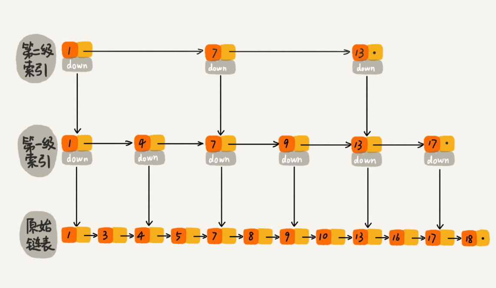
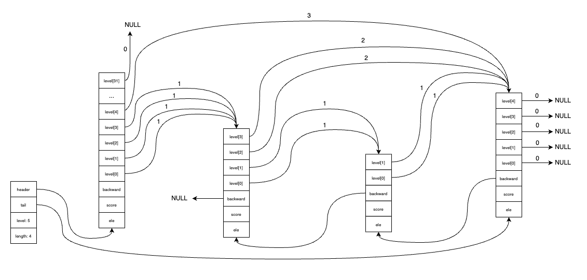
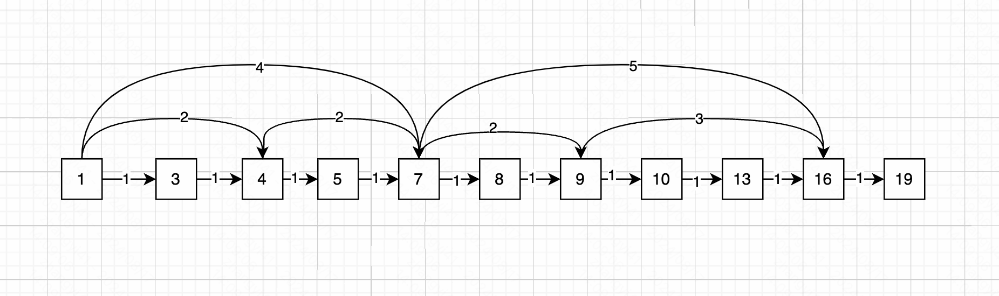

本文基于 redis 源码 7.4.0 版本。

redis 中跳表没有在具体的文件中定义。头文件 `server.h` 中定义了跳表的结构，`t_zset.c`中实现了跳表的实现。

先来一个图说明下什么是跳表。类似于在单链表的基础上增加了多级索引。



跳表的优缺点：

- 高效查询：查找的时间复杂度平均为 `O(logN)`，最坏 `O(N)`时间复杂度。与平衡二叉搜索树相当。并且由于多层索引的存在，比链表或数组有更快的查找速度。
- 动态调整：跳表可以动态的增加和删除元素，而无需大规模重构数据结构。插入和删除的平均时间复杂度为 `O(logN)`。且插入新元素时，可以根据概率动态决定是否增加新的层级，在大多数情况下可以保持较低的层数，从而节省空间。
- 空间效率：跳表不是所有节点都有索引，相比于平衡二叉搜索树结构，空间效率更高。

#### 一、基本结构

zskiplist 结构用于保存跳表的信息。如下结构

```c
typedef struct zskiplist {
    struct zskiplistNode *header, *tail;
    unsigned long length;
    int level;
} zskiplist;
```

- header、tail：指向跳表的表头节点、表尾节点
- length：记录跳表的长度，也就是跳表目前包含节点的数量
- level：记录目前跳表内，层数最大的那个节点的层数

zskiplistNode 结构表示跳表节点的信息，如下结构

```c
typedef struct zskiplistNode {
    sds ele;
    double score;
    struct zskiplistNode *backward;
    struct zskiplistLevel {
        struct zskiplistNode *forward;
        unsigned long span;
    } level[];
} zskiplistNode;
```

- ele：成员对象。因为看的是在 zset有序集合中的实现，所以成员对象是字符串
- score：节点的分数，节点会按照各自所保存的分值从小到大排列。和 zset有序集合关联的 double类型的分数排序是对应的
- backward：后退指针，指向当前节点的前一个节点。支持程序从跳表尾部向头部的遍历
- level 数组：标识每一层。每层会有两个属性。当程序从表头向表尾进行遍历时，访问会沿着层的前进指针进行
  - forward：前进指针，用于访问表尾方向的其他节点
  - span：表示跨度，记录了前进指针所指向节点和当前节点的距离


redis 中跳表的结构类似如下：



#### 二、层的数量

如上描述，我们会发现跳表中的 level 数组可以包含多个元素，每个元素都包含了一个指向其他节点的指针。跳表就是通过这些层来加快访问其他节点的速度的。并且，一般来说，层的数量越多，访问其他节点的速度就越快。

在每次创建跳表新节点的时候，程序会根据幂次定律（越大的数出现的概率越小）随机生成一个 `[1, 32]` 之间的值作为 level 数组的大小，这个大小就是层的高度。

计算层级的方式。初始层级为1，然后以一定概率尝试增加层级，直到成功为止。这个概率如何计算呢？取一个较大的数字 N，使用 random 获取随机数。

- 如果随机数比这个数字 N 要小，则增加层级，继续尝试
- 如果随机数比这个数组 N 要大，则使用此层级
- 保证此层级不超过 32，如果超过 32，则使用 32 作为层级

这样，由于越大的数字出现的概率越小，节点的平均层级会保持在一个比较低的水平，但同时会有少量节点具有较高的层级，这有助于保持跳表的查找效率。跳表层级数的幂次定律分布的好处：

- 平衡性能和内存消耗：较高的层级可以加快搜索速度，但会占用更多内存。幂次定律分布保证了大部分节点只有一个或少数几个层级，只有极少数节点具有高层级。这样既保证了良好的平均搜索性，又避免了过多的内存消耗。

#### 三、层的跨度

属性 `level[i].span`  表示层的跨度，用于记录两个节点之间的距离。同样的，指向 NULL 的所有前进指针的跨度都为 0，因为他们没有连向任何节点。

跨度实际上是用来计算排位（rank）的，在查找某个节点的过程中，将沿途访问过的所有层的跨度累加起来，得到的结果就是目标节点在跳表中的排位。

比如如果要插入一个元素，不同层级的排位就是为了确认要插入元素的位置。

#### 四、节点的分数

属性 `score` 表示的是节点的分数，是一个 double 类型的浮点数，跳表中的所有节点都按照分数从小到大来排序。

在同一个跳表中，各个节点保存的成员对象是唯一的，但是多个节点保存的分数有可能是相同的。分数相同的节点将按照成员对象的字典序大小来进行排序。

#### 五、使用流程

再来看看跳表的使用流程，加深印象。对于增删改查某个节点。最主要的是需要先找到节点的位置。我们以插入一个新节点为例，来说明下是如何找到节点位置的。

如下图，假设我们有一个跳表，我画了一个简单的图。供我们学习参考。线条上的即为 span。假设我们要插入的元素是 15，同时假设节点上的数字即为他的分数，即节点15 的分数为 15。那么节点 15 需要插入到节点 13 和 节点 16 之间。



这个跳表有三个层级。插入过程中我们有两个数组做辅助操作。

- rank 数组：存储每一层级，当前节点的总跨度。比如
  - 第三层级，节点1 到 节点 13 之间的距离，跨度span之和为 4。因此 `rank[2]=4`
  - 第二层级，节点 1 到节点 13 之间的距离，跨度span之和为 6。因此 `rank[1]=6`
  - 第一层级，节点 1 到节点 13 之间的距离，跨度span之和为 8。所以 `rank[0]=8`
- update 数组：存储需要做更新的节点。

下面，我们开始插入节点 15 的流程。

1. 第一步，遍历跳表，给 rank 数组、update 数组赋值。

从跳表的最高层级开始遍历，先遍历第三层级。只能遍历到节点7。遍历节点16 时，节点 16 的分数大于节点 15 的分数，节点16无法遍历。因此 update 数组只存储了 节点7，即 `update[2]=Node(7)`；rank 数组存储 4，表示跨度span之和，即 `rank[2]=4`。

再遍历第二层级。遍历了节点7、节点9。同样无法遍历节点 16。注意此时是从节点7开始遍历的，因为从上一层级的信息我们得出节点7之前的所有位置都不符合。因此 update 数组存储了节点9，即 `update[1]=Node(9)`；rank 数组存储 6，表示跨度span之和，即 `rank[1]=6`。

最后遍历第一层级。遍历了节点9、节点10、节点13。同样注意是从节点9开始遍历的。因此 update 数组存储了节点13，即 `update[0]=Node(13)`；rank数组存储 8，表示跨度span之和，即 `rank[0]=8`。

2. 第二步，创建节点 15 结构

首先需要给节点 15 创建层级数组，层级的计算方式上文已经阐述。假设他在第一层。

3. 第三步，更新对应节点

节点 15 的各个字段指向，以及 update 数组中存储的要更新的节点，update 数组中现在存储了节点7、节点9、节点13，在这一步需要做更新。

将节点 15 插入到节点 13 和节点 16之间之后。

- 节点 15 的后向指针backward、第一层级中的前向指针forward、跨度span 都需要更新。
- 节点7的跨度span、节点9 的跨度 span 都需要更新
- 节点 13、节点 16 的对应的后向指针backward、以及层级中的前向指针forward、跨度span 都需要更新。
- 以上节点在更新 span 的时候，不同的层级需要用到 rank 数组中的存储记录。具体不再展开。

如上三步就是跳表插入节点的整体流程。其他功能都类似。

比如 `zslGetElementByRank` 返回跳表在给定排位上的节点。就是通过不同层级快速找到具体的位置。然后再通过节点的后向指针 backward 来获取到满足此范围的元素。可以看出，跳表对于范围查询还是比较快速友好的。
