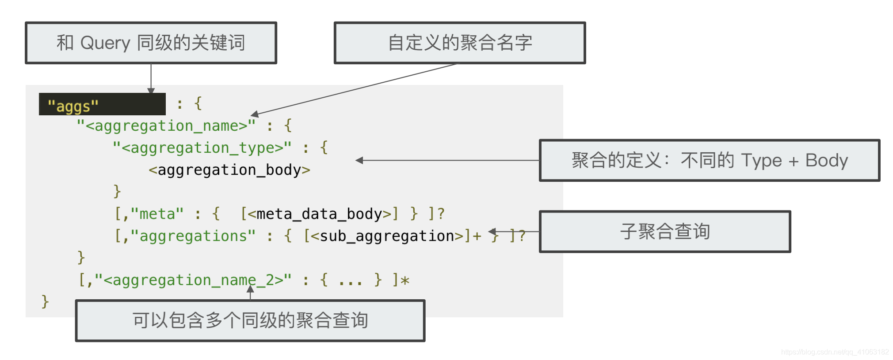
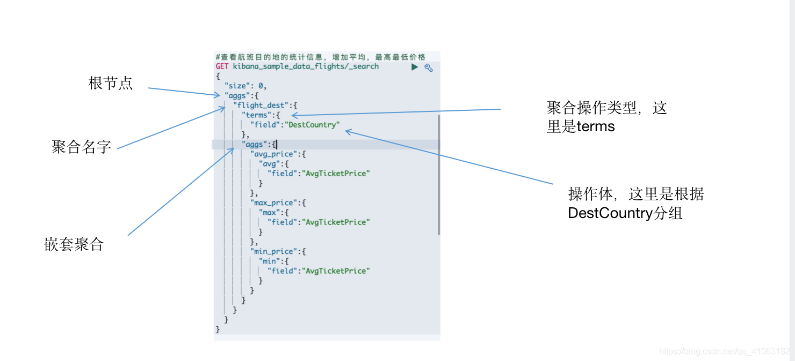

## Aggregations 聚合

ElasticSearch 大致有四种基本聚合类型

- Bucketing aggregation 一些满足特定条件的文档的集合，类似 mysql 的 group by。例如：select count(*) from user group by name， bucketing 的作用就是group by name，根据 name 去分组，返回一个特定条件的文档集合。*
- *Metric aggregation 一些数学运算，对文档进行统计分析，例如：select count(*) from user group by name，count 就是 Metric 的作用，对结果集进行一些计算处理。
- Matrix aggregation 对多个字段进行操作并且返回一个矩阵结果
- Pipeline aggregation 对已经产生的聚合结果进行二次聚合

### 一、聚合的基本用法



- aggs 是与query同级的，是聚合操作的根节点
- aggregation_name 是自定义的聚合名字，是在聚合结果中展示的字段名
- aggregation_type 是聚合的类型，比如 min，是 Metric 计算类型中的一种
- aggregation_body 一般是要操作的计算值，可以是脚本



如上为一个简单的聚合语法

### 二、Bucketing aggregation

作用是将稳定进行分组（分桶）。ElasticSearch 提供了很多类型的 bucketing。

#### 1. Terms Aggregation

精确匹配，根据指定的字段将值相等的文档分在一个桶中

```sql
// 根据 OriginCountry
  "aggs": {
    "AGG_NAME": {
      "terms": {
        "field": "p_id"
      }
    }
  }
```

如上的查询语句，意为根据字段 p_id 进行分组（ group by ）。terms 是精确匹配，不会分词。

#### 2. Filter Aggregation

过滤聚合，其实就是添加了一个分组的过滤匹配条件，只有符合这个条件的文档才会参与聚合统计。

```sql
  "aggs": {
    "AGG_NAME": {
      "filter": {
        "term": {
          "p_id": "888"
        }
      },
      "aggs": {
        "NAME2": {
          "terms": {
            "field": "dimension"
          }
        }
      }
    }
  }
```

如上，filter 为要过滤的条件，使用 term、match 等都可以。也就是说，只统计 p_id 为 888 的文档，对这些文档以 dimension 分组

#### 3. Filters Aggregation

Filters Aggregation 相当于多个 Filter Aggregation，支持多个匹配条件，这里并不是条件叠加；而是多个条件分别执行，然后一次返回，省去网络 IO

```sql
  "aggs": {
    "AGG_NAME": {
      "filters": {
        "filters": {
          "888": {
            "match": {
              "p_id": "888"
            }
          },
          "893": {
            "match": {
              "p_id": "893"
            }
          }
        }
      },
      "aggs": {
        "NAME2": {
          "terms": {
            "field": "dimension"
          }
        }
      }
    }
  }
```

如上的聚合语义，是分别统计 p_id 为 888 和 893 的关于 dimension 的分组情况。

#### 4. Range Aggregation 

针对数字类型的字段进行范围分桶，会根据设定的范围在运行期间对每个文档的这个字段进行检查，然后将符合条件的划分到对应的区间中

- field：划分的字段
- ranges：表示区间，是个数组，from 表示左区间，to 表示右区间

```sql
  "aggs": {
    "range_pid": {
      "range": {
        "field": "p_id",
        "ranges": [
          {
            "from": 888,
            "to": 900
          },
          {
            "from": 910
          },
          {
            "to": 10
          }
        ]
      }
    }
  }
```

如上的聚合语义，表示根据 p_id 在 `[888, 900], [910, +∞], [0, 10]` 来划分文档区间

#### 5. Histogram Aggregation

直方图分桶统计，意为按照给定的区间值，划分不同的区间，然后统计不同区间的文档数量。比如 interval 是 5，那么不同的区间统计就是：`[0, 5], [5, 10],[10, 15]...` 

- interval：区间值
- min_doc_count：最少有多少文档才会显示

```sql
"aggs": {
    "range_p_id": {
      "histogram": {
        "field": "p_id",
        "interval": 5,
        "min_doc_count": 0
      }
    }
  }
```

如上，表示 p_id 在不同的区间中的文档数，每隔 5 统计一次

### 三、Metric Aggregation

Metric 大多数都是在做一些数学运算

#### 1. Avg、Min、Max、Sum

分别是计算平均值、最小值、最大值、求和的统计指标方法。这些计算只针对数字类型的字段。

missing 字段可以过滤掉某个值不参与计算。

```sql
  "aggs": {
    "total_duration_avg": {
      "avg": {
        "field": "total_duration",
        "missing": 13179.0
      }
    },
    "total_duration_min": {
      "min": {
        "field": "total_duration"
      }
    },
    "total_duration_sum": {
      "sum": {
        "field": "total_duration"
      }
    }
  }
```

如上，语义就是对 total_duration 字段求 avg、min、sum。其中求 avg 的时候忽略掉 13179.0 这个值

#### 2. Weighted Avg Aggregation

Weighted Avg Aggregation 相对于 Avg Aggregation，多了一个比重的影响因素，就是会在原来的平均值上乘以设置的那个比重字段，然后再加入平均值的计算

- weight：比重字段
- missing：可以过滤掉某个值不参与计算

```sql
"aggs": {
    "avg_ticket": {
      "weighted_avg": {
        "value": {
          "field": "AvgTicketPrice"
        },
        "weight": {
          "field": "dayOfWeek"
        }
      }
    }
  }
```

如上，语义表示对 AvgTicketPrice 求平均值，并且还要和 dayOfWeek（星期几）作为比重字段相乘做计算

#### 3. Cardinality Aggregation

Cardinality Aggregation 类似于 count，但是他多了一个功能是去重，只对唯一的数字做统计，有些类似 distinct count

```sql
  "aggs": {
    "p_id_distinct_count": {
      "cardinality": {
        "field": "p_id"
      }
    }
  }
```

如上，语义表示对 p_id 做 count，但是是去重的

#### 4. Stats Aggregation

stats Aggregation 是 count、min、max、avg、sum 这些聚合的集合。

```sql
  "aggs": {
    "stats_data": {
      "stats": {
        "field": "total_duration"
      }
    }
  }
  // 会返回
    "aggregations" : {
    "stats_data" : {
      "count" : 3014798,
      "min" : 4393.0,
      "max" : 434907.0,
      "avg" : 15599.421039817593,
      "sum" : 4.7029103352E10
    }
  }
```

#### 5. Percentiles Aggregation

多值指标聚合，其实就是计算文档中这个字段值的百分位数，返回值一般用来观察分布是否均匀。

- percents：指定观察哪些百分位点
- field：要观察的字段

```sql
"aggs": {
    "percentiles_total_duration": {
      "percentiles": {
        "field": "total_duration",
        "percents": [
          1,
          5,
          25,
          50,
          75,
          95,
          99
        ]
      }
    }
  }
```

#### 6. Percentile Ranks Aggregation

Percentile Ranks Aggregation 与 Percentiles Aggregation正好相反，Percentile Ranks Aggregation 是知道值以后去查看他所在的百分数是多少

```sql
"aggs": {
    "total_duration_percentile_ranks": {
      "percentile_ranks": {
        "field": "total_duration",
        "values": [
          13179.0
        ]
      }
    }
  }
```

### 四、Pipeline Aggregation

对聚合产生的结果进行第二次聚合分析，也就是管道的概念。

### 五、Matrix Aggregation

对多个字段进行计算并且返回相应的计算结果，也就是一个矩阵


