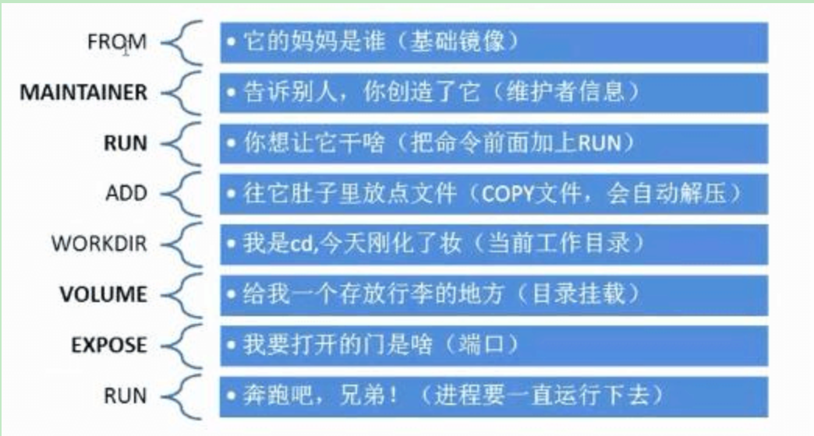

## 初识Dockerfile

Dockerfile 就是用来构建 docker 镜像的构建文件，命令脚本

```shell
# 创建一个dockerfile 文件，名字可以随机，建议：Dockerfile
# 文件中的内容 指令都是大写，如下：

FROM centos

VOLUME ["volume01", "volume02"]

CMD echo "--end----"
CMD /bin/bash
```

```shell
root@9-134-239-95:dockerfile# docker build -f dockerfile1 -t noahyzhang/centos .
Sending build context to Docker daemon  2.048kB
Step 1/4 : FROM centos
latest: Pulling from library/centos
a1d0c7532777: Pull complete 
Digest: sha256:a27fd8080b517143cbbbab9dfb7c8571c40d67d534bbdee55bd6c473f432b177
Status: Downloaded newer image for centos:latest
 ---> 5d0da3dc9764
Step 2/4 : VOLUME ["volume01", "volume02"]
 ---> Running in 9d0cf0f49e0a
Removing intermediate container 9d0cf0f49e0a
 ---> ee700b968468
Step 3/4 : CMD echo "--end----"
 ---> Running in e45a1abfa3e4
Removing intermediate container e45a1abfa3e4
 ---> 2f89182b0d08
Step 4/4 : CMD /bin/bash
 ---> Running in 63d3e5e1099b
Removing intermediate container 63d3e5e1099b
 ---> 63149cb60de2
Successfully built 63149cb60de2
Successfully tagged noahyzhang/centos:latest
```

```shell
docker run -it 容器id /bin/bash # 可以进入我们自己创建的镜像

VOLUME ["volume01", "volume02"] # 匿名挂载了两个目录
可以通过 docker inspect 容器id ，查看 Mounts 中 Source 路径
```

### 数据卷容器

```shell
docker run -it --name docker01 63149cb60de2 
docker run -it --name docker02 --volumes-from docker01 63149cb60de2
相当于docker01 去继承了docker01 这个容器。因此两个容器的 volume01、volume02 数据卷是同步的

docker run -it --name docker03 --volumes-from docker01  63149cb60de2
docker03 再去继承 docker01 这个容器。也可以三个容器同步

即使某个容器被删除了，其他容器依旧可以访问。因为可以作为数据备份
```

多个mysql 实现数据共享

```shell
docker run -d -p 3310:3306 -v /etc/mysql/conf.d -v /var/lib/mysql -e MYSQL_ROOT_PASSWORD=123456 --name mysql01 mysql:5.7 

docker run -d -p 3310:3306 -v /etc/mysql/conf.d -v /var/lib/mysql -e MYSQL_ROOT_PASSWORD=123456 --name mysql02 --volumes-from mysql01 mysql:5.7 

# 这个时候，可以实现两个容器数据同步
```

#### 结论

容器之间配置信息的传递，数据卷容器的生命周期一直持续到没有容器使用为止

但是一旦持久化到了本地，这个时候，本地的数据是不会删除的

## Dockerfile

dockerfile 就是用来构建docker镜像的文件，就是一个命令参数脚本。如下步骤

1. 编写一个 dockerfile 文件
2. docker build 构建成为一个镜像
3. docker run 运行镜像
4. docker push 发布镜像（docker hub）

### dockerfile的构建过程

#### 基础知识：

1. 每个保留关键字（指令）都是必须是大写字母
2. 执行从上到小顺序执行
3. `#` 表示注释
4. 每一个指令都会创建提交一个新的镜像层，并提交


#### dockerfile 指令

```shell
FROM   # 基础镜像 一切从这里开始
MAINTAINER # 镜像是谁写的，姓名+邮箱 
RUN    # 镜像构建的时候需要运行的命令
ADD    # 步骤：tomcat 镜像，这个tomcat压缩包 
WORKDIR# 镜像的工作目录
VOLUME # 挂载的目录
EXPOSE # 暴露端口配置
CMD    # 指定这个容器启动的hi后要运行的命令(只有最后一个会生效，可被替代)
ENTRYPOINT # 指定这个容器启动的时候要运行的命令(可追加命令)
ONBUILD # 当构建一个被继承 DockerFile 这个时候就会运行 ONBUILD 的指令，触发指令
COPY # 类似ADD,将文件拷贝到镜像中
ENV # 构建的时候设置环境变量
```




### 实战测试1

构建一个自己的centos

```dockerfile
# 编写 Dockerfile 文件
FROM centos
MAINTAINER noahyzhang<13572252156@163.com>

ENV MYPATH /usr/local
WORKDIR $MYPATH

RUN yum install -y vim
RUN yum install -y net-tools

EXPOSE 80

CMD echo $MYPATH
CMD echo "---end----"
CMD /bin/bash

# 构建文件
# -f 代表文件路径
# -t(target) 镜像名:[tag]
docker build -f mydockerfile -t mycentos:0.1 . 
```

可以查看本地进行的变更历史，可以看到某个镜像是如何做的

```shell
root@9-134-239-95:dockerfile# docker history mysql:5.7
IMAGE               CREATED             CREATED BY                                      SIZE                COMMENT
8b43c6af2ad0        2 days ago          /bin/sh -c #(nop)  CMD ["mysqld"]               0B                  
<missing>           2 days ago          /bin/sh -c #(nop)  EXPOSE 3306 33060            0B                  
<missing>           2 days ago          /bin/sh -c #(nop)  ENTRYPOINT ["docker-entry…   0B                  
<missing>           2 days ago          /bin/sh -c ln -s usr/local/bin/docker-entryp…   34B                 
<missing>           2 days ago          /bin/sh -c #(nop) COPY file:345a22fe55d3e678…   14.5kB              
<missing>           2 days ago          /bin/sh -c #(nop)  VOLUME [/var/lib/mysql]      0B                  
<missing>           2 days ago          /bin/sh -c {   echo mysql-community-server m…   313MB               
<missing>           2 days ago          /bin/sh -c echo 'deb http://repo.mysql.com/a…   55B                 
<missing>           2 days ago          /bin/sh -c #(nop)  ENV MYSQL_VERSION=5.7.36-…   0B                  
<missing>           2 days ago          /bin/sh -c #(nop)  ENV MYSQL_MAJOR=5.7          0B                  
<missing>           2 days ago          /bin/sh -c set -ex;  key='A4A9406876FCBD3C45…   1.84kB              
<missing>           2 days ago          /bin/sh -c apt-get update && apt-get install…   52.2MB              
<missing>           2 days ago          /bin/sh -c mkdir /docker-entrypoint-initdb.d    0B                  
<missing>           2 days ago          /bin/sh -c set -eux;  savedAptMark="$(apt-ma…   4.17MB              
<missing>           2 days ago          /bin/sh -c #(nop)  ENV GOSU_VERSION=1.12        0B                  
<missing>           2 days ago          /bin/sh -c apt-get update && apt-get install…   9.34MB              
<missing>           2 days ago          /bin/sh -c groupadd -r mysql && useradd -r -…   329kB               
<missing>           3 days ago          /bin/sh -c #(nop)  CMD ["bash"]                 0B                  
<missing>           3 days ago          /bin/sh -c #(nop) ADD file:3c54ad257f2e04f72…   69.3MB      
```

#### CMD和ENTRYPOINT 的区别

测试 cmd

```shell
# 构建dockerfile
FROM centos
CMD ["ls","-a"]

# 构建镜像 docker build -f cm_test -t cmdtest .
# 执行 docker run -it bef91298cd9e

# 想追加一个命令 -l 
docker run bef91298cd9e -l
docker: Error response from daemon: OCI runtime create failed: container_linux.go:345: starting container process caused "exec: \"-l\": executable file not found in $PATH": unknown.
ERRO[0000] error waiting for container: context canceled 
# cmd 的情况下，如果只追加 -l，那就是替换了 CMD ["ls","-a"] 命令，-l 不是一个命令所以报错
```

```shell
# 构建 dockerfile
FROM centos
ENTRYPOINT ["ls", "-a"]

# 构建镜像 docker build -f entrypoint_test -t entrypoint:0.1 
# 执行 docker run entrypoint:0.1
# 可以追加命令 docker run entrypoint:0.1 -l
```

#### 实战测试2：Tomcat 镜像

1. 编写 Dockerfile

    ```dockerfile
    FROM centos
    MAINTAINER noahyzhang<13572252156.163.com>
    
    COPY readme.txt /usr/local/readme.txt
    ADD apache-tomcat-9.0.55.tar.gz /usr/local/
    ADD jdk-8u311-linux-x64.tar.gz /usr/local
    
    RUN yum -y install vim
    
    ENV MYPATH /usr/local
    WORKDIR $MYPATH
    
    ENV JAVA_HOME  /usr/local/jdk1.8.0_311
    ENV CLASSPATH $JAVA_HOME/lib/dt.jar:$JAVA_HOME/lib/tools.jar
    ENV CATALINA_HOME /usr/local/apache-tomcat-9.0.55
    ENV CATALINA_BASH /usr/local/apache-tomcat-9.0.55
    ENV PATH $PATH:$JAVA_HOME/bin:$CATALINA_HOME/lib:$CATALINA_HOME/bin
    
    EXPOSE 8080
    
    CMD /usr/local/apache-tomcat-9.0.55/bin/startup.sh && tail -F /usr/local/apache-tomcat-9.0.55/bin/logs/catalina.out
    ```

2. 构建镜像

    ```shell
    docker build -t diytomcat .
    ```

3. 运行

    ```shell
    docker run -d -p 9090:8080 --name noahyzhangtomcat -v /tmp/build/tomcat/test:/usr/local/apache-tomcat-9.0.55/webapps/test -v /tmp/build/tomcat/tomcatlogs/:/usr/local/apache-tomcat-9.0.55/logs diytomcat
    ```

### 发布镜像

在 dockerhub 上提交

1. 登录docker

    ```shell
    docker login --help
    docker login -u noahyzhang
    密码：xiangongye1234..
    
    # 退出邓丽
    docker logout 
    ```

2. 推送镜像

    ```shell
    docker tag SOURCE_IMAGE[:TAG] TARGET_IMAGE[:TAG]
    docker tag diytomcat:latest noahyzhang/diytomcat:0.1 
    docker push noahyzhang/diytomcat:0.1
    ```

3. 即可在docker hub 网站看到自己上传的镜像

### 压缩解压包

```shell
#  将一个镜像打包成一个压缩包 docker save [OPTIONS] IMAGE [IMAGE...]
docker save -o ./diytomcat.package 镜像id
# 将一个压缩包解压成一个镜像 docker load [OPTIONS]
docker load -i ./diytomcat.package 
```

### 小结


