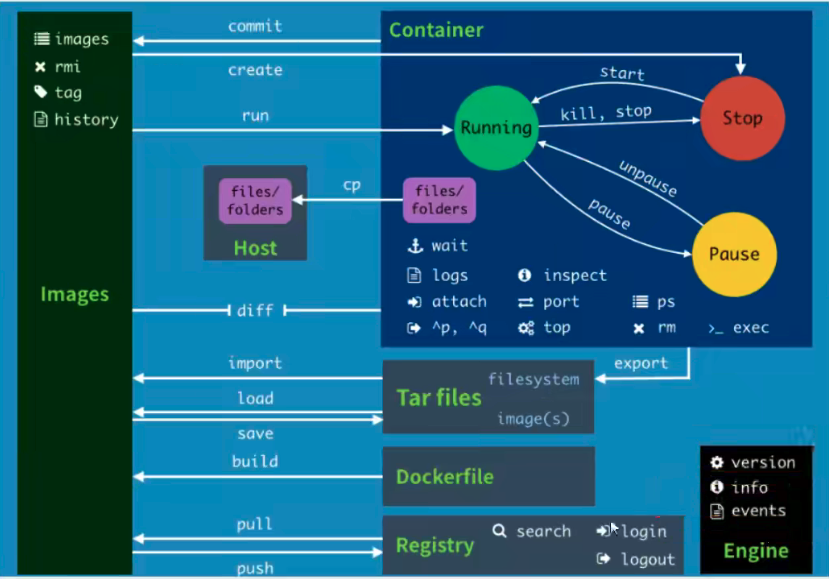

## Docker的常用命令

### 一、镜像命令

#### 帮助命令

```shell
docker version  # 显示docker 版本信息
docker info # 显示docker 的系统信息，包括镜像和容器的数量
docker 命令 --help # 帮助命令
```

#### 镜像命令

docker images 查看所有本地的主机上的镜像

```shell
root@9-134-239-95:~# docker images
REPOSITORY                                                                  TAG                 IMAGE ID            CREATED             SIZE
hello-world                                                                 latest              feb5d9fea6a5        7 weeks ago         13.3kB

# 解释
REPOSITORY 镜像的仓库源
TAG 镜像的标签
IMAGE ID 镜像的ID
CREATED 镜像的创建时间
SIZE 镜像的大小

# 可选选项
-a, --all  # 列出所有镜像
-q, --quiet  # 只列出镜像的 IMAGE ID
```

docker search 搜索镜像

```shell
root@9-134-239-95:~# docker search mysql
NAME                              DESCRIPTION                                     STARS               OFFICIAL            AUTOMATED
mysql                             MySQL is a widely used, open-source relation…   11680               [OK]                
mariadb                           MariaDB Server is a high performing open sou…   4450                [OK]                
mysql/mysql-server                Optimized MySQL Server Docker images. Create…   867                                     [OK]
percona                           Percona Server is a fork of the MySQL relati…   561                 [OK]                
phpmyadmin                        phpMyAdmin - A web interface for MySQL and M…   369                 [OK]                
centos/mysql-57-centos7           MySQL 5.7 SQL database server                   91                                      
mysql/mysql-cluster               Experimental MySQL Cluster Docker images. Cr…   89                                      
centurylink/mysql                 Image containing mysql. Optimized to be link…   59                                      [OK]
databack/mysql-backup             Back up mysql databases to... anywhere!         52         

# 可选项，通过STARS 来过滤
--filter=STARS=3000  # 搜索出来的镜像就是 STARS 大于3000的
```

docker pull 下载镜像

```shell
# 下载镜像 docker pull 镜像名[:tag]
# 如果不写 tag， 默认就是 latest 
# 会分层下载，docker image 的核心（联合文件系统）
Digest：签名
docker pull docker.io/library/mysql:latest # 使用真实的地址下载也可 
```

docker rmi 删除镜像： i 就代表image 

```
docker rmi -f 镜像id 镜像id
docker rmi -f $(docker images -aq) # 删除全部的镜像 
```

### 二、容器命令

我们有了镜像才可以创建容器

#### 新建容器并启动

```
docker run [可选参数] image 

# 参数说明 
--name="Name"  容器名字 tomcat01
-d  以后台方式运行
-it  使用交互方式运行，进入容器查看内容
-p  指定容器的断开 -p 8080:8080 和主机进行映射
	-p ip:主机端口:容器端口
	-p 主机端口：容器端口（常用）
	-p 容器端口
-P   随机指定端口

docker run -it 镜像id /bin/bash
exit 退出容器命令 
```

#### 列出所有的运行的容器

```
docker ps 
-a # 列出当前正在运行的容器+带出历史运行过的容器
-n=？ # 显示最近创建的容器，个数
-q # 只显示容器的编号
```

#### 退出容器

```
exit  # 直接停止并退出容器
Ctrl + P + Q # 容器不停止退出
```

#### 删除容器

```
docker rm 容器id  # 删除指定容器,不能删除正在运行的容器，如果要强制删除，需要 -f 
docker rm -f $(docker ps -aq)  # 删除全部容器 
docker ps -a -q | xargs docker rm # 删除全部容器 
```

#### 启动和停止容器的操作

```
docker start 容器id  # 启动容器
docker restart 容器id  # 重启容器
docker stop 容器id  # 停止当前正在运行的容器
docker kill 容器id  # 强制停止当前容器 
```

### 三、常用的其他命令

#### 后台启动

```
docker run -d 镜像id
问题： docker ps，发现容器停止了
常用的坑：docker 容器使用后台运行，就必须要有一个前台进程，docker 发现没有应用，就会自动停止
# nginx，容器启动后，发现自己没有提供服务，就会立刻停止，就是没有程序了
```

#### 查看日志

```shell
docker logs -f -t --tail 10 容器id # 没有日志

# 自己写一个shell脚本
docker run -d 8652b9f0cb4c /bin/sh -c "while true; do echo noahyzhang; sleep 1;done"
# 显示日志
docker logs -f -t --tail 10 容器id  
# -f 跟随日志输出 
# -t 显示时间戳
# --tail number 显示日志条数 
```

#### 查看容器中进程信息 ps

```shell
root@9-134-239-95:~# docker ps 
CONTAINER ID        IMAGE               COMMAND                  CREATED             STATUS              PORTS               NAMES
b0af58d4d73b        8652b9f0cb4c        "/bin/sh -c 'while t…"   3 minutes ago       Up 3 minutes                            lucid_wilbur

root@9-134-239-95:~# docker top b0af58d4d73b
UID                 PID                 PPID                C                   STIME               TTY                 TIME                CMD
root                2710                2693                0                   00:12               ?                   00:00:00            /bin/sh -c while true; do echo noahyzhang; sleep 1;done
root                5562                2710                0                   00:15               ?                   00:00:00            sleep 1
```

#### 查看镜像的元数据

docker inspect 容器id 

```shell
root@9-134-239-95:~# docker inspect b0af58d4d73b
[
    {
        "Id": "b0af58d4d73b38706dec67285ce6b95f28a6321bc13451a14fbc721743bfab2f",
        "Created": "2021-11-16T16:12:12.169850022Z",
        "Path": "/bin/sh",
        "Args": [
            "-c",
            "while true; do echo noahyzhang; sleep 1;done"
        ],
        "State": {
            "Status": "running",
            "Running": true,
            "Paused": false,
            "Restarting": false,
            "OOMKilled": false,
            "Dead": false,
            "Pid": 2710,
            "ExitCode": 0,
            "Error": "",
            "StartedAt": "2021-11-16T16:12:12.6608041Z",
            "FinishedAt": "0001-01-01T00:00:00Z"
        },
        "Image": "sha256:8652b9f0cb4c0599575e5a003f5906876e10c1ceb2ab9fe1786712dac14a50cf",
        "ResolvConfPath": "/var/lib/docker/containers/b0af58d4d73b38706dec67285ce6b95f28a6321bc13451a14fbc721743bfab2f/resolv.conf",
        "HostnamePath": "/var/lib/docker/containers/b0af58d4d73b38706dec67285ce6b95f28a6321bc13451a14fbc721743bfab2f/hostname",
        "HostsPath": "/var/lib/docker/containers/b0af58d4d73b38706dec67285ce6b95f28a6321bc13451a14fbc721743bfab2f/hosts",
        "LogPath": "/var/lib/docker/containers/b0af58d4d73b38706dec67285ce6b95f28a6321bc13451a14fbc721743bfab2f/b0af58d4d73b38706dec67285ce6b95f28a6321bc13451a14fbc721743bfab2f-json.log",
        "Name": "/lucid_wilbur",
        "RestartCount": 0,
        "Driver": "overlay2",
        "Platform": "linux",
        "MountLabel": "",
        "ProcessLabel": "",
        "AppArmorProfile": "",
        "ExecIDs": null,
        "HostConfig": {
            "Binds": null,
            "ContainerIDFile": "",
            "LogConfig": {
                "Type": "json-file",
                "Config": {}
            },
            "NetworkMode": "default",
            "PortBindings": {},
            "RestartPolicy": {
                "Name": "no",
                "MaximumRetryCount": 0
            },
            "AutoRemove": false,
            "VolumeDriver": "",
            "VolumesFrom": null,
            "CapAdd": null,
            "CapDrop": null,
            "Dns": [],
            "DnsOptions": [],
            "DnsSearch": [],
            "ExtraHosts": null,
            "GroupAdd": null,
            "IpcMode": "shareable",
            "Cgroup": "",
            "Links": null,
            "OomScoreAdj": 0,
            "PidMode": "",
            "Privileged": false,
            "PublishAllPorts": false,
            "ReadonlyRootfs": false,
            "SecurityOpt": null,
            "UTSMode": "",
            "UsernsMode": "",
            "ShmSize": 67108864,
            "Runtime": "runc",
            "ConsoleSize": [
                0,
                0
            ],
            "Isolation": "",
            "CpuShares": 0,
            "Memory": 0,
            "NanoCpus": 0,
            "CgroupParent": "",
            "BlkioWeight": 0,
            "BlkioWeightDevice": [],
            "BlkioDeviceReadBps": null,
            "BlkioDeviceWriteBps": null,
            "BlkioDeviceReadIOps": null,
            "BlkioDeviceWriteIOps": null,
            "CpuPeriod": 0,
            "CpuQuota": 0,
            "CpuRealtimePeriod": 0,
            "CpuRealtimeRuntime": 0,
            "CpusetCpus": "",
            "CpusetMems": "",
            "Devices": [],
            "DeviceCgroupRules": null,
            "DiskQuota": 0,
            "KernelMemory": 0,
            "MemoryReservation": 0,
            "MemorySwap": 0,
            "MemorySwappiness": null,
            "OomKillDisable": false,
            "PidsLimit": 0,
            "Ulimits": null,
            "CpuCount": 0,
            "CpuPercent": 0,
            "IOMaximumIOps": 0,
            "IOMaximumBandwidth": 0,
            "MaskedPaths": [
                "/proc/asound",
                "/proc/acpi",
                "/proc/kcore",
                "/proc/keys",
                "/proc/latency_stats",
                "/proc/timer_list",
                "/proc/timer_stats",
                "/proc/sched_debug",
                "/proc/scsi",
                "/sys/firmware"
            ],
            "ReadonlyPaths": [
                "/proc/bus",
                "/proc/fs",
                "/proc/irq",
                "/proc/sys",
                "/proc/sysrq-trigger"
            ]
        },
        "GraphDriver": {
            "Data": {
                "LowerDir": "/var/lib/docker/overlay2/d5d695c27f79231feb9073a188e8b77aed2d010413f22295f7c1e071a0390c7b-init/diff:/var/lib/docker/overlay2/fa7d8adeb6a1d656ba80b94a2e27195136b27e6b7dc5421e41e4250847917210/diff",
                "MergedDir": "/var/lib/docker/overlay2/d5d695c27f79231feb9073a188e8b77aed2d010413f22295f7c1e071a0390c7b/merged",
                "UpperDir": "/var/lib/docker/overlay2/d5d695c27f79231feb9073a188e8b77aed2d010413f22295f7c1e071a0390c7b/diff",
                "WorkDir": "/var/lib/docker/overlay2/d5d695c27f79231feb9073a188e8b77aed2d010413f22295f7c1e071a0390c7b/work"
            },
            "Name": "overlay2"
        },
        "Mounts": [],
        "Config": {
            "Hostname": "b0af58d4d73b",
            "Domainname": "",
            "User": "",
            "AttachStdin": false,
            "AttachStdout": false,
            "AttachStderr": false,
            "Tty": false,
            "OpenStdin": false,
            "StdinOnce": false,
            "Env": [
                "PATH=/usr/local/sbin:/usr/local/bin:/usr/sbin:/usr/bin:/sbin:/bin"
            ],
            "Cmd": [
                "/bin/sh",
                "-c",
                "while true; do echo noahyzhang; sleep 1;done"
            ],
            "Image": "8652b9f0cb4c",
            "Volumes": null,
            "WorkingDir": "",
            "Entrypoint": null,
            "OnBuild": null,
            "Labels": {
                "org.label-schema.build-date": "20201113",
                "org.label-schema.license": "GPLv2",
                "org.label-schema.name": "CentOS Base Image",
                "org.label-schema.schema-version": "1.0",
                "org.label-schema.vendor": "CentOS",
                "org.opencontainers.image.created": "2020-11-13 00:00:00+00:00",
                "org.opencontainers.image.licenses": "GPL-2.0-only",
                "org.opencontainers.image.title": "CentOS Base Image",
                "org.opencontainers.image.vendor": "CentOS"
            }
        },
        "NetworkSettings": {
            "Bridge": "",
            "SandboxID": "d9728811e4984f2dacd7e5055677df5e77728c3fa180e1219bdc560970011ce2",
            "HairpinMode": false,
            "LinkLocalIPv6Address": "",
            "LinkLocalIPv6PrefixLen": 0,
            "Ports": {},
            "SandboxKey": "/var/run/docker/netns/d9728811e498",
            "SecondaryIPAddresses": null,
            "SecondaryIPv6Addresses": null,
            "EndpointID": "f75279553f34561147e6034a042de12861eaca8a2a61fd11eb88cc63003798a3",
            "Gateway": "192.168.10.1",
            "GlobalIPv6Address": "",
            "GlobalIPv6PrefixLen": 0,
            "IPAddress": "192.168.10.2",
            "IPPrefixLen": 24,
            "IPv6Gateway": "",
            "MacAddress": "02:42:c0:a8:0a:02",
            "Networks": {
                "bridge": {
                    "IPAMConfig": null,
                    "Links": null,
                    "Aliases": null,
                    "NetworkID": "17a0d7d41fc5cc89ccb299bf56cbf37ba31c679712c0ff909398beb476b5b534",
                    "EndpointID": "f75279553f34561147e6034a042de12861eaca8a2a61fd11eb88cc63003798a3",
                    "Gateway": "192.168.10.1",
                    "IPAddress": "192.168.10.2",
                    "IPPrefixLen": 24,
                    "IPv6Gateway": "",
                    "GlobalIPv6Address": "",
                    "GlobalIPv6PrefixLen": 0,
                    "MacAddress": "02:42:c0:a8:0a:02",
                    "DriverOpts": null
                }
            }
        }
    }
]
```

#### 进入当前正在运行的容器

```shell
# 我们通常容器都是使用后台方式运行的，需要进入容器，修改一些配置

# 方式1
docker exec -it 容器id /bin/bash 
# 方式2
docker attach 容器id
执行完如下：
root@9-134-239-95:~# docker attach  b0af58d4d73b 
noahyzhang
noahyzhang
...

# 区别
docker exec # 进入容器后开启一个新的终端，可以在里面操作（常用）
docker attach # 进入容器正在执行的终端，不会启动新的进程
```

#### 从容器内拷贝文件到主机上

```shell
# docker cp 容器id:容器内路径 目的主机路径
docker cp 3a3c1b0c5180:/home/test.cpp /tmp

# 拷贝是一个手动过程，未来使用 -v 卷的技术，可以实现
```

### 小结



### 实验

1. 安装nginx

    ```shell
     docker search nginx
     docker pull nginx 
     docker run -d --name nginx01 -p 9999:80 nginx
     # 9999 为宿主机端口对应到容器的80端口
     # --name 可以给这个容器命名，启用多个容器可以有多个名字
     docker exec -it nginx01 /bin/bash
     # whereis nginx
    ```

2. 安装 tomcat

    ```shell
    # 官方的使用
    docker run -it --rm tomcat:9.0
    # 我们之前的启动都是后台，停止了容器之后，容器还是可以查到，docker run -it --rm，一般用来测试，用完即删
    
    # 下载在启动
    docker pull tomcat:9.0 
    
    # 发现问题 1. linux 命令很多没有 2. 没有webapps 
    默认是最小的镜像，所有不必要的都剔除掉了，保证最小的可用
    ```

3. 部署 es + kibana

    ```shell
    # es 暴露的端口比较多
    # es 十分的耗费内存
    # es 的数据一般需要放置到安全目录，挂载
    
    # 启动es 
    docker run -d --name elasticsearch -p 9200:9200 -p 9300:9300 -e "discovery.type=single-node" elasticsearch:tag
    # tag 可以从 dockerhub 中去获取
    # 查看资源使用 docker stats 
    
    # 增加内存限制，修改配置文件 -e 环境配置修改
    docker run -d --name elasticsearch -p 9200:9200 -p 9300:9300 -e "discovery.type=single-node" -e ES_JAVA_OPTS="-Xms64m -Xmx512m" elasticsearch:7.6.2
    ```

### 可视化

- portainer：Docker图形化界面工具，提供一个后台面板供我们操作

    ```
    docker run -d -p 9999:9000 --restart=always -v /var/run/docker.sock:/var/run/docker.sock --privileged=true portainer/portainer 
    ```

    访问测试：http://9.134.239.95:9999 

