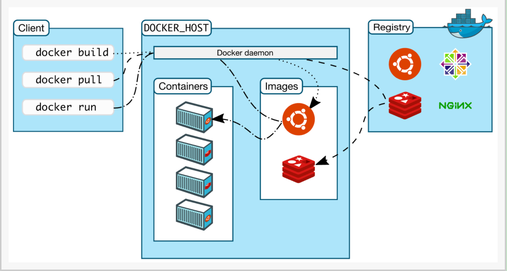

# Docker概述

## Docker 为什么出现

很多项目跑起来需要环境的支持，配置较麻烦，不同的环境可能会出现不同的现象

Docker 通过隔离机制，可以将服务器利用到极致

虚拟机和Docker 都是虚拟化技术。docker 的镜像只是（最核心的环境 4M ）十分的小巧

## 关于Docker

Docker 基于 Go 语言开源项目

比较Docker 和虚拟机技术的不同：

- 传统虚拟机，虚拟出硬件，运行一个完整的操作系统，然后在这个系统上安装和运行软件
- 容器内的应用直接运行在宿主机的内部，容器是没有自己的内核的，也没有虚拟我们的硬件，所以就更轻便
- 每个容器间都是相互隔离，每个容器内都有一个属于自己的文件系统，互不影响

> DevOps （开发、运维）

- 应用更快速的交付和部署
- 更便捷的升级和扩缩容
- 更简单的系统运维
- 更高效的计算资源利用

# Docker 安装


## Docker 的基本组成



镜像（image）：docker 镜像就像一个模板，可以通过这个模板来创建容器服务

容器（container）：Docker利用容器技术，可以独立运行一个活着一组应用，通过镜像来创建的

仓库（repository）：存放镜像的地方。分为公有仓库和私有仓库


## Docker 安装

文章：https://docs.docker.com/engine/install/centos/

卸载docker

1. 卸载 Docker Engine、CLI 和 Containerd 包：

    ```
    $ sudo yum remove docker-ce docker-ce-cli containerd.io
    ```

2. 主机上的映像、容器、卷或自定义配置文件不会自动删除。删除所有镜像、容器和卷：

    ```
    $ sudo rm -rf /var/lib/docker  # 默认的工作路径
    $ sudo rm -rf /var/lib/containerd
    ```

## 容器启动流程

运行某个容器，如果本机有这个镜像，直接运行；如果没有这个镜像，则去仓库寻找并下载。

## Docker 如何工作

Docker 是一个 Client-Server 结构的系统，Docker 的守护进程运行在主机上，通过socket 从客户端访问。Docker-Server 接收到 Docker-client 的指令，就会执行这个命令。

Docker 为什么比VM 快？

1. Docker 有比虚拟机更少的抽象层
2. docker 利用的是宿主机的内核，vm 需要是 Guest OS
3. 所以说，新建一个容器的时候，docker 不需要虚拟机一样重新加载一个操作系统内核，避免引导。虚拟机是加载 Guest OS，分钟级别的。而Docker 是利用宿主机的操作系统，省略了这个复杂的操作，是妙级的