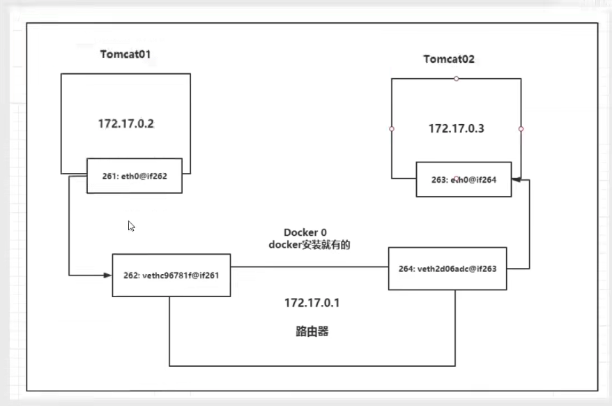
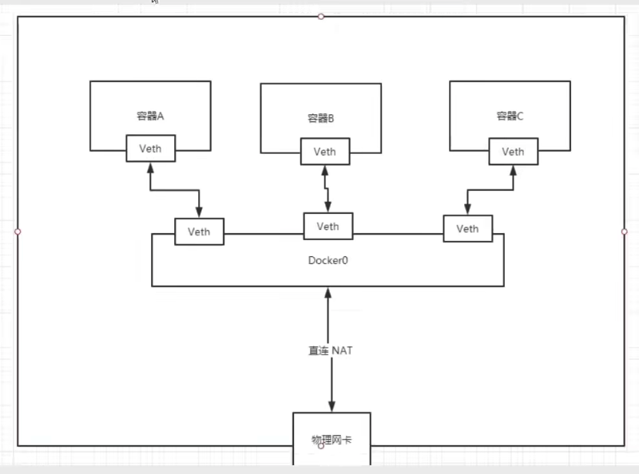

## Docker网络

### 理解 Docker0

```shell
root@9-134-239-95:tomcat# ip addr
1: lo: <LOOPBACK,UP,LOWER_UP> mtu 65536 qdisc noqueue state UNKNOWN group default 
    link/loopback 00:00:00:00:00:00 brd 00:00:00:00:00:00
    inet 127.0.0.1/8 scope host lo
       valid_lft forever preferred_lft forever
2: eth1: <BROADCAST,MULTICAST,UP,LOWER_UP> mtu 1500 qdisc mq state UP group default qlen 1000
    link/ether 52:54:00:d2:e6:38 brd ff:ff:ff:ff:ff:ff
    inet 9.134.239.95/21 brd 9.134.239.255 scope global eth1
       valid_lft forever preferred_lft forever
3: docker0: <NO-CARRIER,BROADCAST,MULTICAST,UP> mtu 1500 qdisc noqueue state DOWN group default 
    link/ether 02:42:7e:31:2e:67 brd ff:ff:ff:ff:ff:ff
    inet 192.168.10.1/24 brd 192.168.10.255 scope global docker0
       valid_lft forever preferred_lft forever
       
# 注意 docker0 的地址为 192.168.10.1 
```

```
docker run -d -P --name centos01 centos:7

# 查看容器内部的网络地址 ip addr, 发现容器启动的时候会得到一个 eth0 的容器内部ip地址，dokcer分配的
docker exec -it centos01 ip addr
1: lo: <LOOPBACK,UP,LOWER_UP> mtu 65536 qdisc noqueue state UNKNOWN group default 
    link/loopback 00:00:00:00:00:00 brd 00:00:00:00:00:00
    inet 127.0.0.1/8 scope host lo
       valid_lft forever preferred_lft forever
134: eth0: <BROADCAST,MULTICAST,UP,LOWER_UP> mtu 1500 qdisc noqueue state UP group default 
    link/ether 02:42:c0:a8:0a:03 brd ff:ff:ff:ff:ff:ff
    inet 192.168.10.3/24 brd 192.168.10.255 scope global eth0
       valid_lft forever preferred_lft forever
       
# linux 宿主机下可以ping 同docker 容器的ip 地址
```

```
再到 宿主机下执行 ip addr 
便可以发现又出现和容器互连的网卡
```

#### 原理

1. 我们每启动一个 docker 容器，docker 就会给docker容器分配一个ip，我们只要安装了docker，就会有一个网卡 docker0 桥接模式，使用的技术是 evth-pair 技术
2. 我们发现这个容器的网卡都是成对出现的。evth-pair 就是一对虚拟设备接口，他们都是成对出现的，一段连接着协议，一段彼此连接。正因为有这个特性，evth-pair 充当一个桥梁，连接各种虚拟网络设备。
3. 同一个宿主机下的容器间是可以互通的。tomcat01 和 tomcat02 是公用的一个路由器 docker0 。所有的容器不指定网络的情况下，都是docker0 路由的，docker 会给我们的容器分配一个默认的可用IP。



#### 小结

Docker使用的是 linux 的桥接，宿主机中是一个Docker容器的网桥 docker0



Docker 中的所有的网络接口都是虚拟的。虚拟的转发效率高。只要容器删除，对应的网桥一对也就没有了

### --link

通过容器名字可以访问嘛？使用 link 技术

```shell
docker run -it --name centos01 centos:7 
docker run -it --name centos02 --link centos01 centos:7
# 从容器 centos02 可以 ping 通 centos01,但是从 centos01 不能 ping 通 centos02 
```

原理

```shell
root@9-134-239-95:~# docker exec -it centos02 cat /etc/hosts
127.0.0.1       localhost
::1     localhost ip6-localhost ip6-loopback
fe00::0 ip6-localnet
ff00::0 ip6-mcastprefix
ff02::1 ip6-allnodes
ff02::2 ip6-allrouters
192.168.10.2    centos01 11f2400fc0f4
192.168.10.3    47e9bc0b1846
```

--link 就是在 hosts 配置中增加了 `192.168.10.2    centos01 11f2400fc0f4`

现在不建议使用 --link，不适用于 docker0，docker0 问题：不支持容器名连接访问。

## 自定义网络

```shell
# 查看所有的 docker 网络
root@9-134-239-95:~# docker network ls
NETWORK ID          NAME                DRIVER              SCOPE
471e3bf9266c        bridge              bridge              local
a09d489d2abd        host                host                local
ef2dbca65b2a        none                null                local
```

#### 网络模式

- bridge：桥接模式（默认）
- none：不配置网络
- host：和宿主机共享网络
- container：容器内网络连通（用得少，局限很大）

```shell
# 我们直接启动的命令 默认自带 --net bridge，而这个就是我们的 docker0
docker run -d -P --name tomcat01 --net bridge tomcat

# docker0 特点,默认，域名不能访问，--link 可以打通连接

# 我们可以自定义一个网络
# --drive vridge
# --subnet 192.168.0.0/24 
docker network create --driver bridge --subnet 192.168.0.0/24 --gateway 192.168.0.1 mynet
# 查看创建好的网络 
root@9-134-239-95:~# docker network ls
NETWORK ID          NAME                DRIVER              SCOPE
471e3bf9266c        bridge              bridge              local
a09d489d2abd        host                host                local
c4206da2444d        mynet               bridge              local
ef2dbca65b2a        none                null                local
```

查看自己的网络的详细信息

```shell
root@9-134-239-95:~# docker network inspect c4206da2444d
[
    {
        "Name": "mynet",
        "Id": "c4206da2444d400f439e664f32e1c686e8390b80cd16f7201b84b9b5862a7f72",
        "Created": "2021-11-20T18:56:19.795056448+08:00",
        "Scope": "local",
        "Driver": "bridge",
        "EnableIPv6": false,
        "IPAM": {
            "Driver": "default",
            "Options": {},
            "Config": [
                {
                    "Subnet": "192.168.0.0/24",
                    "Gateway": "192.168.0.1"
                }
            ]
        },
        "Internal": false,
        "Attachable": false,
        "Ingress": false,
        "ConfigFrom": {
            "Network": ""
        },
        "ConfigOnly": false,
        "Containers": {},
        "Options": {},
        "Labels": {}
    }
]

docker run -it --name centos01 --net mynet centos:7

root@9-134-239-95:~# docker network inspect mynet
[
    {
        "Name": "mynet",
        "Id": "c4206da2444d400f439e664f32e1c686e8390b80cd16f7201b84b9b5862a7f72",
        "Created": "2021-11-20T18:56:19.795056448+08:00",
        "Scope": "local",
        "Driver": "bridge",
        "EnableIPv6": false,
        "IPAM": {
            "Driver": "default",
            "Options": {},
            "Config": [
                {
                    "Subnet": "192.168.0.0/24",
                    "Gateway": "192.168.0.1"
                }
            ]
        },
        "Internal": false,
        "Attachable": false,
        "Ingress": false,
        "ConfigFrom": {
            "Network": ""
        },
        "ConfigOnly": false,
        "Containers": {
            "83d2de16363b74e09528897fc7128418e0799678e7d0dbcae4397edc7bb5ca70": {
                "Name": "centos01",
                "EndpointID": "779f1b1c7d0d007ad693025c1bfd93b81a62fc193c058fc66a833a82fdde9d7f",
                "MacAddress": "02:42:c0:a8:00:02",
                "IPv4Address": "192.168.0.2/24",
                "IPv6Address": ""
            }
        },
        "Options": {},
        "Labels": {}
    }
]

# 再次测试 ping 连接，使用自定义网络，也可以使用容器名 ping 互通 
docker run -it --name centos02 --net mynet centos:7
docker exec -it centos01 ping centos02
```

我们自定义的网络docker 都已经帮我们维护好了对应的关系，推荐我们平时这样使用网络

**好处：**

不同的集群使用不同的网络，保证集群是安全和健康的

#### 网络连通的操作

```shell
# 让一个容器连接到网段
docker network connect [OPTIONS] NETWORK CONTAINER 

# 连通之后就是将容器放到了 mynet 网络下
# 原理：一个容器，两个IP

# centos-bridge-01 网络是 bridge
# centos01、centos02 网络是 mynet
docker run -it --name centos-bridge-01 centos:7
# 让容器 centos-bridge-01 连通网络 mynet 
docker network connect mynet centos-bridge-01
# 可以发现 centos-bridge-01 可以 ping 通 centos01、centos02 
docker exec -it centos-bridge-01 ping centos02

# 可以使用 docker inspect centos-bridge01 或 centos01 查看 Networks 的配置
# 可以发现 centos-bridge01 在网络 mynet 上也有分配ip 
  "Networks": {
                "bridge": {
                    "IPAMConfig": null,
                    "Links": null,
                    "Aliases": null,
                    "NetworkID": "471e3bf9266cdb440b66f674ab08b4980c02f1b94a8aa1021eb86b054ad5c82a",
                    "EndpointID": "039f506800c9eae9ee0ff8d82576230660b5bf672f15537d88a6b43b410bc1a2",
                    "Gateway": "192.168.10.1",
                    "IPAddress": "192.168.10.2",
                    "IPPrefixLen": 24,
                    "IPv6Gateway": "",
                    "GlobalIPv6Address": "",
                    "GlobalIPv6PrefixLen": 0,
                    "MacAddress": "02:42:c0:a8:0a:02",
                    "DriverOpts": null
                },
                "mynet": {
                    "IPAMConfig": {},
                    "Links": null,
                    "Aliases": [
                        "0da8bddb8bfd"
                    ],
                    "NetworkID": "c4206da2444d400f439e664f32e1c686e8390b80cd16f7201b84b9b5862a7f72",
                    "EndpointID": "127633b61cc874ddf29082b9c463694313e64fbba35288baccefbfa60dac1baf",
                    "Gateway": "192.168.0.1",
                    "IPAddress": "192.168.0.4",
                    "IPPrefixLen": 24,
                    "IPv6Gateway": "",
                    "GlobalIPv6Address": "",
                    "GlobalIPv6PrefixLen": 0,
                    "MacAddress": "02:42:c0:a8:00:04",
                    "DriverOpts": {}
                }
            }
```

结论：假设要跨网络操作别的容器，就要使用 docker network connect 去连通

## 部署redis集群

先去学习 redis 集群

