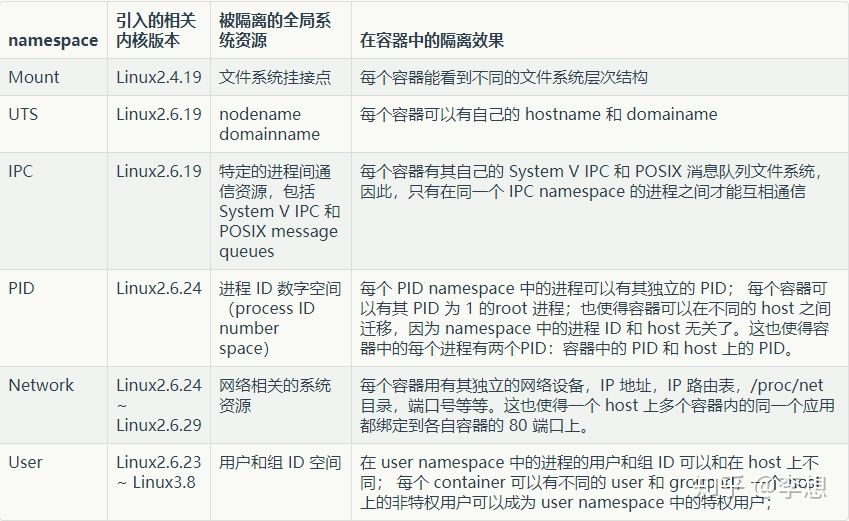

## docker 如何隔离资源

主要依赖 Linux 的 Namespace 和 Cgroups 两个技术。Namespace是Linux提供的资源隔离机制，说的直白一点，就是调用Linux内核的方法，实现各种资源的隔离。具体包括：文件系统、网络设备和端口、进程号、用户用户组、IPC等资源

### 一、namespace

Linux 内核从版本 2.4.19 开始陆续引入了 namespace 的概念。其目的是将某个特定的全局系统资源通过抽象方法使得namespace 中的进程看起来拥有它们自己的隔离的全局系统资源实例。Linux 内核中实现了六种 namespace，按照引入的先后顺序，列表如下：



例如，容器进程启动时，只要启用了Mount Namespace，并将自己打包的文件系统挂载好，就可以实现每个容器仅看到自己的文件，实现文件资源的隔离。总之，Docker 守护进程创建容器实例时都启用了相应的namespace，使得容器中的进程都处于一种隔离的运行环境之中。

通过系统调用 `clone()` 来创建一个具有独立 Namespace 的进程是最常见的做法，它可以通过 flags 参数传入相应标志位来控制进程的各种状态，如下：

```
pid = clone(fun,stack,flags,clone_arg);
(flags:CLONE_NEWPID  | CLONE_NEWNS |
    CLONE_NEWUSER | CLONE_NEWNUT |
    CLONE_NEWIPC  | CLONE_NEWUTS |
    ...)
```

**docker run中namespace相关参数**

- --ipc string IPC namespace to use
- --pid string PID namespace to use
- --userns string User namespace to use
- --uts string UTS namespace to use

可以在容器启动的时候，指定这些参数，从而强制容器运行在特定 namespace 之中。例如，你可以指定 --pid host，从而让容器进程使用宿主机进程空间，此时容器可以看到 host 上所有的进程。

场景：把常用的性能诊断工具都打包到一个镜像中，然后必要的时候在服务器上使用此镜像进行问题分析，此时加上该参数会很方便

### 二、Cgroups

通过Namespace，容器实现了资源的隔离，从而每个容器看起来都像是拥有自己独立的运行环境。注意，只是看起来。因为容器使用cpu、内存等并不受限制，假如某个容器占用这些资源过高，就可能会造成其它容器运行迟缓甚至异常，这就需要Cgroups了

cgroups 的全称是control groups，是Linux内核提供的一种可以限制单个进程或者多个进程所使用资源的机制，可以对 cpu，内存等资源实现精细化的控制

其典型的子系统如下：

- cpu 子系统，主要限制进程的 cpu 使用率。
- cpuacct 子系统，可以统计 cgroups 中的进程的 cpu 使用报告。
- cpuset 子系统，可以为 cgroups 中的进程分配单独的 cpu 节点或者内存节点。
- memory 子系统，可以限制进程的 memory 使用量。
- blkio 子系统，可以限制进程的块设备 io。
- devices 子系统，可以控制进程能够访问某些设备。
- net_cls 子系统，可以标记 cgroups 中进程的网络数据包，然后可以使用 tc 模块（traffic control）对数据包进行控制。
- freezer 子系统，可以挂起或者恢复 cgroups 中的进程。
- ns 子系统，可以使不同 cgroups 下面的进程使用不同的 namespace。

Cgroups 的实现是文件系统，我们可以直接查看。直接执行 mount -t cgourp 即可看到，系统已经自动在 /sys/fs/cgroup 目录下挂载好了相应文件，每个目录代表了上面的某种资源类型

```
> mount -t cgroup
cgroup on /sys/fs/cgroup/systemd type cgroup (rw,nosuid,nodev,noexec,relatime,xattr,release_agent=/usr/lib/systemd/systemd-cgroups-agent,name=systemd)
cgroup on /sys/fs/cgroup/oom type cgroup (rw,nosuid,nodev,noexec,relatime,oom)
cgroup on /sys/fs/cgroup/devices type cgroup (rw,nosuid,nodev,noexec,relatime,devices)
cgroup on /sys/fs/cgroup/hugetlb type cgroup (rw,nosuid,nodev,noexec,relatime,hugetlb)
cgroup on /sys/fs/cgroup/freezer type cgroup (rw,nosuid,nodev,noexec,relatime,freezer)
cgroup on /sys/fs/cgroup/memory type cgroup (rw,nosuid,nodev,noexec,relatime,memory)
cgroup on /sys/fs/cgroup/blkio type cgroup (rw,nosuid,nodev,noexec,relatime,blkio)
cgroup on /sys/fs/cgroup/cpu,cpuacct type cgroup (rw,nosuid,nodev,noexec,relatime,cpuacct,cpu)
cgroup on /sys/fs/cgroup/pids type cgroup (rw,nosuid,nodev,noexec,relatime,pids)
cgroup on /sys/fs/cgroup/perf_event type cgroup (rw,nosuid,nodev,noexec,relatime,perf_event)
cgroup on /sys/fs/cgroup/cpuset type cgroup (rw,nosuid,nodev,noexec,relatime,cpuset)
cgroup on /sys/fs/cgroup/net_cls type cgroup (rw,nosuid,nodev,noexec,relatime,net_cls)
```

比如 /sys/fs/cgroup/cpu 目录下文件，代表对 cpu 资源的控制

```
[/sys/fs/cgroup/cpu] ls
cgroup.clone_children  cgroup.sane_behavior  cpuacct.usage         cpu.cfs_quota_us          cpu.rt_runtime_us  docker             onion          tasks
cgroup.event_control   cpuacct.stat          cpuacct.usage_percpu  cpu.cfs_relax_thresh_sec  cpu.shares         kubepods           release_agent  user.slice
cgroup.procs           cpuacct.uptime        cpu.cfs_period_us     cpu.rt_period_us          cpu.stat           notify_on_release  system.slice
```

#### 如何使用 Cgroups 

可以直接在相应资源控制组目录下创建文件夹，例如，在 cpu 目录下创建 hello_cpu 目录，而系统会自动在 hello_cpu 目录下创建必要的文件

```
➜  [/sys/fs/cgroup/cpu] mkdir hello_cpu
➜  [/sys/fs/cgroup/cpu] cd hello_cpu 
[/sys/fs/cgroup/cpu/hello_cpu] ls
cgroup.clone_children  cgroup.procs  cpuacct.uptime  cpuacct.usage_percpu  cpu.cfs_quota_us          cpu.rt_period_us   cpu.shares  notify_on_release
cgroup.event_control   cpuacct.stat  cpuacct.usage   cpu.cfs_period_us     cpu.cfs_relax_thresh_sec  cpu.rt_runtime_us  cpu.stat    tasks
```

然后写一个死循环，运行，得到一个 pid 

```
cd /sys/fs/cgroup/cpu/hello_cpu
echo 20000 > cpu.cfs_quota_us
echo pid > tasks
top
```

将cpu.cfs_quota_us的值改为20000（此参数表示1秒周期内进程使用cpu的最大微秒数，因此20000表示20%）。然后将进程的Pid写入tasks文件中去。再次执行 top 命令会发现 cpu 使用率只有 20% 了。其他的资源控制也与此类似

**docker对Cgroups的使用**

默认情况下，docker 启动一个容器后，就会在 /sys/fs/cgroup 目录下的各个资源目录下生成以容器 ID 为名字的目录，在容器被 stopped 后，该目录被删除。那么，对容器资源进行控制的方式，就同上边的例子一样

