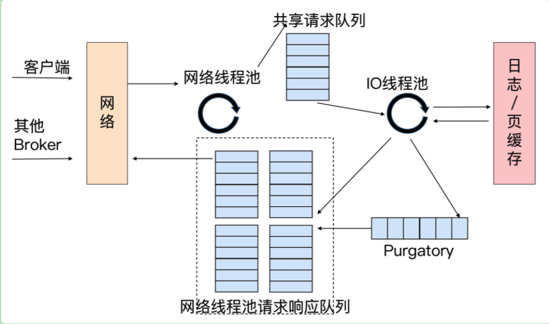

kafka 所有的请求都是通过TCP网络以Socket 的方式进行通讯的，使用的Reactor模式



```
Broker端参数 num.network.threads：网络线程池的数量，默认值是3。表示每台Broker启动时会创建3个网络线程，专门处理客户端发送的请求
Broker端参数 num.io.threads：控制 IO线程池 的数量，默认值是8，表示每台Broker启动后自动创建8个IO线程处理请求

注意：请求队列是所有网络线程共享的，而响应队列则是每个网络线程专属。因为 Dispatcher 只是用于分发而不负责响应回传，因此只能让每个网络线程自己发送 Response 给客户端，所以这些 Response 就没有必要放在一个公共地方。

Purgatory组件：用来“缓存延时请求”,就是哪些一时未满足条件不能立刻处理的请求。比如设置了 acks=all 的 Produce 请求，那么该请求就必须等待 ISR 中所有副本都接收了消息后才能返回，此时处理该请求的 IO 线程就必须等待其他 Broker 的写入结果。当请求不能立刻处理时，他就会暂存在 Purgatory 中。稍后一旦满足了完成条件，IO线程会继续处理该请求，并将 Response 放入对应网络线程的响应队列中。
```

控制类请求和数据类请求分离

```
控制类请求：执行特定的 kafka 内部动作。比如：LeaderAndIsr、StopReplica
数据类请求：操作消息数据。比如：Produce、fetch

问题：控制类请求可能会导致数据类请求失效？
例子1: 某个主题上只有1个分区，且该分区配置了两个副本，其中Leader副本保存在 Broker0 上，Follower 副本保存在 Broker1 上。假设 Broker0 机器积压了很多 Produce 请求，但此时使用kafka命令将该主题分区的Leader、Follower角色互换，那么kafka内部控制器组件会发送 LeaderAndlsr 请求给 Broker0，告诉它，它不再是Leader，而是Follower了，而 Broker1 上的 Follower 副本因为被选为新的 Leader，因此停止向 Broker0 拉取消息。
此时，如果刚才积压的 Produce 请求都设置了 acks=all，那么这些在 LeaderAndlsr 发送之前的请求就很无法正常完成了。他们会被暂存在 Purgatory 中不断重试，直接最终超时返回给客户端。
社区解决办法：kafka broker 启动后，会在后台分别创建两套网络线程池和IO线程池的组合，他们分别处理数据类请求和控制类请求。至于所用的 Socket 端口，自然是使用不同的端口了，你需要提供不同的 listeners 配置，显式地指定那套端口用于处理那类请求。
```


