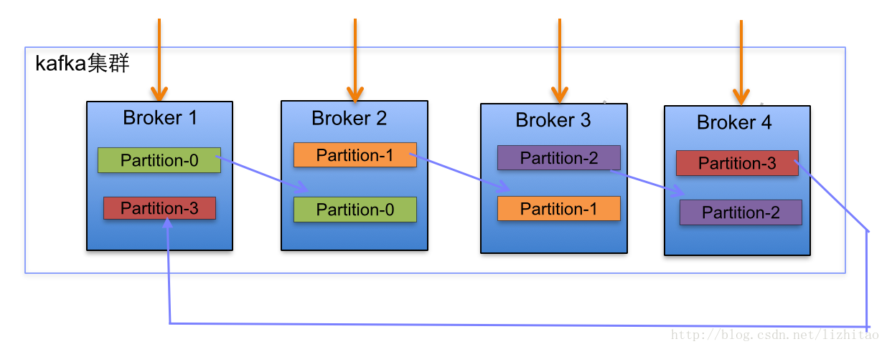
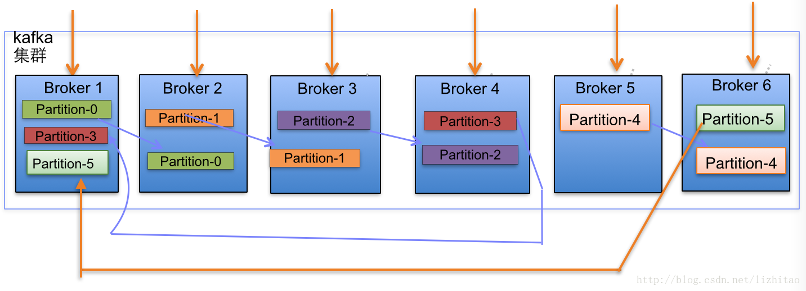
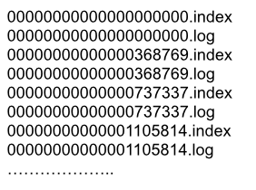
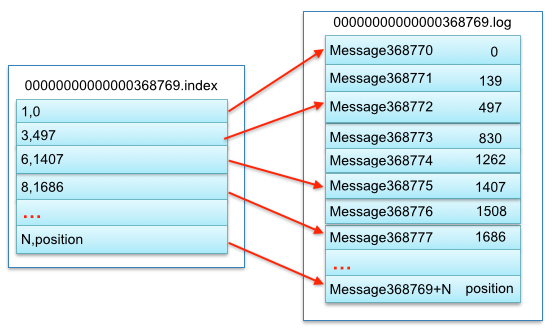
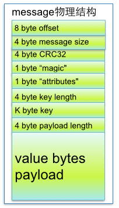

## kafka 文件存储机制

### 一、topic 中 partition 存储分布

在 kafka 文件存储中，同一个 topic 下有多个不同的 partition，每个 partition 为一个目录，partition 命名规则为 “topic名称+有序序号”，第一个 partition 序号从 0 开始，序号最大值为 partitions 数量减 1 。

当kafka 中有多 Broker 多 partition 的时候：如下，是一个 kafka 集群中，1 个 Topic 4 个 Broker，2 Replication，

当集群中新增 2 节点，partition 增加到 6 个时分布情况如下：

副本分配逻辑规则如下：

- 在 kafka 集群中，每个 Broker 都有均等分配 partition 的 leader 机会
- 如上图，箭头指向副本，以 partition-0 为例，broker1 中的 partition-0 为 leader，broker2 中 partition-0 为副本
- 如上图，每个 broker （按照 brokerId 有序）依次分配主 partition，下一个 broker 为副本，如此循环迭代分配，多副本遵循此规则

副本分配算法如下：

- 将所有 N broker 和待分配的 i 个 partition 排序
- 将第 i 个 partition 分配到第 ( i % n ) 个 broker 上
- 将第 i 个 partition 的第 j 个副本分配到第 ( ( i+j ) % n ) 个 broker 上 

### 二、partition 中文件存储方式

- 每个 partition（目录）相当于一个巨型文件被平均分配到多个大小相等的 segment（段）数据文件中。但每个段 segment file 消息数量不一定相等，这种特性方便 old segment file 快速被删除
- 每个 partition 只需要支持顺序读写就行了，segment 文件生命周期由服务端配置参数决定

这样做的好处是能快速删除无用文件，有效提高磁盘利用率

### 三、partition 中 segment 文件存储结构

partition 中 segment file 组成和物理结构

- segment file 组成：由 2 部分组成，为 index file 和 data file，这两个文件一一对应，后缀为 `.index` 和 `.log` ，分别表示为 segment 索引文件、数据文件
- segment 文件命名规则：partition 全局的第一个 segment 从 0 开始，后续每个 segment 文件名为上一个 segment 文件最后一个消息的 offset 值。数值最大为 64 位 long 大小，19 位数字字符长度，没有数字用 0 填充

如下，创建一个 topic XXX 包含 1 个 partition，设置每个 segment 大小为 500M，并启动生产者向 kafka broker 写入大量数据，如下图：

以上图一对 segment file 文件为例，segment 中 index file 和 data file 对应关系的物理结构如下：

可以看出来，segment index file 的存储结构是一个稀疏索引，索引文件存储元数据，数据文件存储消息。索引文件中的元数据指向对应数据文件中 message 的偏移地址。其中以索引文件中元数据 `3, 497` 为例，依次在数据文件中表示第 3 个 message（在全局 partition 表示第 368772 个 message）、以及该消息的物理偏移地址为 497

segment data file 由许多 message 组成，来看看 message 物理结构：

参数说明：

| 关键字              | 解释                                                         |
| ------------------- | ------------------------------------------------------------ |
| 8 byte offset       | 在parition(分区)内的每条消息的偏移（offset），确定每条消息在parition(分区)内的位置。即offset表示partiion的第多少条message |
| 4 byte message size | message 大小                                                 |
| 4 byte CRC32        | 用 crc32 校验 message                                        |
| 1 byte “magic”      | 表示本次发布Kafka服务程序协议版本号                          |
| 1 byte “attributes” | 表示为独立版本、或标识压缩类型、或编码类型。                 |
| 4 byte key length   | 表示key的长度,当key为-1时，K byte key字段不填                |
| K byte key          | 可选                                                         |
| value bytes payload | 表示实际消息数据。                                           |

### 四、在 partition 中如何通过 offset 查找 message

例如读取 offset = 368776 的 message，通过如下步骤

- 第一步查找 segment file 以上图为例，其中 00000000000000368769.index 的消息量起始偏移量为368770 = 368769 + 1，其他后续文件依次类推，以起始偏移量命名并排序这些文件，只要根据 offset  二分查找文件列表，就可以快速定位到具体文件。 当 offset=368776 时定位到 00000000000000368769.index 
- 第二部通过定位到的 segment file，当 offset = 368776 时，依次定位到 00000000000000368769.index 的元数据物理位置 和 00000000000000368769.log 的物理偏移地址，然后再通过 00000000000000368769.log 顺序查找直到 offset=368776 为止

segment index file 采用稀疏索引存储方式，大大减少了索引文件大小，通过 mmap 可以直接内存操作，稀疏索引为数据文件的每个对应 message 设置一个元数据指针，它比稠密索引节省了更多的存储空间，但查找起来可能需要消耗更多的时间。

### 五、kafka 高效文件存储设计特点

- kafka 把 topic 中一个 partition 大文件分成多个小文件，通过多个小文件，就容易定期清除或删除已经消费完的文件，减少磁盘占用
- 通过索引信息可以快速定位 message 和确定 response 的最大大小
- 通过 index 元数据全部映射到 memory，可以避免 segment index file 的 IO 磁盘操作
- 通过索引文件使用稀疏索引存储，可以大幅降低文件元数据占用空间大小

