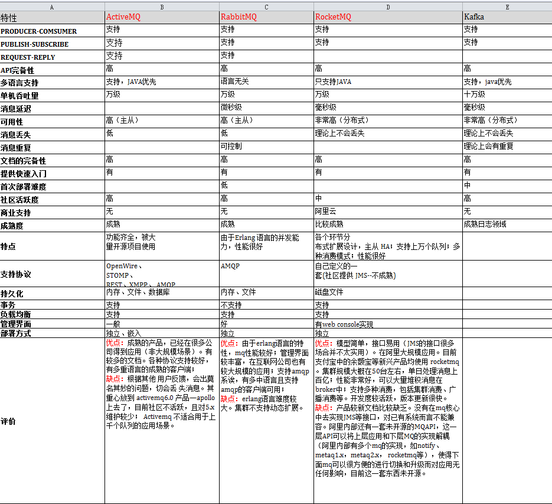

## 消息队列

### 一、消息队列的模式

消息队列目前主要2种模式，分别为“点对点模式”和“发布/订阅模式”。

#### 1. 点对点模式

一个具体的消息只能由一个消费者消费。多个生产者可以向同一个消息队列发送消息；但是，一个消息在被一个消费者处理的时候，这个消息在队列上会被锁住或者被移除并且其他消费者无法处理该消息。需要额外注意的是，如果消费者处理一个消息失败了，消息系统一般会把这个消息放回队列，这样其他消费者可以继续处理。

#### 2. 发布/订阅模式

单个消息可以被多个订阅者并发的获取和处理。一般来说，订阅有两种类型：

- 临时（ephemeral）订阅，这种订阅只有在消费者启动并且运行的时候才存在。一旦消费者退出，相应的订阅以及尚未处理的消息就会丢失。
- 持久（durable）订阅，这种订阅会一直存在，除非主动去删除。消费者退出后，消息系统会继续维护该订阅，并且后续消息可以被继续处理。

### 二、消息队列技术选型的衡量标准

对消息队列进行技术选型时，需要通过以下指标衡量你所选择的消息队列，是否可以满足你的需求

- 消息顺序：发送到队列的消息，消费时是否可以保证消费的顺序，比如A先下单，B后下单，应该是A先去扣库存，B再去扣，顺序不能反。
- 消息路由：根据路由规则，只订阅匹配路由规则的消息，比如有A/B两者规则的消息，消费者可以只订阅A消息，B消息不会消费。
- 消息可靠性：是否会存在丢消息的情况，比如有A/B两个消息，最后只有B消息能消费，A消息丢失。
- 消息时序：主要包括“消息存活时间”和“延迟/预定的消息”，“消息存活时间”表示生产者可以对消息设置TTL，如果超过该TTL，消息会自动消失；“延迟/预定的消息”指的是可以延迟或者预订消费消息，比如延时5分钟，那么消息会5分钟后才能让消费者消费，时间未到的话，是不能消费的。
- 消息留存：消息消费成功后，是否还会继续保留在消息队列。
- 容错性：当一条消息消费失败后，是否有一些机制，保证这条消息是一种能成功，比如异步第三方退款消息，需要保证这条消息消费掉，才能确定给用户退款成功，所以必须保证这条消息消费成功的准确性。
- 伸缩：当消息队列性能有问题，比如消费太慢，是否可以快速支持库容；当消费队列过多，浪费系统资源，是否可以支持缩容。
- 吞吐量：支持的最高并发数。

### 三、主流消息队列的对比

下面简单介绍常用的消息队列：

- Kafka：Apache Kafka它最初由LinkedIn公司基于独特的设计实现为一个分布式的提交日志系统( a distributed commit log)，之后成为Apache项目的一部分。号称大数据的杀手锏，谈到大数据领域内的消息传输，则绕不开Kafka，这款为大数据而生的消息中间件，以其百万级TPS的吞吐量名声大噪，迅速成为大数据领域的宠儿，在数据采集、传输、存储的过程中发挥着举足轻重的作用。
- RabbitMQ：RabbitMQ 2007年发布，是使用Erlang语言开发的开源消息队列系统，基于AMQP协议来实现。AMQP的主要特征是面向消息、队列、路由（包括点对点和发布/订阅）、可靠性、安全。AMQP协议更多用在企业系统内，对数据一致性、稳定性和可靠性要求很高的场景，对性能和吞吐量的要求还在其次。
- RocketMQ：是阿里开源的消息中间件，它是纯Java开发，具有高吞吐量、高可用性、适合大规模分布式系统应用的特点。RocketMQ思路起源于Kafka，但并不是Kafka的一个Copy，它对消息的可靠传输及事务性做了优化，目前在阿里集团被广泛应用于交易、充值、流计算、消息推送、日志流式处理、binglog分发等场景。
- ActiveMQ：是Apache出品，最流行的，能力强劲的开源消息总线。官方社区现在对ActiveMQ 5.x维护越来越少，较少在大规模吞吐的场景中使用，所以该消息队列也不是我们文章中重点讨论的内容。

### 四、消息队列的优缺点

#### 1. kafka 

优点：

- 高吞吐、低延迟：kakfa 最大的特点就是收发消息非常快，kafka 每秒可以处理几十万条消息，它的最低延迟只有几毫秒；
- 高伸缩性： 每个主题(topic) 包含多个分区(partition)，主题中的分区可以分布在不同的主机(broker)中；
- 持久性、可靠性： Kafka 能够允许数据的持久化存储，消息被持久化到磁盘，并支持数据备份防止数据丢失，Kafka 底层的数据存储是基于 Zookeeper 存储的，Zookeeper 我们知道它的数据能够持久存储；
- 容错性： 非常高，kafka是分布式的，一个数据多个副本，某个节点宕机，Kafka 集群能够正常工作；
- 消息有序：消费者采用Pull方式获取消息，消息有序，通过控制能够保证所有消息被消费且仅被消费一次；
- 有优秀的第三方Kafka Web管理界面Kafka-Manager，在日志领域比较成熟，被多家公司和多个开源项目使用；
- 功能支持：功能较为简单，主要支持简单的MQ功能，在大数据领域的实时计算以及日志采集被大规模使用。

缺点：

- Kafka单机超过64个队列/分区，Load会发生明显的飙高现象，队列越多，load越高，发送消息响应时间变长；
- 使用短轮询方式，实时性取决于轮询间隔时间；
- 消费失败不支持重试；
- 支持消息顺序，但是一台代理宕机后，就会产生消息乱序；
- 社区更新较慢。

总结：

- Kafka主要特点是基于Pull的模式来处理消息消费，追求高吞吐量，一开始的目的就是用于日志收集和传输，适合产生大量数据的互联网服务的数据收集业务。
- 大型公司建议可以选用，如果有日志采集功能，肯定是首选kafka。

#### 2. RabbitMQ

优点：

- 异步消息传递：支持多种消息协议，消息队列，传送确认，灵活的路由到队列，多种交换类型；
- 支持几乎所有最受欢迎的编程语言：Java，C，C ++，C＃，Ruby，Perl，Python，PHP等等；
- 可以部署为高可用性和吞吐量的集群;，跨多个可用区域和区域进行联合；
- 可插入的身份验证，授权，支持TLS和LDAP；
- 提供了许多插件，来从多方面进行扩展，也可以编写自己的插件；
- 提供了一个易用的用户界面，使得用户可以监控和管理消息Broker，社区活跃度高。

缺点：

- erlang开发，很难去看懂源码，基本职能依赖于开源社区的快速维护和修复bug，不利于做二次开发和维护；
- RabbitMQ确实吞吐量会低一些，这是因为他做的实现机制比较重；
- 需要学习比较复杂的接口和协议，学习和维护成本较高。

总结：

- 结合erlang语言本身的并发优势，性能较好，社区活跃度也比较高，但是不利于做二次开发和维护。不过RabbitMQ的社区十分活跃，可以解决开发过程中遇到的bug。
- 如果你的数据量没有那么大，小公司优先选择功能比较完备的RabbitMQ。

#### 3. RocketMQ

优点：

- 支持发布/订阅（Pub/Sub）和点对点（P2P）消息模型；
- 在一个队列中可靠的先进先出（FIFO）和严格的顺序传递；
- 支持拉（pull）和推（push）两种消息模式；
- 单一队列百万消息的堆积能力；
- 支持多种消息协议，如 JMS、MQTT 等；
- 可靠的FIFO和严格的有序消息传递在同一队列中；
- 灵活的分布式横向扩展部署架构，满足至少一次消息传递语义；
- 提供 docker 镜像用于隔离测试和云集群部署；
- 提供配置、指标和监控等功能丰富的 Dashboard。

缺点：

- 支持的客户端语言不多，目前是java及c++，其中c++不成熟
- 社区活跃度一般
- 没有在 mq 核心中去实现JMS等接口，有些系统要迁移需要修改大量代码

总结：

- 天生为金融互联网领域而生，对于可靠性要求很高的场景，尤其是电商里面的订单扣款，以及业务削峰，在大量交易涌入时，后端可能无法及时处理的情况。
- RoketMQ在稳定性上可能更值得信赖，这些业务场景在阿里双11已经经历了多次考验，如果你的业务有上述并发场景，建议可以选择RocketMQ。

#### 4. ActiveMQ

优点

- 支持来自Java，C，C ++，C＃，Ruby，Perl，Python，PHP的各种跨语言客户端和协议；
- 完全支持JMS客户端和Message Broker中的企业集成模式；
- 支持许多高级功能，如消息组，虚拟目标，通配符和复合目标；
- 完全支持JMS 1.1和J2EE 1.4，支持瞬态，持久，事务和XA消息；
- Spring支持，以便ActiveMQ可以轻松嵌入到Spring应用程序中，并使用Spring的XML配置机制进行配置；
- 专为高性能集群，客户端 - 服务器，基于对等的通信而设计；
- CXF和Axis支持，以便ActiveMQ可以轻松地放入这些Web服务堆栈中以提供可靠的消息传递；
- 可以用作内存JMS提供程序，非常适合单元测试JMS；
- 支持可插拔传输协议，例如in-VM，TCP，SSL，NIO，UDP，多播，JGroups和JXTA传输；
- 使用JDBC和高性能日志支持非常快速的持久性。

缺点:

- 官方社区现在对ActiveMQ 5.x维护越来越少，较少在大规模吞吐的场景中使用。

---

来自文章：https://www.mdnice.com/writing/5f57746731234c37ba0dfbc9ce54a9ff