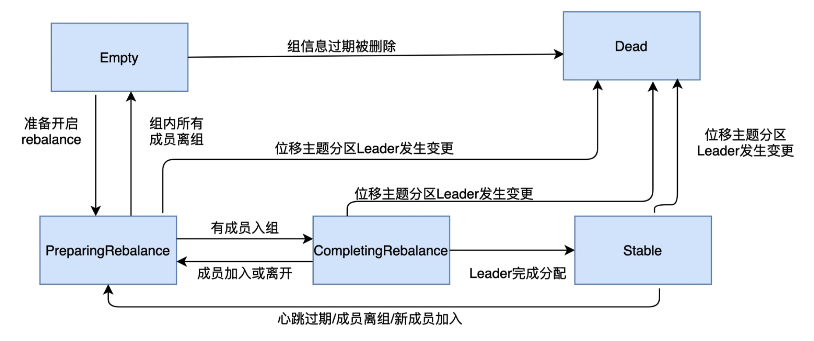

重平衡过程通过消费者端的心跳线程通知到其他消费者实例

heartbear.interval.ms：设置了心跳的间隔时间，也控制重平衡通知的频率。如果想要消费者实例能迅速地得到通知，那可以设置一个非常小的值，这样消费者就能更快的感知到重平衡已经开启了

#### 消费者组的5种状态

| 状态                | 含义                                                         |
| ------------------- | ------------------------------------------------------------ |
| Empty               | 组内没有任何成员，但消费者组可能存在已提交的位移数据，而且这些位移尚未过期 |
| Dead                | 组内没有任何成员，但组的元数据信息已经在协调者端被移除。(协调者组件保存着当前向它注册过的所有组信息，所谓的元数据信息就类似于这个注册信息) |
| PreparingRebalance  | 消费者组准备开启重平衡，此时所有成员都要重新请求加入消费者组 |
| CompletingRebalance | 消费者组下所有成员已经加入，各个成员正在等待分配方案。       |
| Stable              | 消费者组的稳定状态。该状态表明重平衡已经完成，组内各成员能够正常消费数据了 |

#### 消费者组状态机



```
消费者组启动时的状态流转过程：一个消费者组最开始是 Empty 状态，当重平衡开启后，它会被置于 PreparingRebalance 状态等待成员加入，之后变更到 CompletingRebalance 状态等待分配方案，最后流转到 Stable 状态完成重平衡。
当有新成员加入或已有成员退出时，消费者组的状态从 Stable 直接跳到 PreparingRebalance 状态，此时，所有现存成员必须重新申请加入组。当所有成员都退出组后，消费者组状态变更为 Empty。Kafka 定期自动删除过期位移的条件是，组要处于 Empty 状态。因此，如果你的消费者组停掉了很长时间(超过7天)，那么kafka 很可能把该组的位移数据删除了。
```

#### 消费者端重平衡流程

```
重平衡分为两个步骤：
1. JoinGroup 请求：加入组。
当组内成员加入组时，它会向协调者发送 JoinGroup 请求，在该请求中，每个成员都要将自己订阅的主题上报，这样协调者就能收集到所有成员的订阅信息。一旦收集了全部成员的 JoinGroup 请求后，协调者会从这些成员中选择一个担任这个消费者组的领导者。一般第一个发送 JoinGroup 请求的成员自动成为领导者。领导者消费者的任务是收集所有成员的订阅信息，然后根据这些信息，制定具体的分区消费分配方案。
选出领导者之后，协调者会把消费者订阅消息封装进 JoinGroup 请求的响应体中，然后发给领导者，由领导者统一做出分配方案后，去发送 SyncGroup 请求
2. SyncGroup 请求：等待领导者消费者分配方案
领导者向协调者发送 SyncGroup 请求，将刚刚做出的分配方案发给协调者。其他成员也会发送空的 SyncGroup 请求。这一步的目的是让协调者接收分配方案，然后统一以 SyncGroup 响应的方式分发给所有成员。
```

```
为什么重平衡需要从消费者实例中选择一个Leader，让Leader去制定重平衡方案，为什么不直接让协调者组件来处理呢？
答：客户端自己制定分配方案，类似分配方案插件，插件可以实现自定义分配方案，只是这个插件同时是客户端，不用依赖服务器端重启或者部署。
```

