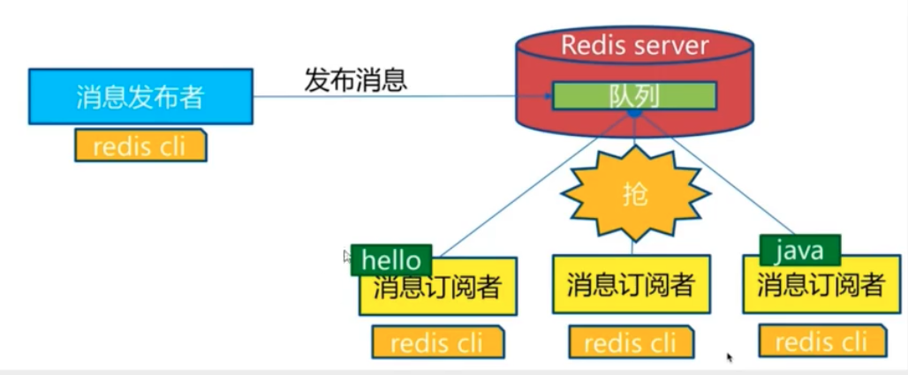
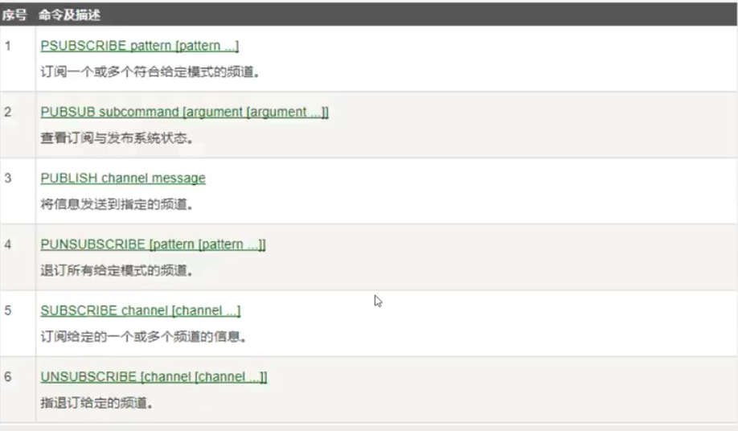

## Redis 发布订阅

 

> 命令



订阅端：

```
127.0.0.1:6379> SUBSCRIBE noahyzhang  # 订阅一个频道，频道的名字：noahyzhang
Reading messages... (press Ctrl-C to quit)
1) "subscribe"
2) "noahyzhang"
3) (integer) 1
# 等待读取推送的消息
1) "message"  # 消息
2) "noahyzhang"  # 那个频道的消息
3) "nihao" # 消息的具体内容 
```

发送端：

```
publish noahyzhang "hello" # 发布者发布消息到频道
```

> 原理

Redis 是使用 C 实现的，通过分析 Redis 源码里的 pubsub.c 文件，Redis 通过 PUBLISH、SUBSCRIBE 和 PSUBSCRIBE 等命令实现发布和订阅功能。

通过 SUBSCRIBE 命令订阅某频道后，redis-server 里维护一个字典，字典的键值就是一个个频道！而字典的值则是一个链表，链表中保存了所有订阅这个 channel 的客户端，SUBSCRIBE 命令的关键，就是将客户端添加到给定 channel 的订阅链表中。

通过 PUBLISH 命令向订阅者发送消息，redis-server 会使用给定的频道作为键，在他所维护的 channel 字典中查找记录了订阅这个频道的所有客户端的链表，遍历这个链表，将消息发布给所有订阅者

Pub/Sub 从字面上理解就是发布与订阅，在Redis 中，你可以设定对某一个key 值进行消息发布及消息订阅，当一个 key 值上进行了消息发布后，所有订阅它的客户端都会收到相应的消息。这一功能最明显的用法就是用作实时消息系统，比如普通的即时聊天，群聊等功能。