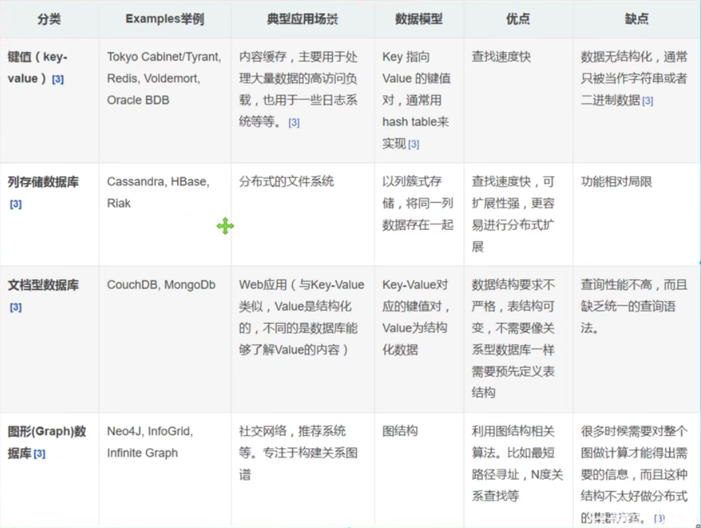

## NoSQL 的四大分类

#### 1. kV键值对

#### 2. 文档型数据库( bson 格式和 json 一样)

- MongoDB

    基于分布式文件存储的数据库，C++编写，主要用来处理大量的文档

    是一个介于关系型数据库和非关系型数据库中间的产品

    MongoDB 是非关系型数据库中功能最丰富、最像关系型数据库的

- ConthDB

#### 3. 列存储数据库

- HBase
- 分布式文件系统

#### 4. 图形关系数据库

- 它不是存图形，放的是关系，比如：朋友圈社交网络，广告推荐
- Neo4j、Info

