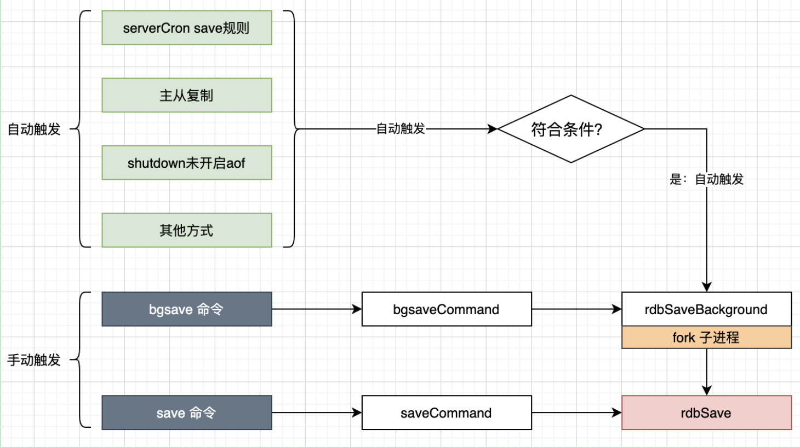
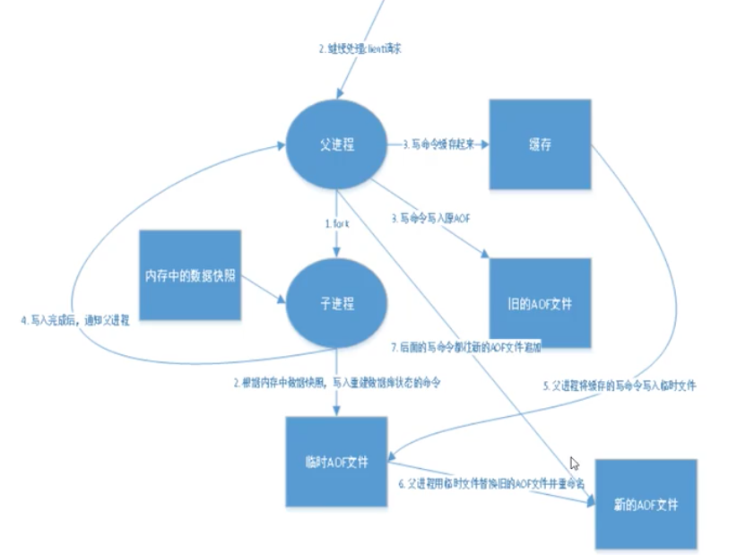

## Redis 持久化

Redis 是内存数据库，如果不将内存中的数据库状态保存到磁盘，那么一旦服务器进程退出，服务器中的数据库状态也会消失。所以Redis 提供了持久化功能

### RDB（Redis DataBase）

在指定的时间间隔内将内存中的数据集快照写入磁盘，也就是行话讲的Snapshot 快照，它恢复时是将快照文件直接读到内存里



Redis 会单独创建（Fork）一个子进程来进行持久化，会先将数据写入到一个临时文件中，待持久化过程都结束了，在用这个临时文件替换上次持久化好的文件。整个过程中，主进程是不进行任何IO操作的。这就确保了极高的性能。如果需要进行大规模数据的恢复，且对于数据恢复的完整性不是非常敏感，那么RDB方式要比AOF方式更加的高效。RDB的缺点是最后一次持久化后的数据可能丢失。我们默认的就是RDB，一般情况下不需要修改这个配置。

有时候在生产环境会将这个文件备份。

rdb保存的文件就是 dump.rdb，配置： `dbfilename dump.rdb`

> 触发机制

1. save 的规则满足的情况下，会自动触发 rdb 规则
2. 执行 flushall 命令，也会触发 rdb 规则
3. 退出 redis，也会产生 rdb 文件

备份就会自动生成一个 dump.rdb

> 如何恢复 rdb 文件

1. 只需要将 rdb 文件放在 redis 启动目录就可以，redis 启动的时候会自动检测 dump.rdb 恢复其中的数据

2. 查看存在的位置

    ```
    127.0.0.1:6379> config get dir
    1) "dir"
    2) "/usr/local/bin"  # 如果这个目录下存在 dump.rdb 文件，启动就会自动恢复其中的数据
    ```

优点：

1. 适合大规模的数据恢复
2. 对数据的完整性要求不高

缺点：

1. 需要一定的时间间隔，子进程去操作，如果redis 意外宕机了，这个最后一次修改的数据就没有了
2. fork 进程的时候，会占用一定的空间

### AOF（APPEND Only File）

将我们的所有命令都记录下来，恢复的时候就把这个文件全部在执行一遍



以日志的形式来记录每个写操作，将Redis 执行过的所有指令记录下来（读操作不记录），只许追加文件但不可以改写文件，redis 启动之初会读取该文件重新构建数据，换言之，redis 重启的时候就根据日志文件内容将写指令从前到后执行一次以完成数据的恢复工作

**aof保存的是 appendonly.aof 文件** 

配置文件：APPEND ONLY MODE。开启打开配置：`appendonly yes`

默认是不开启的，我们需要手动进行配置，我们只需要将 appendonly 改为 yes 就开启了 aof。重启redis-server 就可以生效了

如果这个 aof 文件有错位，redis-server 启动就会失败，我们可以使用 ` redis-check-aof --fix appendonly.aof` 来修改这个文件。但是任何的恢复都会有容错范围

```
redis-check-aof --fix appendonly.aof 
0x              6e: Expected prefix '*', got: 'a'
AOF analyzed: size=121, ok_up_to=110, ok_up_to_line=27, diff=11
This will shrink the AOF from 121 bytes, with 11 bytes, to 110 bytes
Continue? [y/N]: y
Successfully truncated AOF
```

> 重写规则

```
auto-aof-rewrite-percentage 100
1329 auto-aof-rewrite-min-size 64mb 
```

aof默认就是文件的无限追加，文件就会越来越大。 如果aof 文件大于 64M，fork 一个新的进程来将文件进行重写。

> 优点和缺点

优点：

1. 每一次修改都同步，文件的完整性会更好
2. 每秒同步一次，就可能会丢失一秒的数据
3. 从不同步，效率是最高的

缺点：

1. 相对于数据文件来说，aof 远远大于 rdb，修改的速度也比 rdb 慢
2. aof 运行效率也要比 rdb 慢，所以redis 默认的配置就是 rdb 持久化

**扩展：**

1. RDB 持久化方法能够在指定的时间间隔内对你的数据进行快照存储
2. AOF 持久化方式记录每次对服务器写的操作，当服务器重启的时候会重新执行这些命令来恢复原始的数据，AOF命令以Redis 协议追加保存每次写的操作到文件末尾，Redis 还能对 AOF 文件进行后台重写，使得 AOF 文件的体积不至于过大。
3. **只做缓存，如果你只希望你的数据在服务器运行的时候存在，你也可以不使用任何持久化**
4. 同时开启两种持久化方式
    - 在这种情况下，当redis 重启的时候会优先载入 AOF 文件来恢复原始的数据，因为在通常情况下 AOF 文件保存的数据集要比 RDB 文件保存的数据集要完整
    - RDB 的数据不实时，同时使用两者时服务器重启也只会找AOF 文件，那要不要只使用AOF呢？作者建议不要，因为RDB 更适合用于备份数据库（AOF在不断变化不好备份），快速重启，而且不会有AOF 可能潜在的Bug，留着做为一个万一的手段
5. 性能建议
    - 因为 RDB 文件只用作后备用途，建议只在 Slave 上持久化 RDB 文件，而且只要 15分钟备份一次就够了，只保留 save 900 1 这条规则
    - 如果 Enable AOF，好处是在最恶劣情况下也只会丢失不超过两秒数据，启动脚本较简单只 load 自己的 AOF 文件就可以了，代价一是带来了持续的IO，二是AOF rewrite 的最后将 rewrite 过程中产生的新数据写到新文件造成的阻塞几乎是不可避免的。只要硬盘许可，应该尽量减少 AOF rewrite 的频率，AOF 重写的基础大小默认值 64M 太小了，可以设为 5G 以上，默认超过原大小100% 大小重写可以改造到适当的数值。
    - 如果不 Enable AOF，仅靠 Master-Slave Replication 实现高可用性也可以，能省掉一大笔IO，也减少了 rewrite 时带来的系统波动。代价是如果 Master/Slave 同时倒掉，会丢失十几分钟的数据，启动脚本也要比较两个 Master/Slave 中的 RDB 文件，载入较新的那个，微博就是这种架构

