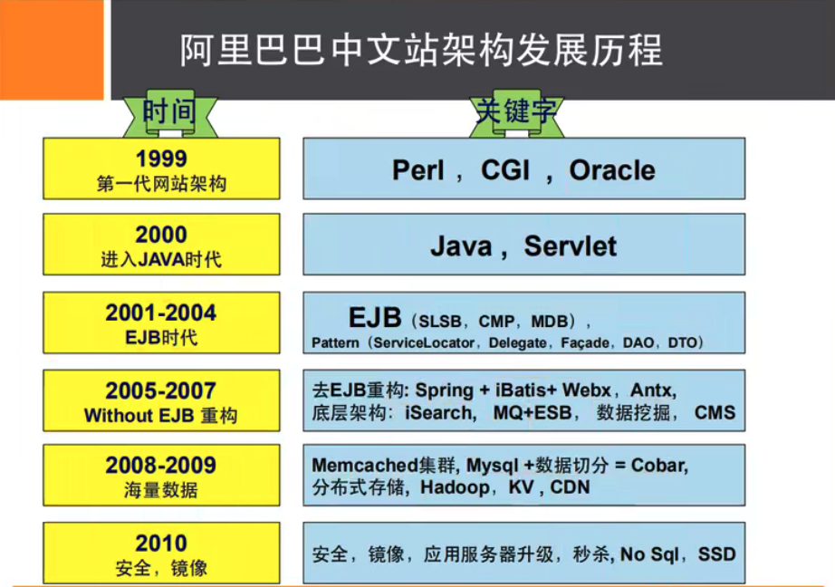

### NoSQL 概述

#### 一、为什么要用NoSQL？

#### 1. 单机MySQL的时代

app ->  DAL -> MySQL

整个网络的瓶颈是什么？

1. 数据量如果太大，一个机器放不了
2. 数据的索引( B+tree )，MySQL 300百万条数据，一个机器的内存也放不下
3. 访问量（读写混合），一个服务器承受不了

#### 2. Memcached（缓存）+ MySQL + 垂直拆分 （读写分离）

网站80% 都是在读，每次都去查询数据库十分低效，因此可以使用缓存来保证效率

发展过程：优化数据结构和索引 --> 文件缓存(IO) --> Memcached

#### 3. 分库分表 + 水平拆分 + MySQL集群

MySQL 引擎 MyISAM：表锁，十分影响效率。Innodb：行锁

#### 4. 如今年代

MySQL 等关系型数据库就不够用了，数据量太多

### 二、什么是NoSQL

NoSQL = Not Only SQL

很多的数据类型用户的个人信息，社交网络，地理位置。这些数据类型的存储不需要一个固定的格式，不需要关系型数据库来存储

NoSQL 特点：

1. 方便扩展（数据之间没有关系，很好扩展）

2. 大数据高性能（Redis 一秒可写8万次，读取 11 万次，NoSQL的缓存记录，是一种细粒度的缓存，性能比较高）

3. 数据类型是多样型的（不需要事先设计数据库，随取随用）

4. 传统 RDBMS 和 NoSQL 

    ```
    传统的 RDBMS 
    - 结构化组织
    - SQL
    - 数据和关系都存在单独的表中 row-col 
    - 操作，数据定义语言
    - 严格的一致性
    - 基础的事务
    - ...
    ```

    ```
    NoSQL
    - 不仅仅是数据
    - 没有固定的查询语言
    - 健值对存储，列存储，文档存储，图形数据库（社交关系）
    - 最终一致性
    - CAP 定理和 BASE（异地多活）
    - 高性能、高可用、高可扩展
    - ...
    ```

### 三、阿里巴巴数据架构演进



所有牛逼的人都有一段苦逼的岁月，但是你只要像SB一样的坚持，终将牛逼