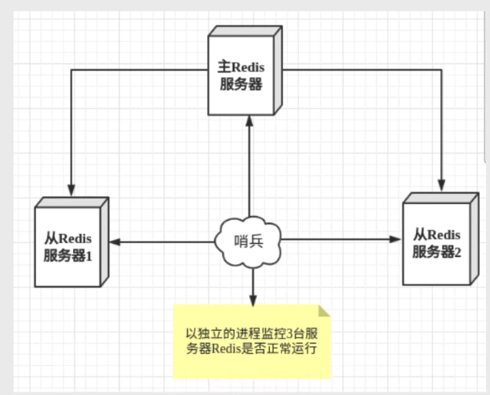
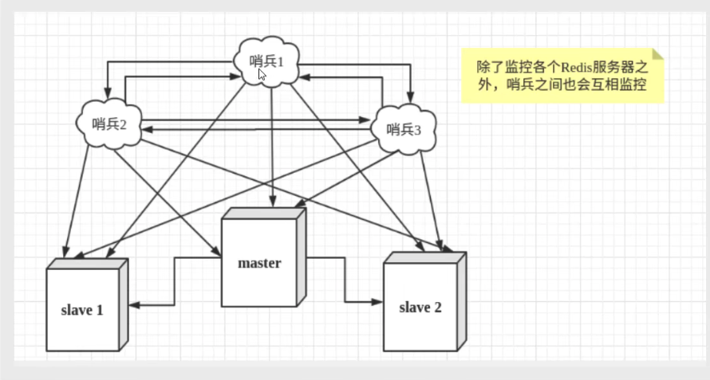

## Redis 主从复制

### 概念

主从复制，是指将一台Redis服务器的数据，复制到其他Redis 服务器，前者称为主节点（master/leader），后者称为从节点（slave/follower）；数据的复制是单向的，只能由主节点到从节点。Master 以写为主，Slave 以读为主。

默认情况下，每台Redis 服务器都是主节点；且一个主节点可以有多个从节点（或者没有从节点），但一个从节点只能有一个主节点。

**主从复制的作用主要包括：**

1. 数据冗余：主从复制实现了数据的热备份，是持久化之外的一种数据冗余方式
2. 故障恢复：当主节点出现问题时，可以由从节点提供服务，实现快速的故障恢复；实际上是一种服务的冗余
3. 负载均衡：在主从复制的基础上，配合读写分离，可以由主节点提供写服务，由从节点提供读服务（即写Redis 数据时应当连接主节点，读Redis数据时应当连接从节点），分担服务器负载；尤其是在写少读多的场景下，通过多个从节点分担读负载，可以大大提高Redis 服务器的并发量
4. 高可用（集群）基石：除了上述作用之外，主从复制还是哨兵和集群能够实施的基础，因此说主从复制是Redis 高可用的基础

一般来说，要将Redis 运行于工程项目中，只使用一台Redis是万万不能的（宕机），原因如下：

1. 从结构上，单个Redis 服务器会发生单点故障，并且一台服务器需要处理所有的请求负载，压力较大
2. 从容量上，单个Redis 服务器内存容量有限，就算一台Redis 服务器内存容量为 256G，也不能将所有内存用作Redis 存储内存，一般来说，**单台Redis 最大使用内存不应该超过20G**

### 环境配置

只配置从库，不用配置主库

```
127.0.0.1:6379> info replication  # 查看当前库的信息 
# Replication
role:master   # 角色 master
connected_slaves:0
master_failover_state:no-failover
master_replid:8c3bda110884e255a289720ffb126dd246ed2549
master_replid2:0000000000000000000000000000000000000000
master_repl_offset:0
second_repl_offset:-1
repl_backlog_active:0
repl_backlog_size:1048576
repl_backlog_first_byte_offset:0
repl_backlog_histlen:0
```

复制3个配置文件，然后修改对应的信息

1. 端口 `port 6379`
2. pid 名字  `pidfile /var/run/redis_6379.pid`
3. log 文件名字  `logfile "6379.log"`
4. dump.rdb 名字   ` dbfilename dump_79.rdb` 

### 一主二从

默认情况下，没台redis 服务器都是主节点；我们一般只需要配置从机就好

```
slaveeof 127.0.0.1 6379 # 配置主机
info replication # 查看信息
```

真是的主从配置应该在配置文件中配置，这样的话是永久的，如果使用命令就是暂时的

主机断开连接，从机依旧连接到主机的，但是没有写操作。主机如果回来了，从机依旧可以直接获取到主机写的信息

如果使用命令行来配置的主从，如果从机重启了，配置就会丢失，变成主机。

> 复制原理

Slave 启动成功连接到 Master 后会发送一个 sync 同步命令

Master 接到命令，启动后台的存盘进程，同时收集所有接收到的用于修改数据集命令，在后台进程执行完毕之后，master 将传送整个数据文件到Slave，并完成一次完全同步

全量复制：Slave 服务在接受到数据库文件数据之后，将其存盘并加载到内存中

增量复制：Master 继续将新的所有收集到的修改命令依次传给 Slave，完成同步。但是只要是重新连接 master，一次完全同步（全量复制）将被自动执行，我们的数据一定可以在从机中看到。

### 层层链路

上一个主节点连接下一个从节点。这也可以是一种主从复制

这种方式，如果没有主节点，这个时候能不能选择一个主节点呢？“谋朝篡位”

如果主机断开了连接，我们使用 ` slaveof no one` 让自己变成主机！其他的节点就可以连接到最新的这个主节点（手动）。如果这个时候原来的主节点修复了，依旧需要手动设置。

### 哨兵模式（重要）

主从切换技术的方法是：当主服务器宕机后，需要手动把一台从服务器切换为主服务器，这就需要人工干预，费时费力，还会造成一段时间内的服务不可用。这不是一种推荐的方式，更多时候，我们优先考虑哨兵模式。Redis 从2.8 正式提供了 Sentinel （哨兵）架构来解决这个问题

谋朝篡位的自动版，能够后台监控主机是否故障，如果故障了根据投票数自动将从库转换为主库

哨兵模式是一种特殊的模式，首先Redis 提供了哨兵的命令，哨兵是一个独立的进程，作为进程，他会独立运行。其原理是哨兵通过发送命令，等待Redis 服务器响应，从而监控运行的多个 Redis 实例。



这里的哨兵有两个作用

- 通过发送命令，让Redis 服务器返回，监控其运行状态，包括主服务器和从服务器
- 当哨兵检测到 master 宕机，会自动将 slave 切换成 master，然后通过发布订阅模式通知其他的从服务器，修改配置文件，让他们切换主机

然而一个哨兵进程对 Redis 服务器进行监控，可能会出现问题，为此，我们可以使用多个哨兵进行监控。各个哨兵之间还会进行监控，这样就形成了多哨兵模式



假设主服务器宕机，哨兵1 先检测到这个结果，系统并不会马上进行 failover 过程，仅仅是哨兵1 主观的认为主服务器不可用，这个现象称为**主观下线**。当后面的哨兵也检测到主服务器不可用，并且数量达到一定值时，那么哨兵之间会进行一次投票，投票的结果由一个哨兵发起，进行 failover 【故障转移】操作。切换成功后，就会通过发布订阅模式，让各个哨兵把自己监控的从服务器实现切换主机，这个过程称为**客观下线**。

> 测试

我们目前的状态是一主二从

1. 配置哨兵 配置文件

    ```
    # sentinel monitor 被监控的名称 host port 1 
    sentinel monitor myredis 127.0.0.1 6379 1 
    ```

    后面的这个数字1，代表主机挂了，slave 投票看让谁接替称为主机，票数最多的就会成为主机

2. 启动哨兵

    ```
     ./redis-sentinel ../etc/sentinel.conf 
    ```

​		如果master 节点断开了，这个时候就会从从机中随机选择一个服务器（投票算法）

如果主机此时回来了，只能归并到新的主机上，当做从机，这就是哨兵模式的规则

优点：

1. 哨兵集群，基于主从复制模式，所有的主从配置优点，它全有
2. 主从可以切换，故障可以转移，系统的可用性就会更好
3. 哨兵模式就是主从模式的升级，手动到自动，更加健壮

缺点：

1. Redis 不好在线扩容，集群容量一旦达到上限，在线扩容就十分麻烦
2. 实现哨兵模式的配置很麻烦，里面有很多选择

> 哨兵模式的全部配置

```
#sentinel 配置

#端口
port 26379

#目录
dir /tmp

#日志文件
logfile /var/log/redis/redis-sentinel.log

#是否在后台执行，yes：后台运行；no：不是后台运行
daemonize yes

#是否开启保护模式，默认开启。开启后，只能根据配置的bind地址和密码进行访问。
protected-mode no

#主节点信息，格式：sentinel <master-name> <ip> <redis-port> <quorum>；
#<master-name> 自定义主节点名称；
#<ip> <redis-port> 主节点的ip和端口；
#<quorum> 多少个主节点检测到主节点有问题就进行故障转移
sentinel monitor mymaster 127.0.0.1 6379 2

#sentinel与master的心跳时间（毫秒），默认30秒。
sentinel down-after-milliseconds mymaster 30000

#故障转移时，最多可以有多少个slave同时对新的master进行数据同步，该值越小，完成故障转移的时间越长，但可用slave数量越多，该值越大，越多slave因为replication而不可用。建议设置为1。
sentinel parallel-syncs mymaster 1

#故障转移超时时间（毫秒），默认180秒。
sentinel failover-timeout mymaster 180000

#master和slaves密码。
#sentinel auth-pass mymaster password

#当sentinel有警告级别的事件发生时执行（也有的资料说failover时触发）的脚本。
#sentinel notification-script <master-name> <script-path>

#故障转移之后执行的脚本，并传递7个参数：<master-name> <role> <state> <from-ip> <from-port> <to-ip> <to-port>。
#<master-name> 表示 master名字
#<role> 表示的是 每个redis实力的角色，如leader、observer
#<state> 表示状态
#<from-ip> 原来的redis master
#<from-port> 
#<to-ip> 故障迁移后的redis master
#<to-port>
#sentinel client-reconfig-script <master-name> <script-path>
```

