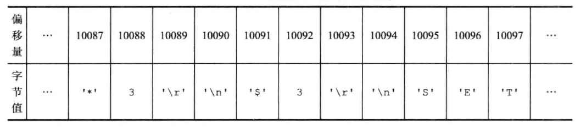
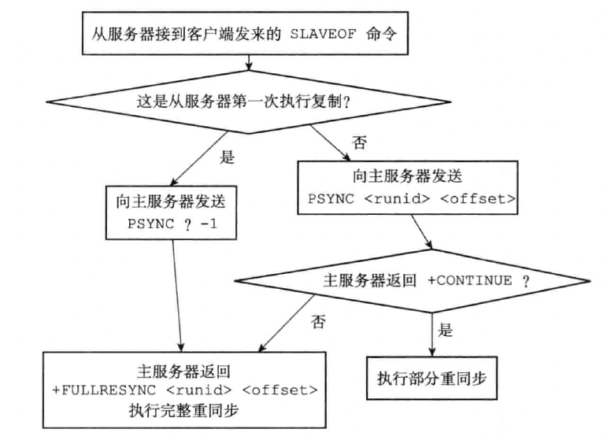

## 一、旧版复制功能

分为 “同步”（sync）和 “命令传播” 两个操作。

- 同步，用于将从服务器的数据库状态更新至主服务器当前所处的数据库状态
- 命令传播操作，用于在主服务器的数据库状态被修改时，导致主从服务器的数据库状态出现不一致。此操作让主从服务器的数据库重新回到一致状态

### 1. 同步

客户端向从服务器发送 SLAVEOF 命令，要求从服务器复制主服务器。从服务器会向主服务器发送 SYNC 命令来进行同步操作，SYNC 命令的执行步骤如下：

- 从服务器向主服务器发送 SYNC 命令
- 收到 SYNC 命令的主服务器执行 BGSAVE 命令，生成一个 RDB 文件，并使用一个缓冲区记录从现在开始执行的所有写命令
- 当主服务器的 BGSAVE 命令执行完成，主服务器会将 RDB 文件发送给从服务器。从服务器接收并载入这个 RDB 文件，然后更新数据库状态
- 主服务器将记录在缓冲区中的所有写命令发送给从服务器，从服务器接收并更新数据库状态

### 2. 命令传播

执行完同步之后，主从服务器的数据库状态达到一致状态。但后续主服务器执行客户端的写命令，又会导致主从服务器状态不在一致。因此主服务器需要对从服务器执行命令传播操作。

主服务器将自己执行的写命令，发送给从服务器执行，即可让主从服务器再次回到一致状态。

### 3. 缺陷

复制分为两种情况：

- 初次复制：从服务器以前没有复制过任何主服务器，或者从服务器当前要复制的主服务器和上一次复制的主服务器不同
- 断线后重复制：处于命令传播阶段的主从服务器因为网络原因而中断了复制，网络恢复后重新连接，并继续复制

对于初次复制来说，旧版复制功能可以很好的完成任务。但对于断线后重重复来说，旧版复制功能虽然可以让主从服务器重新回到一致状态，但效率非常低，因为只需要复制断线时的一部分数据，而不需要重新载入全量的数据库数据。为了让从服务器补足一部分缺失的数据，却要让主从服务器重新执行一次 SYNC 命令，是非常低效的（生成 RDB、发送 RDB、载入 RDB 都是非常占用资源的）。

## 二、新版复制功能的实现

redis 从 2.8 开始，使用 PSYNC 命令来执行复制操作。PSYNC 命令有完整重同步、部分重同步两种模式：

- 完整重同步用于处理初次复制的情况。通过 RDB 文件，以及向从服务器发送保存在缓冲区里面的写命令来进行同步
- 部分重同步用于处理断线后重复制的情况。从服务器在断线后重连主服务器时，主服务器可以将断连期间执行的写命令发送给从服务器来进行同步

### 1. 部分重同步的实现

部分重同步由以下三个部分组成：

- 主服务器的复制偏移量和从服务器的复制偏移量
- 主服务器的复制积压缓冲区
- 服务器的运行 ID

执行复制的双方，主服务器向从服务器传播 N 个字节的数据时，就将自己的复制偏移量的值增加 N。从服务器收到 N 个字节的数据时，也会将自己的复制偏移量增加 N。

那么从服务器断线重连成功后，需要进行 “完整重同步” 还是 “部分重同步”，和复制积压缓冲区有关。

#### 1.1 复制积压缓冲区

复制积压缓冲区是由主服务器维护的一个固定长度、先进先出的队列，默认 1MB。

当主服务器进行命令传播时，它不仅将 “写命令” 发送给所有从服务器，还会将 “写命令” 存储到 “复制积压缓冲区” 中。因此，主服务器的 “复制积压缓冲区” 中会保存着一部分最近传播的写命令，并且 “复制积压缓冲区” 会为队列中的每个字节记录相应的 “复制偏移量”。



当从服务器重新连接上主服务器时，从服务器会通过 PSYNC 命令将自己的 “复制偏移量 offset” 发送给主服务器，主服务器会根据这个复制偏移量来决定从服务器执行何种同步操作：

-  如果 offset 偏移量之后的数据，仍然存在于 “复制积压缓冲区” 中，那么主服务器将对从服务器执行部分重同步操作
- 相反，如果 offset 偏移量之后的数据已经不存在于 “复制积压缓冲区” 了，那么主服务器将对从服务器执行完整重同步操作

#### 1.2 服务器的运行 ID

每个 redis 服务器，不论是主服务器和从服务器，都会有自己的 “运行 ID”。“运行 ID” 在服务器启动时自动生成，由 40 个随机的十六进制字符组成。

当从服务器对主服务器进行初次复制时，主服务器会把自己的 “运行 ID” 发送给从服务器。当从服务器 “断线重连” 上一个主服务器时，从服务器将向当前连接的主服务器发送之前保存的 “运行 ID”。

- 如果从服务器保存的 “运行ID” 和当前连接的主服务器的 “运行 ID” 相同，那么说明从服务器断线之前复制的就是当前连接的这个主服务器，主服务器可以继续尝试执行 “部分重同步” 操作
- 如果从服务器保存的 “运行 ID” 和当前连接的主服务器的 “运行 ID” 并不相同，那么主服务器将对从服务器执行完整重同步操作

## 三、PSYNC 命令的实现

psync 命令执行完整重同步和部分重同步时可能遇到的情况。



## 四、心跳检测

在命令传播阶段，从服务器默认会每秒一次的频率，向主服务器发送命令：

```
REPLCONF ACK <replication_offset>
```

- replication_offset 是从服务器当前的复制偏移量

此命令对于主从服务器有三个作用：

- 检测主从服务器的网络连接状态
- 辅助实现 min-slaves 选项
- 检测命令丢失

### 1. 检测主从服务器的网络连接状态

主从服务器可以通过发送和接收 `REPLCONF ACK` 命令来检查两者之间的网络连接是否正常。如果主服务器超过一秒没有收到从服务器发来的 `REPLCONF ACK` 命令，那么主服务器就知道主从服务器之间的连接出现问题了。

可以向主服务器发送 `INFO replication` 命令，在列出的从服务器列表的 lag 一栏中，可以看到对应从服务器最后一次向主服务器发送 `REPLCONF ACK` 命令距离现在过了多少秒。

### 2. 辅助实现 min-slaves 配置选项

redis 的 `min-slaves-write` 和 `min-slaves-max-lag` 两个选项可以防止主服务器在不安全的情况下执行写命令。比如：

```
min-slaves-to-write 3
min-slaves-max-lag 10
```

那么在从服务器的数量少于 3 个，或者三个从服务器的延迟（lag）值都大于或等于 10 秒时，主服务器将拒绝执行写命令。

### 3. 检查命令丢失

如果因为网络故障，主服务器传播给从服务器的写命令 丢失，那么当从服务器向主服务器发送 `REPLCONF ACK` 命令时，主服务器将发现从服务器当前的复制偏移量少于自己的复制偏移量，然后主服务器就会根据从服务器提交的复制偏移量，在复制积压缓冲区中找到从服务器缺少的数据，并将这些数据重新发送给从服务器。

注意，主服务器向从服务器补发缺失数据这一操作的原理，和部分重同步操作的原理非常相似。这两个操作的区别在于，补发缺失数据操作在主从服务器没有断线的情况下执行。而部分重同步操作则在主从服务器断线并重连之后执行。


