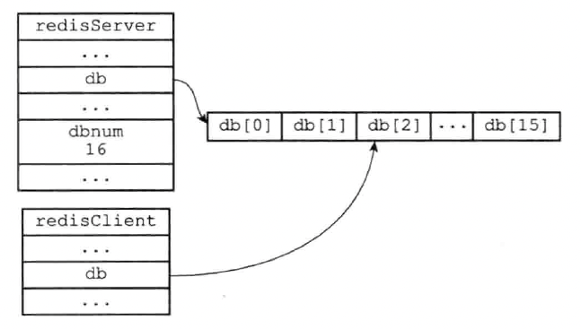

redis 服务器将所有数据库都保存在 redisServer 结构的 db 数组中，每个 redisDb 结构代表一个数据库。redis 服务器在初始化时，默认会创建 16 个数据库。

```
struct redisServer {
	redisDb *db; // 一个数组，保存着服务器中的所有数据库
	int dbnum; // 服务器的数据库数量
	...
}

typedef struct redisDb {
	dict *dict; // 数据库键空间，保存着数据库中所有的键值对
	dict *expires; // 过期字典，保存着键的过期时间
} redisDb;
```

redisDb 结构中的 dict 字典保存了数据库中所有的键值对。

## 一、切换数据库

使用 `select 2` 语句，即可将切换到 2 号数据库。

在服务器内部，redisClient 结构保存客户端状态，其中有一个 db 字段记录了客户端当前的目标数据库。

```
struct redisClient {
		// 记录客户端当前正在使用的数据库
		redisDb* db;
		// ...
};
```

如下图所示：



## 二、数据库键空间

redis 是一个键值对数据库服务器，服务器中的每个数据库都由一个 redisDb 结构表示，其中 redisDb 结构的 dict 字典保存了数据库中的所有键值对，我们将整个字典称为 “键空间”。

```
struct redisDb {
		// 数据库键空间，保存着数据库中所有键值对
		dict* dict;
		// ...
};
```

“键空间” 这个字典，每个键都是一个字符串对象；每个值可以是字符串对象、列表对象、哈希表对象、集合对象和有序集合中任意一种。

添加 / 删除 / 更新一个新键值对到数据库，就是操作 “键空间”。

### 1. 读写键空间时的维护操作

- 在读取一个键之后（读操作和写操作都要对键进行读取），服务器会根据键是否存在来更新服务器的键空间命中（hit）次数和键空间不命中（miss）次数，这两个值可以在 info stats 命令的 keyspace_hits 属性和 keyspace_misses 属性中查看
- 在读取一个键之后，服务器会更新键的 LRU（最后一次使用）时间，这个值可以用于计算键的闲置时间，使用 `object idletime <key>` 命令可以查看键 key 的闲置时间
- 如果服务器在读取一个键时发现该键已经过期，那么服务器会先删除这个过期键，然后才执行余下的其他操作
- 如果有客户端使用 watch 命令监视某个键，那么服务器在对被监视的键进行修改之后，会将这个键标记为脏，从而让事务程序注意到这个键已经被修改过
- 服务器每次修改一个键之后，都会对脏键计数器的值增一，这个计数器会触发服务器的持久化以及复制操作
- 如果服务器开启了数据库通知功能，那么在对键进行修改之后，服务器将按配置发送相应的数据库通知。

## 三、键的过期时间

客户端可以以秒或者毫秒精度为数据库的某个键设置生存时间（expire/pexpire），再经过指定时间后，服务器就会自动删除过期时间为 0 的键。

```shell
127.0.0.1:6379> set key value
OK
127.0.0.1:6379> EXPIRE key 3
(integer) 1
127.0.0.1:6379> get key
"value"
127.0.0.1:6379> get key
(nil)
```

客户端可以通过 expireat / pexpireat 命令设置过期时间（expire time），过期时间是一个 unix 时间戳。

TTL / PTTL 命令返回距离这个键被服务器自动删除还有多长时间

```
127.0.0.1:6379> set key value
OK
127.0.0.1:6379> expire key 1000
(integer) 1
127.0.0.1:6379> ttl key
(integer) 997
127.0.0.1:6379> ttl key
(integer) 995
```

移除过期时间：`persist <key> ` 

**保存过期时间**：

redisDb 结构中的 expires 字典保存了数据库中所有键的过期时间。过期字典的键是一个指向某个键对象的指针；值是一个 long long 类型的整数（一个毫秒精度的 unix 时间戳）。

```
struct redisDb {
		// 过期字典，保存着键的过期时间
		dict* expires;
};
```

注意：“键空间” 的键和过期字典的键都指向同一个键对象，所以不会出现任何重复对象，不会浪费空间。

### 1. 过期键删除策略

如果一个键过期了，什么时候会被删除呢？

- 定时删除，在设置键的过期时间的同时，创建一个定时器，让定时器在键的过期时间来执行对键的删除操作。
- 惰性删除：放任过期不管，但是每次从键空间中获取该键时，都检查取得的键是否过期，如果过期的话，就删除该键；如果没有过期，就返回该键
- 定期删除：每隔一段时间，程序对数据库进行一次检查，删除里面的过期键。

三种方案的优缺点：

- 定时删除。优点是：可以保证过期键会尽可能快的被删除，并释放过期键所占用的内存，是内存最友好的。缺点是：占用太多CPU 时间，影响服务器的响应时间和吞吐量，尤其是过期键比较多的情况下。
- 惰性删除。优点是：CPU 友好，保存了删除过期键的操作只会在非做不可的情况下进行。缺点是：浪费太多内存，有内存泄露的危险。
- 定期删除。是一种折中，定期删除策略每隔一段时间执行一次删除过期键操作，并通过限制删除操作执行的时长和频率来减少删除操作对 CPU 时间的影响。除此之外，通过定期删除过期键，定期删除策略有效减少了因为过期键而带来的内存浪费。难点是确定删除操作执行的时长和频率。

Redis 采用惰性删除和定期删除两种策略。

## 四、 AOF、RDB和复制功能对过期键的处理

### 1. 生成 RDB 文件阶段

执行 save、bgsave 创建一个新的 RDB 文件时，程序会对数据库中的键进行检查，已过期的键不会保存到新创建的 RDB 文件中。因此数据库中包含过期键不会对生成新的 RDB 文件造成影响。

### 2. 载入 RDB 文件阶段

- 如果服务器以主服务器模式运行，载入 RDB 文件时，程序会检查过期键，过期键会被忽略
- 如果服务器以从服务器模式运行，载入 RDB 文件时，键无论是否过期，都会被载入到数据库中。不过，因为主从服务器在进行数据同步时，从服务器的数据库会被清空，所以一般来说，过期键对载入RDB 文件的从服务器也不会造成影响

### 3. AOF 文件写入

当服务器以 AOF 持久化模式运行时，如果某个键过期但没有被删除，则不会有影响；当过期键被删除后，程序会向 AOF 文件追加一条 DEL 命令来显式的记录该键已被删除。

举例，如果客户端使用 `GET message` 命令，试图访问过期的 message 键，那么服务将执行如下三个动作：

1. 从数据库中删除 message 键
2. 追加一条 `DEL message` 命令到 AOF 文件
3. 向执行 GET 命令的客户端返回空回复

### 4. AOF 重写

在执行 AOF 重写时，程序会对数据库中的键进行检查，已过期的键不会保存到重写后的 AOF 文件中

### 5. 复制

当服务器运行在复制模式下时，从服务器的过期键删除动作由主服务器控制

- 主服务器在删除一个过期键之后，会显式的向所有从服务器发送一个 DEL 命令，告诉从服务器删除这个过期键
- 从服务器在执行客户端发送的读命令时，即使碰到过期键也不会将过期键删除，而是继续像处理未过期的键一样来处理过期键
- 从服务器只有在接到主服务器发来的 DEL 命令之后，才会删除过期键

这样，通过由主服务器来控制从服务器统一删除过期键，可以保证主从服务器数据的一致性。但是会造成客户端可以读取到从服务器的过期键。

## 五、数据库通知

客户端通过订阅给定的频道或者模式，来获得数据库中键的变化，以及数据库中命令的执行情况

