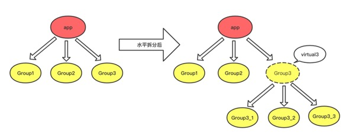
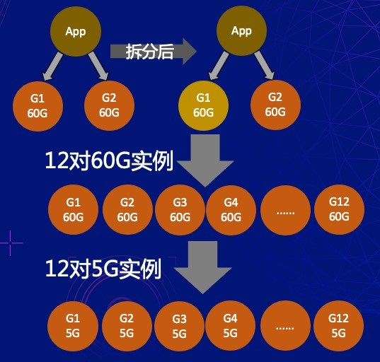
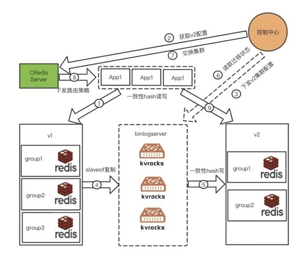

## Redis 扩缩容

redis 扩缩容一般通过垂直扩缩容的方式解决 redis 集群容量的问题，垂直扩缩容比较简单，只是 Maxmemory 的配置更改。但随着集群规模扩大，这种方式逐渐会遇到瓶颈。

- 一方面，单个 redis 实例过大，会带来较大的运维风险和困难
- 另一方面，宿主机容量有上限，不能无止境的扩容

考虑到运维便利性和资源利用率的平衡，一般单个 redis 实例可以参考设置为 15GB。参考携程使用 redis 的演进过程

### 一、水平拆分扩容

尽管一致性 hash 是个比较简单优秀的集群方案，但是还是存在扩缩容之后有节点的变动。从客户端角度来看，key 就像是丢失了一样。

因此提出一种思路，因为在一致性 hash 同一水平位置增加节点会导致数据丢失，那么不改变原来层次节点的 hash 规则，以某个节点为 hash 的起点，再来进行一次一致性hash，演变成树的结构

如图，将树形结构从一层扩展成二层，如果继续拆分新的叶子 Group，则可以将树形结构扩展到 N 层，叶子 Group 是物理分片，直接对应的 Redis 实例，分支 Group 是虚拟分片，当 hash 命中到分支 Group 后，并没有找不到对应的 Redis 实例，需要再继续向下寻找，知道找到叶子 Group 为止

这种方式的缺点：

- 持续的周期很长，对多个 Group 进行拆分的话，每个Group的数据需要同时复制几份同样的实例。比如60G的某个实例，如果想拆到5G一个，那么下级的Group必须有12个，而拆分要先将该实例的数据先同步为12个60G的实例，再根据key的命中规则清理该12个60G的实例中不会命中的key，最终演变成12个5G的实例。一般60G的group实例拆分比较耗时，如果一个集群的分片非常多，加上观察对业务影响的时间，可能要持续上几天或一两周，并且只能是有人值守的串行操作。
- 拆分过程中需要2次迁移，拆分中中间态实例对于内存的要求是非常大的，拆分完成后对内存的需求会急剧下降，因此每次拆分都涉及到2次迁移，尽管迁移不会影响业务，但对于执行操作拆分的运维人员来说，压力比较大，而且一不小心也会导致线上事故。
- 拆分后无法还原回去，也就是说假设业务分拆后收缩，对Redis的需求变小了，但它实际拆分后的分片还在那边，所申请的空间还并没有释放掉，客观上浪费了资源，降低了Redis总体的利用率
- 只支持扩容，不支持缩容，除了一些集群过大需要分拆外，还有一些申请远超需求的实例需要缩容，而水平分拆对于这点无能为力。
- 拆分一次，就多一次的性能损耗，因为需要多计算一次hash，虽然耗时不大，但是对于性能敏感的业务还是有影响

这种水平拆分的方案虽然解决了实例过大的问题，但不能缩容的弊端也逐渐凸显出来。

### 二、水平拆分扩缩容

#### 1. 双写

即然缩分片比较困难，可以让业务双写 2 个新老集群，新老集群的分片数、配置都不一样。最终会迁移到新集群中，而新集群的大小满足当前业务需求

双写虽然可以解决缩容问题，但对于业务的侵入比较深，此外由于双写集群引入了业务配合观察的时间，整体流程也比较长。

#### 2. 引入 binlogServer

引入一个中间态的 binlogServer，它既是一个老集群的 slave 节点，又充当了新集群的客户端。一方面，它会从 redis master 复制全量数据和增量数据；另一方面，它又充当客户端的角色，将复制来的数据按照新集群的一致性 hash 规则写往新集群。

- 根据旧集群的分片启动对应个数的 binlogServer，并获取新集群的一致性 hash 规则
- 每个 binlogServer 成为旧集群单个分片中 master 的 slave，执行 slaveof 后保存旧集群中 master 传过来的 rdb 文件并解析，对于每个 rdb 文件，解析还原成 redis 命令，并按照一致性 hash 规则写入新集群中，对于后续旧集群传播过来的命令，同样同步到新集群中
- 当这个过程都完成并且 binlog 追的差不多的时候，为了数据一致性，可以停止旧集群的写，将请求迁移到新集群（可能会导致数据丢失或不一致）

这种方案解决了这几个问题

- 持续时间大大缩短，基本上跟旧集群最大实例的大小正相关，因为是并发执行，跟集群分片数无关。大大缩短了扩缩容的周期，并且业务在毫无感知的情况下即可完成扩缩容。由于可以做到秒级切换集群，即使扩缩容后对业务有影响也可以快速回退，因为回退也只是更改了集群的路由指向
- 扩缩容过程只需要 1 次切换集群指向，0 次迁移，没有中间态，也无需通过大内存宿主机来实现拆分
- 对于扩容的集群，很方便再来一次缩容还原回去，缩容同理。对于那些已经水平拆分过的集群，也可以通过这种方式还原回去
- 既可以扩容也可以缩容，甚至还可以不扩容也不缩容按集群来迁移
- 扩缩容之后无性能损耗

