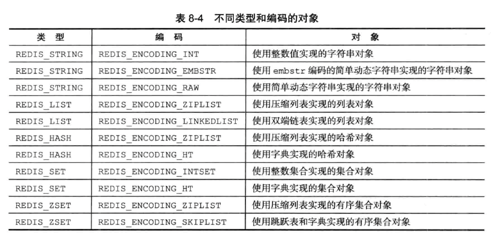
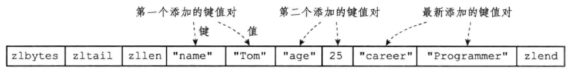
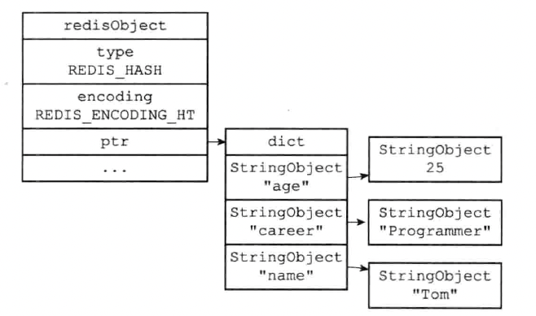
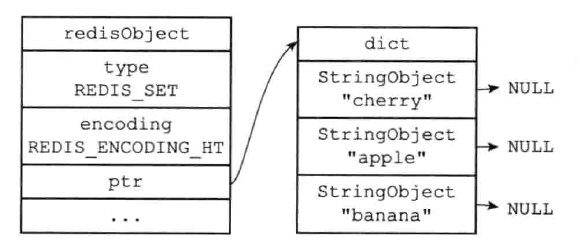

redis 根据实现的数据结构创建出五种类型的对象：字符串对象、列表对象、哈希对象、集合对象和有序集合对象。

redis 的对象实现了基于引用计数技术的内存回收机制。既可以自动释放对象所占内存；也可以实现对象共享机制，可以让多个数据库键共享同一个对象来节约内存。

## 一、对象类型与编码

Redis 中五种类型的对象都是由如下结构表示

```c
typedef struct redisObject {
	// 类型
	unsigned type:4;
	// 编码
	unsigned encoding:4;
	// 指向底层实现数据结构的指针
	void *ptr;
	// ...
} robj;
```

对象的编码



redis 可以根据不同的使用场景来为一个对象设置不同的编码，从而优化对象在某一场景下的效率。比如：

在列表对象包含的元素比较少时，redis 使用压缩列表作为底层实现：

- 因为压缩列表比双端链表更节约内存，并且在元素数量较少时，在内存中以连续块方式保存的压缩列表比起双端链表可以更快被载入到缓存中
- 随着列表对象包含的元素越来越多，使用压缩列表来保存元素的优势逐渐消失。列表对象会使用双端链表，更适合保存大量元素。

## 二、对象

### 1. 字符串对象

字符串对象的编码可以是 int、raw 或者 embstr。

- 如果一个字符串对象保存的是整数值，并且这个整数值可以用 long 类型来表示，那么字符串对象会将整数值保存在字符串对象结构的 ptr 属性里面（将 void* 转换成 long），并将字符串对象的编码设置为 int
- 如果字符串对象保存的是一个字符串值，并且这个字符串值的长度大于 32 字节，那么字符串对象将使用一个简单动态字符串（SDS）来保存这个字符串值，并将对象的编码设置 为 raw
- 如果字符串对象保存的字符串值长度小于等于 32 字节，那么字符串对象将使用 embstr 编码的方式来保存
- 可用用 long double 类型表示的浮点数在 Redis 中也是作为字符串值来保存的，先将浮点数转换为字符串再保存

embstr 编码专门用于保存短字符串。这种编码和 raw 编码一样，都使用 redisObject 结构和 SDS 结构来表示字符串对象，但 raw 编码会调用两次内存分配函数来分别创建 redisObject 结构和 SDS 结构，而 embstr 编码则通过调用一次内存分配函数来分配一块连续的空间，空间中依次包含 redisObject 和 SDS 两个结构。使用 embstr 编码的字符串对象来保存短字符串值有如下好处：

- embstr 编码将创建字符串对象所需的内存分配次数从 raw 编码的两次降低为一次。同理，内存释放也一样
- embstr 编码的字符串对象的所有数据都保存在一块连续的内存中，所以可以利用好缓存。

#### 1.1 编码转换

int、embstr 编码的字符串对象在条件满足时，会被转换成 raw 编码的字符串对象。比如：

- int 编码的字符串对象，如果我们向对象保存了字符串值，那么编码将从 int 变为 raw。
- embstr 字符串实际上是只读的，当我们想要修改时，会先将 embstr 转换成 raw，然后再修改。

#### 1.2 常用命令

常用命令包括：

| 命令   | int 编码的实现方法                                           | embstr 编码的实现方法                                  | raw 编码的实现方法                                      |
| ------ | ------------------------------------------------------------ | ------------------------------------------------------ | ------------------------------------------------------- |
| SET    | 使用 int 编码保存值                                          | 使用 embstr 编码保存值                                 | 使用 raw 编码保存值                                     |
| GET    | 拷贝对象所保存的整数值，将这个拷贝转换成字符串值，然后向客户端返回这个字符串值 | 直接向客户端返回字符串值                               | 直接向客户端返回字符串值                                |
| APPEND | 将对象转换成 raw 编码，然后按 raw 编码的方式执行此操作       | 将对象转换成 raw 编码，然后按 raw 编码的方式执行此操作 | 调用 sdscatlen 函数，将给定字符串追加到现有字符串的末尾 |
| INCRBY | 对整数值进行加法计算，得出的计算结果会作为整数被保存起来     | embstr 编码不能执行此命令，向客户端返回一个错误        | raw 编码不能执行此命令，向客户端返回一个错误            |

### 2. 列表对象

列表对象的编码可以是 ziplist（压缩列表） 或者 linkedlist（双端链表）

- 当列表对象保存的所有字符串元素的长度都小于64字节；且列表对象保存的元素数量小于512个；使用 ziplist 编码
- 否则使用 linkedlist 编码

当使用 ziplist 编码所需的两个条件的任意一个不能被满足时，对象的编码转换操作就会被执行，原本保存在压缩列表里的所有列表元素都会被转移并保存到双端链表中，对象的编码也会从 ziplist 变为 linkedlist

常用命令包括

| 命令        | ziplist 编码的实现方法                                       | linkedlist 编码的实现方式                                    |
| ----------- | ------------------------------------------------------------ | ------------------------------------------------------------ |
| LPUSH/RPUSH | 调用 ziplistPush 函数，将新元素推入到压缩列表的表头/表尾     | 调用 listAddNodeHead 函数，将新元素推入到双端链表的表头/表尾 |
| LPOP/RPOP   | 调用 ziplistIndex 函数定位压缩列表的表头节点/表尾节点，在向用户返回节点所保存的元素之后，调用 ziplistDelete 函数删除表头节点/表尾节点 | 调用 listFirst 函数定位双端链表的表头节点/表尾节点，在向用户返回节点所保存的元素之后，调用 listDelNode 函数删除表头节点/表尾节点 |

### 3. 哈希对象

哈希对象的编码可以是 ziplist（压缩列表） 或者 hashtable（哈希表）

- 当哈希对象保存的所有键值对的键和值的字符串长度都小于64字节，且哈希对象保存的键值对数量小于512个时，使用 ziplist 编码
- 否则可能发生编码转换，使用 hashtable 编码

ziplist 编码的哈希对象，每当有新的键值对要加入到哈希对象时，程序会先将保存了键的压缩列表节点推入到压缩列表表尾，然后再将保存了值的压缩列表节点推入到压缩列表表尾，因此：

- 保存了同一键值对的两个节点总是紧挨在一起，保存键的节点在前，保存值的节点在后
- 先添加到哈希对象中的键值对会被放在压缩列表的表头方向，而后来添加到哈希对象中的键值对会被放在压缩列表的表尾方向。



hashtable 编码的哈希对象，每个键值对都使用一个哈希键值对来保存：

- 哈希表的每个键都是一个字符串对象，对象中保存了键值对的键
- 哈希表的每个值都是一个字符串对象，对象中保存了键值对的值



常用命令包括：

| 命令 | ziplist 编码的实现方法                                       | hashtable 编码的实现方法                                     |
| ---- | ------------------------------------------------------------ | ------------------------------------------------------------ |
| HSET | 首先调用 ziplistPush 函数，将键推入到压缩列表的表尾，然后再次调用 ziplistPush 函数，将值推入到压缩列表表尾 | 调用 dictAdd 函数，将新节点添加到字典中                      |
| HGET | 首先调用 ziplistFind 函数，在压缩列表中查找指定键所对应的节点，然后调用 ziplistNext 函数，将指针移动到键节点旁边的值节点，最后返回值节点 | 调用 dictFind 函数，在字典中查找给定键，然后调用 dictGetVal 函数，返回该键所对应的值 |
| HDEL | 调用 ziplistFind 函数，在压缩列表中查找指定键所对应的节点，然后将相应的键节点、以及键节点旁边的值节点都删除掉 | 调用 dictDelete 函数，将指定键所对应的键值对从字典中删除掉   |

### 4. 集合对象

集合对象的编码可以是 intset（整数集合） 或者 hashtable（字典）

- 当集合对象保存的所有元素都是整数值，且元素数量不超过 512 个，使用 intset 编码
- 否则，使用 hashtable 编码

hashtable 编码的集合对象，字典的每个键都是一个字符串对象，字典的值则全部被设置为 NULL



常用命令包括

| 命令      | intset 编码的实现方法                                        | hashtable 编码的实现方法                                     |
| --------- | ------------------------------------------------------------ | ------------------------------------------------------------ |
| SADD      | 调用 intsetAdd 函数，将所有新元素添加到整数集合里面          | 调用 dictAdd，以新元素为键，NULL 为值，将键值对添加到字典里面 |
| SCARD     | 调用 intsetLen 函数，返回整数集合所包含的元素数量，这个数量就是集合对象所包含的元素数量 | 调用 dictSize 函数，返回字典所包含的键值对数量，这个数量就是集合对象所包含的元素数量 |
| SISMEMBER | 调用 intsetFind 函数，在整数集合中查找给定的元素，如果找到了说明元素存在于集合，没找到则说明元素不存在集合 | 调用 dictFind 函数，在字典的键中查找给定的元素，如果找到了说明元素存在于集合，没找到则说明元素不存在集合 |

### 5. 有序集合对象

有序集合的编码可以是 ziplist（压缩列表） 或者 （字典+跳表）

ziplist 编码的有序集合对象，每个集合元素使用两个紧挨在一起的压缩列表节点来保存，第一个节点保存元素的成员，第二个元素则保存元素的分值（score）。压缩列表中的元素按分值从小到大进行排序。

Skiplist 编码的有序集合对象，使用 zset 结构作为底层实现。zset 结构同时使用了字典和跳表。跳表按分值从小到大保存了所有元素，程序可以利用跳表进行范围型查找。字典为有序集合创建了一个从成员到分值的映射，字典的键保存了元素的成员，而字典的值则保存了元素的分值。因此程序可以用常数时间复杂度查找给定成员的分值。

zset 结构中的两种数据结构：跳表和字典。都通过指针来共享相同元素的成员和分值，所以不会产生任何重复成员或分值，不会浪费空间

- 当有序集合保存的元素数量小于 128 个，且所有元素成员的长度都小于 64 字节，则使用 “跳表+字典” 编码
- 否则使用 skiplist 编码

#### 5.1 为什么有序集合需要同时使用跳跃表和字典来实现？

单独使用字典或者跳跃表，在性能上对比同时使用字典和跳跃表都会有所降低。

- 如果我们只使用字典来实现有序集合，虽然可以用 O(1) 时间复杂度查找成员的分值，但是因为字典以无序的方式保存集合元素，所以在执行范围型操作时，比如 ZRANK、ZRANGE等命令时，程序都需要对字典保存的所有元素进行排序，完成这种排序需要至少 O(N logN) 的时间，以及额外的 O(N) 内存空间。
- 如果只使用跳跃表的话，范围查找的优点可以保留，但是根据成员查找分值这一操作的复杂度将从 O(1) 上升到 O(logN) 

使用场景：zset 可以做排行榜，zset 可以实现动态排序，有 score 属性可以用来排名

常用命令包括

| 命令   | ziplist 编码的实现方法                                       | zset 编码的实现方法                                          |
| ------ | ------------------------------------------------------------ | ------------------------------------------------------------ |
| ZADD   | 调用 ziplistInsert 函数，将成员和分值作为两个节点分别插入到压缩列表 | 先调用 zslInsert 函数，将新元素添加到跳跃表，然后调用 dictAdd 函数，将新元素关联到字典 |
| ZCARD  | 调用 ziplistLen 函数，获取压缩列表包含节点的数量，将这个数量除以 2 得出集合元素的数量 | 访问跳跃表数据结构的 length 属性，直接返回集合元素的数量     |
| ZCOUNT | 遍历压缩列表，统计分值在给定范围内的节点的数量               | 遍历跳跃表，统计分值在给定范围内的节点的数量                 |
| ZRANGE | 从表头向表尾遍历压缩列表，返回给定索引范围内的所有元素       | 从表头向表尾遍历跳跃表，返回给定索引范围内的所有元素         |

