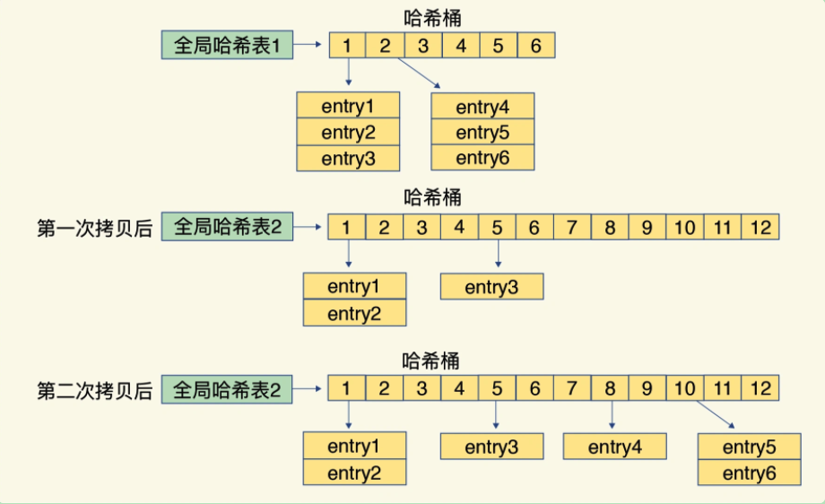
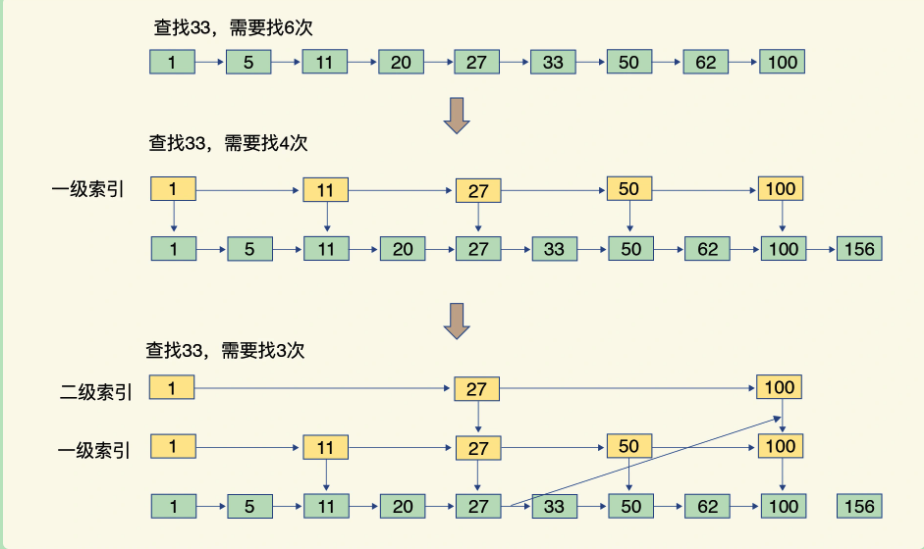

### 一、redis 有哪些慢操作

#### 1. 键和值之间的哈希表

redis中键和值之间采用哈希表来保存所有键值对。当往 Redis 中写入大量数据后，就可能发现操作有时候会突然变慢了。这其实是因为**哈希表的冲突问题和 rehash 可能带来的操作阻塞**。

redis解析哈希冲突采用链表构造哈希冲突链。哈希表做 rehash 操作，rehash 也就是增加现有的哈希桶数量，让逐渐增多的 entry 元素能在更多的桶之间分散保存，减少单个桶中的元素数量，从而减少单个桶中的冲突。

redis实现的 渐进式 rehash 操作，全局有默认有两个哈希表，一开始，当刚插入数据时，默认使用哈希表 1，此时的哈希表 2 并没有被分配空间。装载因子 = 哈希表中所有entry的个数 / 哈希表中哈希桶个数。Redis 会根据装载因子的两种情况来触发 rehash 操作

1. 装载因子 >= 5 ：立刻开始做 rehash
2. 装载因子 >= 1：允许进行rehash，但如果在进行 RDB生成和AOF重写时，哈希表的rehash 是被禁止的，为了避免对RDB和AOF重写造成影响
3. redis 会执行定时任务，在rehash 被触发后，即使没有收到新请求，Redis 也会定时执行一次 rehash 操作，而且，每次执行时长不会超过 1 ms，以免对其他任务造成影响。

Redis 执行 rehash，这个过程分为三步：

1. 给哈希表 2 分配更大的空间，例如是当前哈希表 1 大小的两倍
2. 把哈希表 1 中的数据重新映射并拷贝到哈希表 2 中（大量的数据拷贝，如果一次性把哈希表 1 中的数据都迁移完，会造成 Redis 线程阻塞，无法服务其他请求。此时，Redis 就无法快速访问数据了。）Redis 仍然正常处理客户端请求，每处理一个请求时，从哈希表1中的第一个索引位置开始，顺带着将这个索引位置上的所有 entries 拷贝到哈希表2 中；等处理下一个请求时，再顺带拷贝哈希表1 中的下一个索引位置的 entries。
3. 释放哈希表 1 的空间

**渐进式rehash**

#### 2. 集合底层的数据结构

集合底层数据结构主要有5种：整形数组、双向链表、哈希表、压缩列表和跳表

**压缩列表**：类似于一个数组，数组中的每一个元素都对应保存一个数据。和数组不同的是，压缩列表在表头有三个字段 zlbytes、zltail 和 zllen，分别表示列表长度、列表尾的偏移量和列表中的 entry 个数；压缩列表在表尾还有一个 zlend，表示列表结束。要查找定位第一个元素和最后一个元素，可以通过表头三个字段的长度直接定位，复杂度是 O(1)。而查找其他元素复杂度是 O(N)了。

**跳表**：跳表在链表的基础上，增加了多级索引，通过索引位置的几个跳转，实现数据的快速定位，查找复杂度是 O(logN) 

#### 总结

底层结构是哈希表：String、Hash、Set

跳表：有序Set

集合类型的范围操作需要遍历底层数据结构，复杂度通常是 O(N)，因此建议用其他命令(SCAN)代替

List类型：两种底层数据结构，双向链表和压缩列表，操作复杂度都是 O(N)。因为建议List 用于 POP/PUSH 场景，而不是作为随机读写的集合

