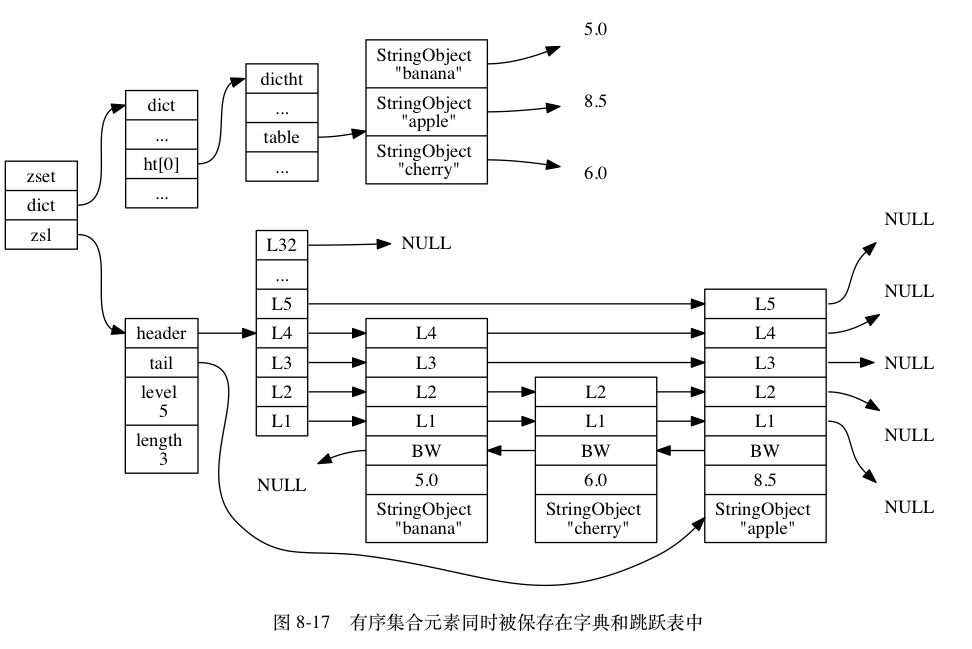
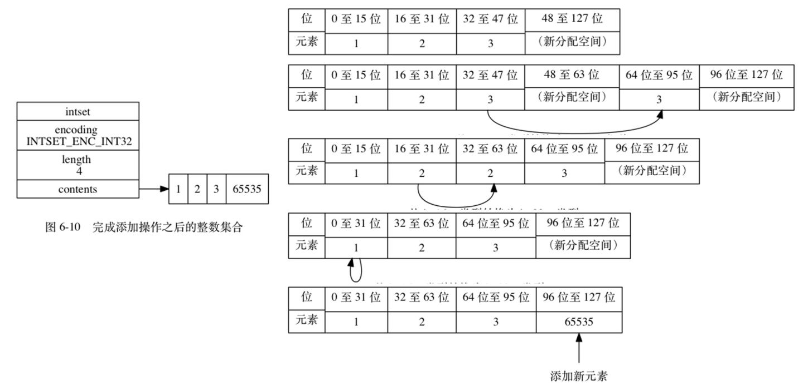
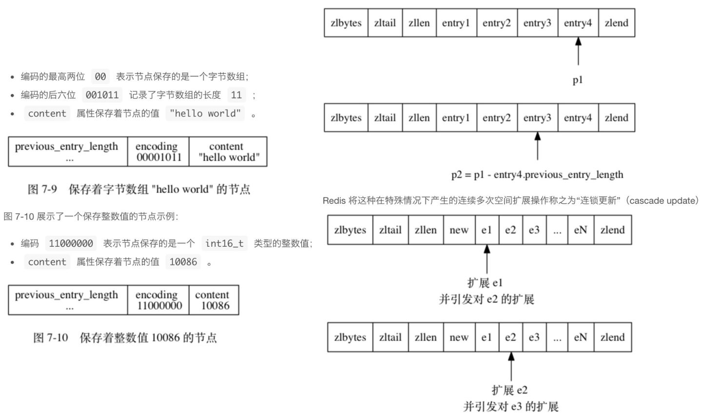

## 一、编码

Redis 中五种类型的对象都是由如下结构表示

```c
typedef struct redisObject {
	// 类型
	unsigned type:4;
	// 编码
	unsigned encoding:4;
	// 指向底层实现数据结构的指针
	void *ptr;
	// ...
} robj;
```

对象的编码

| 编码常量                  | 编码所对应的底层数据结构    |
| ------------------------- | --------------------------- |
| REDIS_ENCODING_INT        | Long 类型的整数             |
| REDIS_ENCODING_EMBSTR     | embstr 编码的简单动态字符串 |
| REDIS_ENCODING_RAW        | 简单动态字符串              |
| REDIS_ENCODING_HT         | 字典                        |
| REDIS_ENCODING_LINKEDLIST | 双端链表                    |
| REDIS_ENCODING_ZIPLIST    | 压缩列表                    |
| REDIS_ENCODING_INTSET     | 整数集合                    |
| REDIS_SKIPLIST            | 跳跃表和字典                |

## 二、对象

### 1. 字符串对象

常用命令包括

| 命令   | int 编码的实现方法                                           | embstr 编码的实现方法                                  | raw 编码的实现方法                                      |
| ------ | ------------------------------------------------------------ | ------------------------------------------------------ | ------------------------------------------------------- |
| SET    | 使用 int 编码保存值                                          | 使用 embstr 编码保存值                                 | 使用 raw 编码保存值                                     |
| GET    | 拷贝对象所保存的整数值，将这个拷贝转换成字符串值，然后向客户端返回这个字符串值 | 直接向客户端返回字符串值                               | 直接向客户端返回字符串值                                |
| APPEND | 将对象转换成 raw 编码，然后按 raw 编码的方式执行此操作       | 将对象转换成 raw 编码，然后按 raw 编码的方式执行此操作 | 调用 sdscatlen 函数，将给定字符串追加到现有字符串的末尾 |
| INCRBY | 对整数值进行加法计算，得出的计算结果会作为整数被保存起来     | embstr 编码不能执行此命令，向客户端返回一个错误        | raw 编码不能执行此命令，向客户端返回一个错误            |

字符串对象的编码可以是 int、raw 或者 embstr

- 如果一个字符串对象保存的是整数值，并且这个整数值可以用 long 类型来表示，那么字符串对象会将整数值保存在字符串对象结构的 ptr 属性里面（将 void* 转换成 long），并将字符串对象的编码设置为 int
- 如果字符串对象保存的是一个字符串值，并且这个字符串值的长度大于 39 字节，那么字符串对象将使用一个简单动态字符串（SDS）来保存这个字符串值，并将对象的编码设置 为 raw
- 如果字符串对象保存的字符串值长度小于等于 39 字节，那么字符串对象将使用 embstr 编码的方式来保存
- 可用用 long double 类型表示的浮点数在 Redis 中也是作为字符串值来保存的，先将浮点数转换为字符串再保存

int、embstr 编码的字符串对象在条件满足时，会被转换成 raw 编码的字符串对象。比如：

```shell
127.0.0.1:6379> set number 888
OK
127.0.0.1:6379> object encoding number
"int"
127.0.0.1:6379> append number " nihao"
(integer) 9
127.0.0.1:6379> get number
"888 nihao"
127.0.0.1:6379> object encoding number
"raw"
```

embstr 字符串实际上是只读的，当我们想要修改时，会先将 embstr 转换成 raw，然后在修改

### 2. 列表对象

常用命令包括

| 命令        | ziplist 编码的实现方法                                       | linkedlist 编码的实现方式                                    |
| ----------- | ------------------------------------------------------------ | ------------------------------------------------------------ |
| LPUSH/RPUSH | 调用 ziplistPush 函数，将新元素推入到压缩列表的表头/表尾     | 调用 listAddNodeHead 函数，将新元素推入到双端链表的表头/表尾 |
| LPOP/RPOP   | 调用 ziplistIndex 函数定位压缩列表的表头节点/表尾节点，在向用户返回节点所保存的元素之后，调用 ziplistDelete 函数删除表头节点/表尾节点 | 调用 listFirst 函数定位双端链表的表头节点/表尾节点，在向用户返回节点所保存的元素之后，调用 listDelNode 函数删除表头节点/表尾节点 |

列表对象的编码可以是 ziplist（压缩列表） 或者 linkedlist（双端链表）

- 当列表对象保存的所有字符串元素的长度都小于64字节；且列表对象保存的元素数量小于512个；使用 ziplist 编码
- 否则使用 linkedlist 编码

当使用 ziplist 编码所需的两个条件的任意一个不能被满足时，对象的编码转换操作就会被执行，原本保存在压缩列表里的所有列表元素都会被转移并保存到双端链表中，对象的编码也会从 ziplist 变为 linkedlist

### 3. 哈希对象

常用命令包括

| 命令 | ziplist 编码的实现方法                                       | hashtable 编码的实现方法                                     |
| ---- | ------------------------------------------------------------ | ------------------------------------------------------------ |
| HSET | 首先调用 ziplistPush 函数，将键推入到压缩列表的表尾，然后再次调用 ziplistPush 函数，将值推入到压缩列表表尾 | 调用 dictAdd 函数，将新节点添加到字典中                      |
| HGET | 首先调用 ziplistFind 函数，在压缩列表中查找指定键所对应的节点，然后调用 ziplistNext 函数，将指针移动到键节点旁边的值节点，最后返回值节点 | 调用 dictFind 函数，在字典中查找给定键，然后调用 dictGetVal 函数，返回该键所对应的值 |
| HDEL | 调用 ziplistFind 函数，在压缩列表中查找指定键所对应的节点，然后将相应的键节点、以及键节点旁边的值节点都删除掉 | 调用 dictDelete 函数，将指定键所对应的键值对从字典中删除掉   |

哈希对象的编码可以是 ziplist（压缩列表） 或者 hashtable（字典）

- 当哈希对象保存的所有键值对的键和值的字符串长度都小于64字节，且哈希对象保存的键值对数量小于512个时，使用 ziplist 编码
- 否则使用 hashtable 编码

#### 4. 集合对象

常用命令包括

| 命令      | intset 编码的实现方法                                        | hashtable 编码的实现方法                                     |
| --------- | ------------------------------------------------------------ | ------------------------------------------------------------ |
| SADD      | 调用 intsetAdd 函数，将所有新元素添加到整数集合里面          | 调用 dictAdd，以新元素为键，NULL 为值，将键值对添加到字典里面 |
| SCARD     | 调用 intsetLen 函数，返回整数集合所包含的元素数量，这个数量就是集合对象所包含的元素数量 | 调用 dictSize 函数，返回字典所包含的键值对数量，这个数量就是集合对象所包含的元素数量 |
| SISMEMBER | 调用 intsetFind 函数，在整数集合中查找给定的元素，如果找到了说明元素存在于集合，没找到则说明元素不存在集合 | 调用 dictFind 函数，在字典的键中查找给定的元素，如果找到了说明元素存在于集合，没找到则说明元素不存在集合 |

集合对象的编码可以是 intset（整数集合） 或者 hashtable（字典）

- 当集合对象保存的所有元素都是整数值，且元素数量不超过 512 个，使用 intset 编码
- 否则，使用 hashtable 编码

#### 5. 有序集合对象

常用命令包括

| 命令   | ziplist 编码的实现方法                                       | zset 编码的实现方法                                          |
| ------ | ------------------------------------------------------------ | ------------------------------------------------------------ |
| ZADD   | 调用 ziplistInsert 函数，将成员和分值作为两个节点分别插入到压缩列表 | 先调用 zslInsert 函数，将新元素添加到跳跃表，然后调用 dictAdd 函数，将新元素关联到字典 |
| ZCARD  | 调用 ziplistLen 函数，获取压缩列表包含节点的数量，将这个数量除以 2 得出集合元素的数量 | 访问跳跃表数据结构的 length 属性，直接返回集合元素的数量     |
| ZCOUNT | 遍历压缩列表，统计分值在给定范围内的节点的数量               | 遍历跳跃表，统计分值在给定范围内的节点的数量                 |
| ZRANGE | 从表头向表尾遍历压缩列表，返回给定索引范围内的所有元素       | 从表头向表尾遍历跳跃表，返回给定索引范围内的所有元素         |

有序集合的编码可以是 ziplist（压缩列表） 或者 skiplist（zset结构 -- 同时包含字典和跳跃表）

虽然 zset 结构同时使用了字典和跳跃表，但是两种数据结构都通过指针来共享相同元素的成员和分值，所以不会产生任何重复成员或分值，不会浪费空间

- 当有序集合保存的元素数量小于 128 个，且所有元素成员的长度都小于 64 字节，则使用 ziplist 编码
- 否则使用 skiplist 编码

**为什么有序集合需要同时使用跳跃表和字典来实现？**

单独使用字典或者跳跃表，在性能上对比同时使用字典和跳跃表都会有所降低。

- 如果我们只使用字典来实现有序集合，虽然可以用 O(1) 时间复杂度查找成员的分值，但是因为字典以无序的方式保存集合元素，所以在执行范围型操作时，比如 ZRANK、ZRANGE等命令时，程序都需要对字典保存的所有元素进行排序，完成这种排序需要至少 O(N logN) 的时间，以及额外的 O(N) 内存空间。
- 如果只使用跳跃表的话，范围查找的优点可以保留，但是根据成员查找分值这一操作的复杂度将从 O(1) 上升到 O(logN) 

使用场景：

zset 可以做排行榜，zset 可以实现动态排序，有 score 属性可以用来排名

## 三、底层实现

### 1. 内存回收

采用引用计数技术实现内存回收机制

### 2. 对象共享

如果多个键的对象值都相同，对于相同的对象值，这些键就会同时指向这个对象。节省空间。

举例：Redis 在初始化服务器时，创建一万个字符串对象，这些对象包含了从 0 到 9999 的所有整数值，当服务器需要用到值为 0 到 9999 的字符串对象时，服务器就会使用这些共享对象，而不是新创建对象。

```
// 查看键 a 所对应的值对象的引用计数
object refcount a
```

### 3. 对象的空转时长

redisObject 结构包含一个属性为 lru ，该属性记录了对象最后一次被命令程序访问的时间。

```
// 查看键 msg 的空转时长
object idletime msg
```

空转时长是通过将当前时间减去键的值对象的 lru 时间计算得出的。当服务器占用的内存过高，需要清理时，空转时长较高的那部分键会优先被服务器释放，从而回收内存。

### 四、底层数据结构的实现

#### 1. 简单动态字符串sds

- 安全兼容部分C 字符串函数
- 长整型或浮点数通过字符串保存

#### 2. 链表 likedlist

- 由listNode组成的双端双向链表。通过dup(),free(),match()函数实现多态

#### 3. 字典 dict/hashtable

- 双哈希表，哈希算法采用MurmurHash，链式存储解决冲突
- rehash通过将ht[0]中的所有键值对rehash到分配更多/更少空间的ht[1]后切换
- 在执行 BGSAVE 或BGREWRITEAOF 的创建子进程中，提高负载因子以避免子进程存在期间进行rehash
- 渐进式rehash，避免了集中式 rehash 而带来的庞大计算量，均摊每次对字典执行添加、删除、查找或者更新操作时，将 ht[0] 哈希表在 rehashidx 索引上的所有键值对 rehash 到 ht[1]，然后自增rehashidx，相当于每次转移一行。渐进式rehash期间，RUD操作在两表上都进行，加入C操作在ht[1]上，保证ht[0]只减不增加

#### 4. 有序集合 zset



- 有序集合zset包含1个字典dict和1个跳跃表zskiplist。让有序集合的查找和范围型操作都尽可能快地执行
- 有序有排位zskiplist。zskiplistNode根据幂次定律生成高度，每层有level[i].forward前进指针，level[i].span记录同层间两顶点的跨度(用于计算rank=sum(span))。节点根据score排序，分值相同的节点将按照成员对象obj在字典序中的大小来进行排序
- zskiplist的CRUD操作时间复杂度在O(logN)

#### 5. 整数集合 intset



- 保存整数值int16/int32/int64的集合，通过encoding的int8有序数组实现
- 自动进行自动升级与降级，通过空间重分配+从后向前复制实现

#### 6. 压缩列表



- 特殊编码的连续内存块组成的有序列表，编码字节数组或整型数组
- 从表尾向表头遍历：只要我们拥有了一个指向某个节点起始地址的指针， 那么通过这个指针以及这个节点的 previous_entry_length 属性， 就可以一直向前一个节点回溯
- 查找R为O(N)，NextNode/PrevNode为O(1)。CUD操作可能引发连锁更新，让每个节点的previous_entry_length 属性都符合压缩列表对节点的要求，执行 N 次空间重分配操作，时间复杂度平均O(N)，最坏在O(N^2)。适合少量元素

