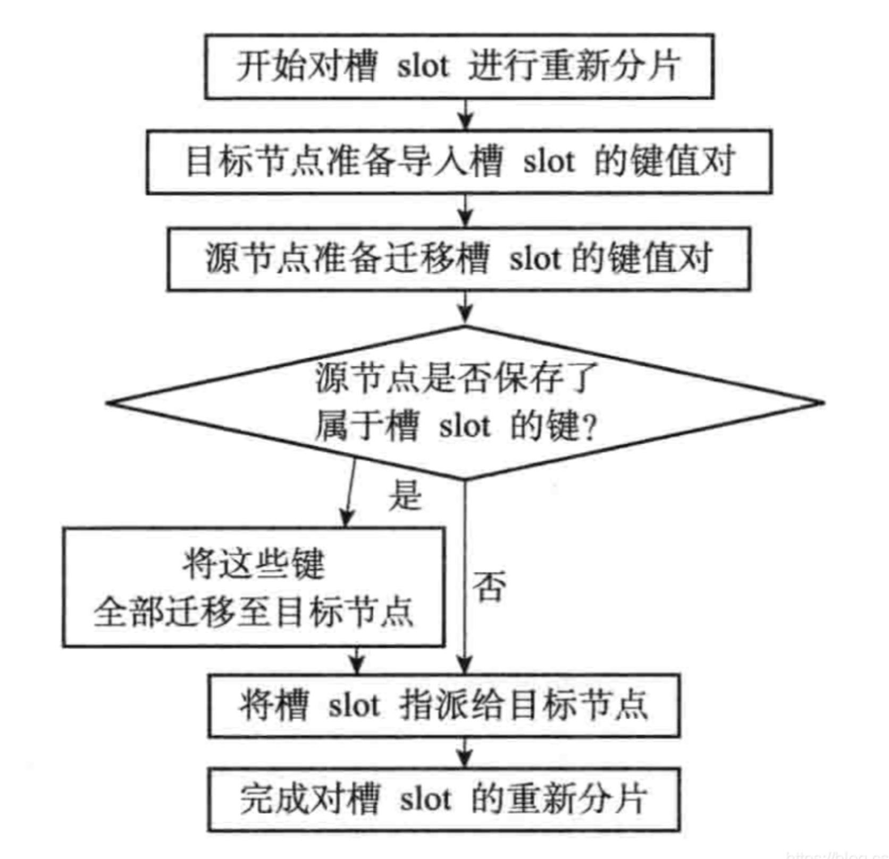

## 集群

### 一、概念

#### 1. 节点

一个 Redis 集群通常用多个节点 node 组成，将各个独立的节点连接起来，构成一个包含多个节点的集群

```
# 让当前的节点和 ip+port 指定的节点握手，握手成功后，就会将 ip+port 节点加入集群汇总
cluster meet <ip> <port> 

# 查看当前集群的节点信息
cluster nodes
```

redis 服务器在启动时会根据配置文件 `cluster-enabled` 选项是否为 yes 决定是否开启服务器的集群模式

每个节点都会使用一个 clusterNode 结构来记录自己的状态，并为集群中的所有其他节点（包括主节点和从节点）都创建一个相应的 clusterNode 结构，以此来记录其他节点的状态。

每个节点都保存着一个 clusterState 结构，这个结构记录了当前节点的视角下，集群目前所处的状态，例如集群是在线还是下线，集群包含多少个节点，集群当前的配置纪元

#### 2. 槽指派

Redis 集群通过分片的方式来保存数据库中的键值对：集群的整个数据库被分为 16384 个槽（slot），数据库中的每个键都属于这 16384 个槽的其中一个，集群中每个节点可以处理 0 或最多 16384 个槽。

当数据库中的 16384 个槽都有节点在处理时，集群处于上线状态（ok）；如果数据库中有任何一个槽没有得到处理，那么集群处于下线状态（fail）。

```
# 查看集群的信息
cluster info 

# 将一个或多个槽指派给节点负责，比如将 0 - 5000 分配给节点
cluster addslots 0 1 2 4 ... 5000
```

cluster addslots 输入的槽必须未指派，底层会设置 `clusterState.slots`数组某个槽的指针指向节点；并且更新这个节点的 `clusterNode.slots`二进制数组。

**clusterNode 中的 slots 数组**

clusterNode 结构的 slots 属性和 numslot 属性记录了节点负责处理哪些槽。

```
struct clusterNode {
	unsigned char slots[16384/8]; // 二进制位数组，长度为 16384/8=2048 字节
	int numslots; // 记录节点负责处理的槽数量，也即是 slots 数组中值为 1 的二进制位的数量
	... 
}
```

根据 slots 数组就可以确定这个节点是否负责处理槽 i，这个时间复杂度仅为 O(1)

节点还会将自己的 slots 数组通过消息发送给集群中的其他节点，以此来告知其他节点自己目前负责处理哪些槽。当节点 A 收到节点 B 的 slots 数组时，节点 A 会在自己的 `clusterState.nodes` 字典中查找节点 B 对应的 clusterNode 结构并更新。集群中的节点都会互相通信，因此集群中每个节点都会知道数据库中的 16384 个槽分别被指派给了哪些节点。

**clusterState 中的 slots 数组**

在每个节点的 clusterState 结构中也有一个 slots 数组

```
struct clusterState {
	clusterNode* slots[16384]; // 记录集群中所有 16384 个槽的指派信息。如果为空，则表示这个槽尚未分配给任何节点
	...
}
```

如果 `sltos[i]` 指针指向一个 clusterNode 结构，那么表示这个槽已经指派给了 clusterNode 结构所代表的节点

为什么要有两个数组来保存槽指派信息呢？

- 如果节点只使用 clusterNode.slots 数组来记录槽的指派信息，那么为了知道某个槽是否被指派，或指派给了那个节点，程序需要遍历 clusterState.nodes 字典中所有 clusterNode 结构，检查这些结构的 slots 数组，直到找到负责处理槽的节点为止，时间复杂度为 O(N)。
- 因为当程序需要将某个节点的槽指派信息发送给其他节点时，程序只需要将相应节点的 clusterNode.slots 数组整个发送出去即可。如果只使用 clusterState.slots 的话，这种情况程序必须先遍历整个 clusterState.slots 数组，记录节点负责处理哪些槽，然后才能发送，比较低效。

clusterState.slots 数组记录了集群中所有槽的指派信息，而 clusterNode.slots 数组只记录了 clusterNode 结构所代表的节点的槽指派信息。

### 二、集群接受客户端请求

客户端向节点发送命令时，接收命令的节点会计算出命令要处理的数据库键属于那个槽，并检查这个槽是否指派给了自己。

- 如果键所在的槽正好指派给了当前节点，那么节点直接执行命令
- 如果键所在槽指派给其他节点，那么节点会向客户端返回一个 MOVED 错误，客户端会主动转向请求正确的节点

节点如何计算数据库键 key 属于那个槽？` CRC16(key) & 16384` ，首先计算键的 CRC-16 校验和，然后 `& 16384` 则计算出一个介于 0 - 16384 之间的整数作为键的槽号。

```
// 查看一个给定键属于那个槽，返回槽
cluster keyslot "name"
```

在集群模式下，一个集群客户端通常会与集群的多个节点创建套接字连接，而所谓的节点转向实际上就是换一个套接字来发送命令

**节点数据库实现**：键值对还是保存在数据库里面。节点会用 `clusterState.slots_to_keys`（跳表）结构来保存槽与键之间的关系。slots_to_keys 跳表每个节点的分值（score）都是一个槽号，而每个节点的成员（number）都是一个数据库键：

- 每当节点往数据库中添加一个新的键值对时，节点就会将这个键以及键的槽号关联到 slots_to_keys 跳跃表
- 当节点删除数据库中的某个键值对时，节点就会在 slots_to_keys 跳跃表解除被删除键与槽号的关系

```
// 返回最多 count 个属于槽 slot 的数据库键，通过跳表比较快速的查询
cluster getkeysinslot <slot> <count>
```

### 三、重新分片

Redis 集群的重新分片操作可以将任意数量已经指派给某个节点（源节点）的槽改为指派给另一个节点（目标节点），并且相关槽所属的键值对也会从源节点被移动到目标节点。重新分片操作可以在线进行。

通过 redis 的集群管理软件 redis-trib 负责执行，redis 提供了进行分片所需的所有命令，而 redis-trib 则通过向源节点和目标节点发送命令来进行重新分片操作。



如果重新分片涉及多个槽，那么 redis-trib 将对每个给定的槽分别执行上面的步骤。处理一种情况：属于被迁移槽的一部分键值对保存在源节点里面，而另一部分键值对则保存在目标节点里面，则进行如下处理：

- 源节点会先在自己的数据库里面查找指定的键，如果找到的话，就直接执行客户端发送的命令
- 如果找不到，源节点将向客户端返回一个 ASK 错误，指引客户端转向正在导入槽的目标节点请求

**ASK 错误和 MOVED 错误的区别**

- MOVED 错误代表槽的负责权已经从一个节点转移到另一个节点。在客户端收到关于槽 i 的 MOVED 错误之后，客户端每次遇到关于槽 i 的命令请求时，都可以直接将命令请求发送至 MOVED 错误所指向的节点，因为该节点就是目前负责槽 i 的节点
- ASK 错误只是两个节点在迁移槽的过程中使用的一种临时措施，在客户端收到槽 i 的 ASK 错误之后，客户端只会在接下来的一次命令请求中将关于槽 i 的命令请求发送至 ASK 错误所指示的节点，但这种转向不会对客户端后面的请求产生任何影响，客户端后面仍然会将关于槽 i 的命令请求发送至目前处理槽 i 的节点，除非 ASK 错误再次出现。

### 四、复制与故障转移

Redis 集群中的节点分为主节点（master）和从节点（slave），主节点用于处理槽，而从节点则用于复制某个主节点，并在被复制的主节点下线时，代替下线主节点继续处理命令请求。

```
// 让接收命令的节点成为 node_id 所指定节点的从节点，并开始对主节点进行复制
cluster replicate <node_id>
```

**故障检测**

集群中的每个节点都会定期向集群中的其他节点发送 PING 消息，以此来检测对方是否在线，如果接收 PING 消息的节点没有在规定的时间内，向发送 PING 消息的节点返回 PONG 消息，那么发送 PING 消息的节点就会将接收 PING 消息的节点标记为疑似下线（PFAIL，probable fail）

集群中的各个节点会通过互相发送消息的方式来交换集群中各个节点的状态信息，例如某个节点是处于在线状态、疑似下线状态（PFAIL）、还是已下线状态（FAIL）

如果在一个集群里面，半数以上负责处理槽的主节点都将某个主节点 x 报告为疑似下线，那么这个主节点 x 将被标记为已下线（FAIL），将主节点 x 标记为已下线的节点会向集群广播一条关于主节点 x 的 FAIL 消息，所有收到这条 FAIL 消息的节点都会立即将主节点 x 标记为已下线。

**故障转移**：当一个从节点发现自己正在复制的主节点进入了已下线状态时，从节点将开始对下线主节点进行故障转移，如以下流程

- 复制下线主节点的所有从节点里面，会有一个从节点被选中
- 被选中的从节点会执行 `SLAVEOF no one` 命令，成为新的主节点
- 新的主节点会撤销所有对已下线主节点的槽指派，并将这些槽全部指派给自己
- 新的主节点向集群广播一条 PONG 消息，这条 PONG 消息可以让集群中的其他节点立即知道这个节点已经由从节点变成了主节点，并且这个主节点已经接管了原本由已下线节点负责处理的槽
- 新的主节点开始接收和自己负责处理的槽有关的命令请求，故障转移完成

**选举新的主节点**

- 集群的配置纪元是一个自增计数器，它的初始值为 0
- 当集群里的某个节点开始一次故障转移操作时，集群配置纪元的值会被赠一
- 对于每个配置纪元，集群里每个负责处理槽的主节点都有一次投票的机会，而第一个向主节点要求投票的从节点将获得主节点的投票
- 当从节点发现自己正在复制的主节点进入已下线状态时，从节点会向集群广播一条 CLUSTERMSG_TYPE_FAILOVER_AUTH_REQUEST 消息，要求所有收到这条消息、并且具有投票权的主节点向这个从节点投票
- 如果一个主节点具有投票权（它正在负责处理槽），并且这个主节点尚未投票给其他从节点，那么主节点将向要求投票的从节点返回一条 CLUSTERMSG_TYPE_FAILOVER_AUTH_ACK 消息，表示这个主节点支持从节点成为新的主节点
- 每个参与选举的从节点都会接收 CLUSTER_TYPE_FAILOVER_AUTH_ACK 消息，并根据自己收到了多少条这种消息来统计自己获取了多少主节点的支持
- 如果集群里有 N 个具有投票权的主节点，那么当一个主节点从收集到大于等于 N/2+1 张支持票时，这个从节点就会当选为新的主节点
- 因为在每一个配置纪元里面，每个具有投票权的主节点只能投一次票，所以如果有 N 个主节点进行投票，那么具有大于等于 N/2+1 张支持票的从节点只会有一个，这确保了新的主节点只会有一个
- 如果在一个配置纪元里面没有从节点能收集到足够多的支持票，那么集群进入一个新的配置纪元，并再次进行选举，直到选出新的主节点为止

基于 Raft 算法的领头选举方法来实现的


